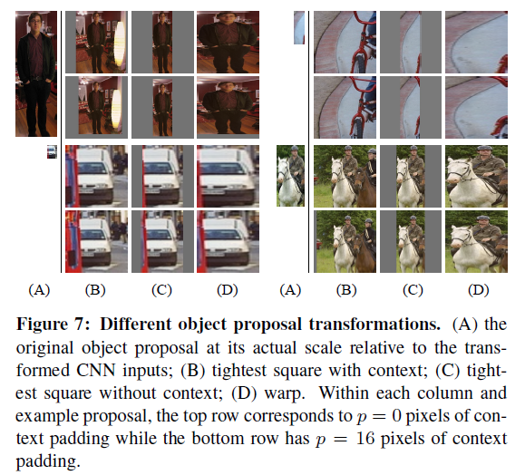

[链接](https://blog.csdn.net/v1_vivian/article/details/78599229)

# 摘要：

过去几年，在权威数据集PASCAL上，物体检测的效果已经达到一个稳定水平。效果最好的方法是融合了多种低维图像特征和高维上下文环境的复杂融合系统。在这篇论文里，我们提出了一种简单并且可扩展的检测算法，可以将mAP在VOC2012最好结果的基础上提高30%以上——达到了53.3%。我们的方法结合了两个关键的因素：

    在候选区域上自下而上使用大型卷积神经网络(CNNs)，用以定位和分割物体。
    当带标签的训练数据不足时，先针对辅助任务进行有监督预训练，再进行特定任务的调优，就可以产生明显的性能提升。

因为我们把region proposal和CNNs结合起来，所以该方法被称为R-CNN：Regions with CNN features。我们也把R-CNN效果跟OverFeat比较了下（OverFeat是最近提出的在与我们相似的CNN特征下采用滑动窗口进行目标检测的一种方法），结果发现RCNN在200类ILSVRC2013检测数据集上的性能明显优于OVerFeat。

    【Overfeat:改进了Alex-net，并用图像缩放和滑窗方法在test数据集上测试网络；提出了一种图像定位的方法；最后通过一个卷积网络来同时进行分类，定位和检测三个计算机视觉任务，并在ILSVRC2013中获得了很好的结果。】

# 介绍：

特征很重要。在过去十年，各类视觉识别任务基本都建立在对SIFT[29]和HOG[7]特征的使用。但如果我们关注一下PASCAL VOC对象检测[15]这个经典的视觉识别任务，就会发现，2010-2012年进展缓慢，取得的微小进步都是通过构建一些集成系统和采用一些成功方法的变种才达到的。

SIFT和HOG是块方向直方图(blockwise orientation histograms)，一种类似大脑初级皮层V1层复杂细胞的表示方法。但我们知道识别发生在多个下游阶段，（我们是先看到了一些特征，然后才意识到这是什么东西）也就是说对于视觉识别来说，更有价值的信息，是层次化的，多个阶段的特征。
Fukushima的“neocognitron，一种受生物学启发用于模式识别的层次化、移动不变性模型，算是这方面最早的尝试。然而neocognitron缺乏监督学习算法。Lecun等人的工作表明基于反向传播的随机梯度下降(SGD)对训练卷积神经网络（CNNs）非常有效，CNNs被认为是继承自neocognitron的一类模型。

CNNs在1990年代被广泛使用，但随即便因为SVM的崛起而淡出研究主流。2012年，Krizhevsky等人在ImageNet大规模视觉识别挑战赛(ILSVRC)上的出色表现重新燃起了世界对CNNs的兴趣（AlexNet）。他们的成功在于在120万的标签图像上使用了一个大型的CNN，并且对LeCUN的CNN进行了一些改造（比如ReLU和Dropout Regularization）。

这个ImangeNet的结果的重要性在ILSVRC2012 workshop上得到了热烈的讨论。提炼出来的核心问题是：ImageNet上的CNN分类结果在何种程度上能够应用到PASCAL VOC挑战的物体检测任务上？

我们通过连接图像分类和目标检测，回答了这个问题。本论文是第一个说明在PASCAL VOC的物体检测任务上CNN比基于简单类HOG特征的系统有大幅的性能提升。我们主要关注了两个问题：使用深度网络定位物体和在小规模的标注数据集上进行大型网络模型的训练。

与图像分类不同的是检测需要定位一个图像内的许多物体。一个方法是将框定位看做是回归问题。但Szegedy等人的工作说明这种策略并不work（在VOC2007上他们的mAP是30.5%，而我们的达到了58.5%）。

    【也就是说将定位问题单纯作为回归解决效果并不好】

另一个可替代的方法是使用滑动窗口探测器，通过这种方法使用CNNs至少已经有20年的时间了，通常用于一些特定的种类如人脸，行人等。为了获得较高的空间分辨率，这些CNNs都采用了两个卷积层和两个池化层。我们本来也考虑过使用滑动窗口的方法，但是由于网络层次更深，输入图片有非常大的感受野（195×195）and 步长（32×32），这使得采用滑动窗口的方法充满挑战。

我们是通过操作”recognition using regions”范式，解决了CNN的定位问题。测试时，对这每张图片，产生了接近2000个与类别无关的region proposal，对每个CNN抽取了一个固定长度的特征向量，然后借助专门针对特定类别数据的线性SVM对每个区域进行分类。我们不考虑region的大小，使用放射图像变形的方法来对每个不同形状的region proposal产生一个固定长度的作为CNN输入的特征向量（也就是把不同大小的proposal放到同一个大小）。图1展示了我们方法的全貌并突出展示了一些实验结果。由于我们结合了Region proposals和CNNs，所以起名**R-CNN：Regions with CNN features。**

检测中面对的第二个挑战是标签数据太少，现在可获得的数据远远不够用来训练一个大型卷积网络。传统方法多是采用无监督与训练，再进行有监督调优。本文的第二个核心贡献是在辅助数据集（ILSVRC）上进行有监督预训练，再在小数据集上针对特定问题进行调优。这是在训练数据稀少的情况下一个非常有效的训练大型卷积神经网络的方法。我们的实验中，针对检测的调优将mAP提高了8个百分点。调优后，我们的系统在VOC2010上达到了54%的mAP，远远超过高度优化的基于HOG的可变性部件模型（deformable part model，DPM）

    【DPM:多尺度形变部件模型，连续获得07-09的检测冠军，2010年其作者Felzenszwalb Pedro被VOC授予”终身成就奖”。DPM把物体看成了多个组成的部件（比如人脸的鼻子、嘴巴等），用部件间的关系来描述物体，这个特性非常符合自然界很多物体的非刚体特征。DPM可以看做是HOG+SVM的扩展，很好的继承了两者的优点，在人脸检测、行人检测等任务上取得了不错的效果，但是DPM相对复杂，检测速度也较慢，从而也出现了很多改进的方法。】

我们的系统也很高效，都是小型矩阵向量相乘和贪婪NMS这些特定类别的计算。这个计算特性源自于特征在不同类别之间的共享（对于不同类别，CNNC提取到的特征是一样的），这比之前使用的区域特征少了两个数量级的维度。

HOG-like特征的一个优点是简单性：能够很容易明白提取到的特征是什么，那我们能可视化出CNNC提取到的特征吗？全连接层有超过5千4百万的参数值，这是关键吗？这些都不是，我们将CNN切断，会发现，移除掉其中94%的参数，精度只会下降一点点。相反，通过网络中的探测单元我们可以看到卷积层学习了一组丰富的特性。

分析我们方法的失败案例，对于进一步提高很有帮助，所以我们借助Hoiem等人的定位分析工具做实验结果的报告和分析。分析结果，我们发发现主要的错误是因为mislocalization,而使用了bounding box regression之后，可以有效的降低这个错误。
介绍技术细节之前，我们提醒大家由于R-CNN是在推荐区域上进行操作，所以可以很自然地扩展到语义分割任务上。只要很小的改动，我们就在PASCAL VOC语义分割任务上达到了很有竞争力的结果，在VOC2011测试集上平均语义分割精度达到了47.9%。

# 用RCNN做物体检测

我们的物体检测系统有三个模块构成。第一个，产生类别无关的region proposal。这些推荐定义了一个候选检测区域的集合；第二个是一个大型卷积神经网络，用于从每个区域抽取特定大小的特征向量；第三个是一个指定类别的线性SVM。本部分，将展示每个模块的设计，并介绍他们的测试阶段的用法，以及参数是如何学习的细节，最后给出在PASCAL VOC 2010-12和ILSVRC2013上的检测结果。

## 模块设计
### 区域推荐（region proposal）
近来有很多研究都提出了产生类别无关区域推荐的方法。比如: objectness（物体性），selective search（选择性搜索），category-independent object proposals(类别无关物体推荐)，constrained parametric min-cuts（受限参最小剪切, CPMC)，multi-scal combinatorial grouping(多尺度联合分组)，以及Ciresan等人的方法，将CNN用在规律空间块裁剪上以检测有丝分裂细胞，也算是一种特殊的区域推荐类型。由于R-CNN对特定区域算法是不关心的，所以我们采用了选择性搜索以方便和前面的工作进行可控的比较。

### 特征提取（Feature extraction）
我们使用Krizhevsky等人所描述的CNN的一个Caffe实现版本对每个推荐区域抽取一个4096维度的特征向量把一个输入为277277大小的图片，通过五个卷积层和两个全连接层进行前向传播,最终得到一个4096-D的特征向量。读者可以参考AlexNet获得更多的网络架构细节。
为了计算region proposal的特征，我们首先要对图像进行转换，使得它符合CNNC的输入（架构中的CNNC只能接受固定大小：277277）。这个变换有很多办法，我们使用了最简单的一种。无论候选区域是什么尺寸和宽高比，我们都把候选框变形成想要的尺寸。具体的，变形之前，我们现在候选框周围加上16的padding,再进行各向异性缩放。 这种形变使得mAp提高了3到5个百分点。在补充材料中，作者对比了各向异性和各向同性缩放缩放方法。
### 特征提取（Feature extraction）
我们使用Krizhevsky等人所描述的CNN的一个Caffe实现版本对每个推荐区域抽取一个4096维度的特征向量。把一个输入为227*227大小的RGB图片，通过五个卷积层和两个全连接层进行前向传播,最终得到一个4096-D的特征向量。读者可以参考AlexNet获得更多的网络架构细节。

## 测试阶段的物体检测

测试阶段，在测试图像上使用selective search抽取2000个推荐区域（实验中，我们使用了选择性搜索的快速模式）。然后变形每一个推荐区域，再通过CNN前向传播计算出特征。然后我们使用对每个类别训练出的SVM给整个特征向量中的每个类别单独打分。

    【对每一个框使用每个类别的SVM进行打分】

然后给出一张图像中所有的打分区域，然后使用NMS（每个类别是独立进行的），拒绝掉一些和高分区域的IOU大于阈值的候选框。

### 运行时的分析
两个特性让检测变得很高效。首先，所有的CNN参数都是跨类别共享的。其次，通过CNN计算的特征向量相比其他通用方法（比如spatial pyramids with bag-of-visual-word encodings）维度是很低的。UVA检测系统的特征比我们的要多两个数量级(360k vs 4k)。
这种共享的结果就是计算推荐区域特征的耗时可以分摊到所有类别的头上（GPU：每张图13s，CPU：每张图53s）。唯一的和具体类别有关的计算是特征向量和SVM权重和点积，以及NMS。实践中，所有的点积都可以批量化成一个单独矩阵间运算。特征矩阵的典型大小是2000×4096，SVM权重的矩阵是4096xN，其中N是类别的数量。
分析表明R-CNN可以扩展到上千个类别，而不需要借用近似技术（如hashing）。及时有10万个类别，矩阵乘法在现代多核CPU上只需要10s而已。但这种高效不仅仅是因为使用了区域推荐和共享特征。由于较高维度的特征，UVA系统存储100k linear predictors需要134GB的内存，而我们只要1.5GB，比我们高了两个数量级。
有趣的是R-CCN和最近Dean等人使用DPMs和hashing做检测的工作相比，他们用了1万个干扰类， 每五分钟可以处理一张图片，在VOC2007上的mAP能达到16%。我们的方法1万个检测器由于没有做近似，可以在CPU上一分钟跑完，达到59%的mAP（3.2节）。

## 训练

有监督的预训练
我们在大型辅助训练集ILSVRC2012分类数据集（没有约束框数据）上预训练了CNN。预训练采用了Caffe的CNN库。总体来说，我们的CNN十分接近krizhevsky等人的网络的性能，在ILSVRC2012分类验证集在top-1错误率上比他们高2.2%。差异主要来自于训练过程的简化。

### 特定领域的参数调优
为了让我们的CNN适应新的任务（即检测任务）和新的领域（变形后的推荐窗口）。我们只使用变形后的推荐区域对CNN参数进行SGD训练。我们替换掉了ImageNet专用的1000-way分类层，换成了一个随机初始化的21-way分类层，（其中20是VOC的类别数，1代表背景）而卷积部分都没有改变。我们对待所有的推荐区域，如果其和真实标注的框的IoU>= 0.5就认为是正例，否则就是负例。SGD开始的learning_rate为0.001（是初始化预训练时的十分之一），这使得调优得以有效进行而不会破坏初始化的成果。每轮SGD迭代，我们统一使用32个正例窗口（跨所有类别）和96个背景窗口，即每个mini-batch的大小是128。另外我们倾向于采样正例窗口，因为和背景相比他们很稀少。

### 目标种类分类器
思考一下检测汽车的二分类器。很显然，一个图像区域紧紧包裹着一辆汽车应该就是正例。同样的，没有汽车的就是背景区域，也就是负例。较为不明确的是怎样标注哪些只和汽车部分重叠的区域。我们使用IoU重叠阈值来解决这个问题，低于这个阈值的就是负例。这个阈值我们选择了0.3，是在验证集上基于{0, 0.1, … 0.5}通过网格搜索得到的。我们发现认真选择这个阈值很重要。如果设置为0.5，可以降低mAP5个点，设置为0，就会降低4个点。正例就严格的是标注的框。

    【IOU<0.3被作为负例，ground-truth是正例，其余的全部丢弃】

一旦特征提取出来，并应用标签数据，我们优化了每个类的线性SVM。由于训练数据太大，难以装进内存，我们选择了标准的hard negative mining method

    【难负例挖掘算法，用途就是正负例数量不均衡，而负例分散代表性又不够的问题，hard negative就是每次把那些顽固的棘手的错误,再送回去继续练,练到你的成绩不再提升为止.这一个过程就叫做’hard negative mining’】

高难负例挖掘算法收敛很快，实践中只要在所有图像上经过一轮训练，mAP就可以基本停止增加了。
附录B中，我们讨论了，为什么在fine-tunning和SVM训练这两个阶段，我们定义得正负样例是不同的。

    【fine-tunning阶段是由于CNN对小样本容易过拟合，需要大量训练数据，故对IoU限制宽松： IoU>0.5的建议框为正样本，否则为负样本； SVM这种机制是由于其适用于小样本训练，故对样本IoU限制严格：Ground Truth为正样本，与Ground Truth相交IoU＜0.3的建议框为负样本。】

我们也会讨论为什么训练一个分类器是必要的，而不只是简单地使用来自调优后的CNN的最终fc8层的输出。

    【为什么单独训练了一个SVM而不是直接用softmax，作者提到，刚开始时只是用了ImageNet预训练了CNN，并用提取的特征训练了SVMs，此时用正负样本标记方法就是前面所述的0.3,后来刚开始使用fine-tuning时，也使用了这个方法，但是发现结果很差，于是通过调试选择了0.5这个方法，作者认为这样可以加大样本的数量，从而避免过拟合。然而，IoU大于0.5就作为正样本会导致网络定位准确度的下降，故使用了SVM来做检测，全部使用ground-truth样本作为正样本，且使用非正样本的，且IoU大于0.3的“hard negatives”，提高了定位的准确度】。

## 在PASCAL VOC 2010-12上的结果

按照PASCAL VOC的最佳实践步骤，我们在VOC2007的数据集上验证了我们所有的设计思想和参数处理，我们在VOC2012上训练和优化了SVMs，最终结果在VOC 2010-12的数据库，我们在评估服务器上提交了两个结果（一个是有bunding box regression，一个没有）。
表1展示了在VOC2010的结果，我们将自己的方法同四种先进基准方法作对比，其中包括SegDPM，这种方法将DPM检测子与语义分割系统相结合并且使用附加的inter-detector的环境和图片检测器。更加恰当的比较是同Uijling的UVA系统比较，因为我们的方法同样基于候选框算法。对于候选区域的分类，他们通过构建一个四层的金字塔，并且将之与SIFT模板结合，SIFT为扩展的OpponentSIFT和RGB-SIFT描述子，每一个向量被量化为4000-word的codebook。分类任务由一个交叉核的SVM承担，对比这种方法的多特征方法，非线性内核的SVM方法，我们在mAP达到一个更大的提升，从35.1%提升至53.7%，而且速度更快。我们的方法在VOC2011/2012测试集上达到了相似的检测效果mAP53.3%。

# 可视化、消融、模型的错误

## 可视化学习到的特征

直接可视化第一层filters非常容易理解，它们主要捕获方向性边缘和对比色。难以理解的是后面的层。Zeiler and Fergus提出了一种可视化的很棒的反卷积办法。我们则使用了一种简单的非参数化方法，直接展示网络学到的东西。这个想法是单一输出网络中一个特定单元（特征），然后把它当做一个正确类别的物体检测器来使用。
方法是这样的，先计算所有抽取出来的推荐区域（大约1000万），计算每个区域所导致的对应单元的激活值，然后按激活值对这些区域进行排序，然后进行最大值抑制，最后展示分值最高的若干个区域。这个方法让被选中的单元在遇到他想激活的输入时“自己说话”。我们避免平均化是为了看到不同的视觉模式和深入观察单元计算出来的不变性。
我们可视化了第五层的池化层pool5，是卷积网络的最后一层，feature_map(卷积核和特征数的总称)的大小是6 x 6 x 256 = 9216维。忽略边界效应，每个pool5单元拥有195×195的感受野，输入是227×227。pool5中间的单元，几乎是一个全局视角，而边缘的单元有较小的带裁切的支持。
图4的每一行显示了对于一个pool5单元的最高16个激活区域情况，这个实例来自于VOC 2007上我们调优的CNN，这里只展示了256个单元中的6个（附录D包含更多）。我们看看这些单元都学到了什么。第二行，有一个单元看到狗和斑点的时候就会激活，第三行对应红斑点，还有人脸，当然还有一些抽象的模式，比如文字和带窗户的三角结构。这个网络似乎学到了一些类别调优相关的特征，这些特征都是形状、纹理、颜色和材质特性的分布式表示。而后续的fc6层则对这些丰富的特征建立大量的组合来表达各种不同的事物。
##  消融研究(Ablation studies)

    ablation study 就是为了研究模型中所提出的一些结构是否有效而设计的实验。如你提出了某某结构，但是要想确定这个结构是否有利于最终的效果，那就要将去掉该结构的网络与加上该结构的网络所得到的结果进行对比，这就是ablation study。也就是（控制变量法）

没有调优的各层性能。
为了理解哪一层对于检测的性能十分重要，我们分析了CNN最后三层的每一层在VOC2007上面的结果。Pool5在3.1中做过剪短的表述。最后两层下面来总结一下。
　　fc6是一个与pool5连接的全连接层。为了计算特征，它和pool5的feature map（reshape成一个9216维度的向量）做了一个4096×9216的矩阵乘法，并添加了一个bias向量。中间的向量是逐个组件的半波整流（component-wise half-wave rectified）【Relu（x<- max(0,x)）】
fc7是网络的最后一层。跟fc6之间通过一个4096×4096的矩阵相乘。也是添加了bias向量和应用了ReLU。
　　我们先来看看没有调优的CNN在PASCAL上的表现，没有调优是指所有的CNN参数就是在ILSVRC2012上训练后的状态。分析每一层的性能显示来自fc7的特征泛化能力不如fc6的特征。这意味29%的CNN参数，也就是1680万的参数可以移除掉，而且不影响mAP。更多的惊喜是即使同时移除fc6和fc7，仅仅使用pool5的特征，只使用CNN参数的6%也能有非常好的结果。可见CNN的主要表达力来自于卷积层，而不是全连接层。这个发现提醒我们也许可以在计算一个任意尺寸的图片的稠密特征图（dense feature map）时使仅仅使用CNN的卷积层。这种表示可以直接在pool5的特征上进行滑动窗口检测的实验。
　　
调优后的各层性能。
我们来看看调优后在VOC2007上的结果表现。提升非常明显，mAP提升了8个百分点，达到了54.2%。fc6和fc7的提升明显优于pool5，这说明pool5从ImageNet学习的特征通用性很强，在它之上层的大部分提升主要是在学习领域相关的非线性分类器。

**对比其他特征学习方法。**相当少的特征学习方法应用与VOC数据集。我们找到的两个最近的方法都是基于固定探测模型。为了参照的需要，我们也将基于基本HOG的DFM方法的结果加入比较
　　第一个DPM的特征学习方法，DPM ST,将HOG中加入略图表征的概率直方图。直观的，一个略图就是通过图片中心轮廓的狭小分布。略图表征概率通过一个被训练出来的分类35*35像素路径为一个150略图表征的的随机森林方法计算
　　第二个方法，DPM HSC，将HOG特征替换成一个稀疏编码的直方图。为了计算HSC，在每个像素上使用一个学习到的1007 * 7 像素（灰度空间）原子求解稀疏码激活，（原文是atoms,应该是这么翻译吧）由此产生的激活以三种方式（全波和半波）整流，空间池化，l2标准化，然后进行幂运算。
　　所有的RCNN变种算法都要强于这三个 DPM方法（表2， 8-10行），包括两种特征学习的方法与最新版本的DPM方法比较，我们的mAP要多大约20个百分点，61%的相对提升。略图表征与HOG现结合的方法比单纯HOG的性能高出2.5%，而HSC的方法相对于HOG提升四个百分点（当内在的与他们自己的DPM基准比价，全都是用的非公共DPM执行，这低于开源版本）。这些方法分别达到了29.1%和34.3%。
## 检测错误分析

为了揭示出我们方法的错误之处， 我们使用Hoiem提出的优秀的检测分析工具，来理解调参是怎样改变他们，并且观察相对于DPM方法，我们的错误形式。这个分析方法全部的介绍超出了本篇文章的范围，我们建议读者查阅文献21来了解更加详细的介绍（例如“normalized AP”的介绍），由于这些分析是不太有关联性，所以我们放在图4和图5的题注中讨论。
## Bounding-box回归

基于错误分析，我们使用了一种简单的方法减小定位误差。受到DPM[17]中使用的约束框回归训练启发，我们训练了一个线性回归模型在给定一个选择区域的pool5特征时去预测一个新的检测窗口。详细的细节参考附录C。表1、表2和图4的结果说明这个简单的方法，修复了大量的错位检测，提升了3-4个百分点。

# 语义分割

区域分类是语义分割的标准技术，这使得我们很容易将R-CNN应用到PASCAL VOC分割任务的挑战。为了和当前主流的语义分割系统（称为$O_2P$，second-order pooling[4]）做对比，我们使用了一个开源的框架。$O_2P$使用CPMC(constrained parametric min-cuts)针对每张图片产生150个区域推荐，并预测每个区域的品质，对于每个类别，进行支撑向量回归（support vector regression，SVR）。他们的方法很高效，主要得益于CPMC区域的品质和多特征类型的强大二阶池化（second-second pooling，SIFT和LBP的增强变种）。我们也注意到Farabet等人[16]将CNN用作多尺度逐像素分类器，在几个高密度场景标注数据集（不包括PASCAL）上取得了不错的成绩。

我们学习[2,4]，将Hariharan等人提供的额外标注信息补充到PASCAL分割训练集中。设计选择和超参数都在VOC 2011验证集上进行交叉验证。最后的测试结果只执行了一次。
　　
## 用于分割的CNN特征。
为了计算CPMC区域上的特征，我们执行了三个策略，每个策略都先将矩形窗口变形到227×227大小。第一个策略完全忽略区域的形状(full ignore)，直接在变形后的窗口上计算CNN特征，就和我们检测时做的一样。但是，这些特征忽略了区域的非矩形形状。两个区域也许包含相似的约束框却几乎没有重叠。因此，第二个策略(fg，foreground)只计算前景遮罩（foreground mask）的CNN特征，我们将所有的背景像素替换成平均输入，这样减除平均值后他们就会变成0。第三个策略(full+fg)，简单的并联全部（full）特征和前景（fg）特征；我们的实验验证了他们的互补性。

## 在VOC 2011上的结果
表3显示了与$O_2P$相比较的VOC 2011验证集的结果（每个类别的计算结果见补充材料）。在每个特征计算策略中，FC6总是优于FC7，下面就针对fc6进行讨论。fg策略略优于full，表明掩蔽区域形状提供了更强的信号，匹配我们的直觉。然而，full+fg的平均精度为47.9%，比fg优4.2%（也稍优于$O_2P$），这表明即使提供了FG特征，由full特征提供的上下文也是有很多信息。值得注意的是，训练20个SVR，在我们的full+fg特征在单核上需要1小时，而在$O_2P$特征则需要10个小时。
在表4中,我们给出了VOC 2011测试集上的结果。比较我们的最佳执行方法，fc6（full+fg），对抗两个强大的baselines。我们的方法在21个类别中的11个达到最高的分割精度，最高的总体分割精度为47.9%，平均跨类别（但可能与$O_2P$结果在任何合理的误差范围内）。通过微调可能会取得更好的成绩。

# 结论

最近几年，物体检测陷入停滞，表现最好的检测系统是复杂的将多低层级的图像特征与高层级的物体检测器环境与场景识别相结合。本文提出了一种简单并且可扩展的物体检测方法，达到了VOC 2012数据集相对之前最好性能的30%的提升。
我们取得这个性能主要通过两个方面：第一是应用了自底向上的候选框训练的高容量的卷积神经网络进行定位和分割物体。另外一个是使用在标签数据匮乏的情况下训练大规模神经网络的一个方法。我们展示了在有监督的情况下使用丰富的数据集（图片分类）预训练一个网络作为辅助性的工作是很有效的，然后采用稀少数据（检测）去调优定位任务的网络。我们猜测“有监督的预训练+特定领域的调优”这一范式对于数据稀少的视觉问题是很有效的。
最后,我们注意到能得到这些结果，将计算机视觉中经典的工具和深度学习(自底向上的区域候选框和卷积神经网络）组合是非常重要的。而不是违背科学探索的主线，这两个部分是自然而且必然的结合。

# 各向同性，各向异性缩放

R-CNN的论文中提到了各向同性，各向异性缩放的概念，这里做一个详细解释：

当我们输入一张图片时，我们要搜索出所有可能是物体的区域，R-CNN采用的就是Selective Search方法，通过这个算法我们搜索出2000个候选框。然后从R-CNN的总流程图中可以看到，搜出的候选框是矩形的，而且是大小各不相同。然而CNN对输入图片的大小是有固定的，如果把搜索到的矩形选框不做处理，就扔进CNN中，肯定不行。因此对于每个输入的候选框都需要缩放到固定的大小。

下面我们讲解要怎么进行缩放处理，为了简单起见我们假设下一阶段CNN所需要的输入图片大小是个正方形图片227*227。因为我们经过selective search 得到的是矩形框，paper试验了两种不同的处理方法：
各向异性缩放：

这种方法很简单，就是不管图片的长宽比例，管它是否扭曲，进行缩放就是了，全部缩放到CNN输入的大小227*227，如下图(D)所示；
各项同性缩放：

因为图片扭曲后，估计会对后续CNN的训练精度有影响，于是作者也测试了“各向同性缩放”方案。有两种办法：

    先扩充后裁剪

直接在原始图片中，把bounding box的边界进行扩展延伸成正方形，然后再进行裁剪；如果已经延伸到了原始图片的外边界，那么就用bounding box中的颜色均值填充；如下图(B)所示;

    先裁剪后扩充

先把bounding box图片裁剪出来，然后用固定的背景颜色填充成正方形图片(背景颜色也是采用bounding box的像素颜色均值),如下图©所示;

对于上面的异性、同性缩放，文献还有个padding处理，上面的示意图中第1、3行就是结合了padding=0, 第2、4行结果图采用padding=16的结果。经过最后的试验，作者发现采用各向异性缩放、padding=16的精度最高。（也就是最后一个图）
