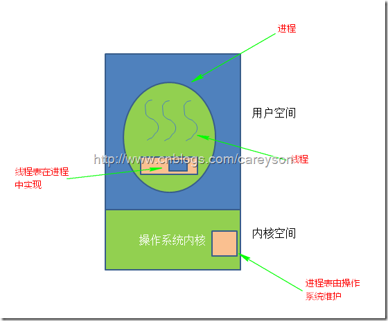
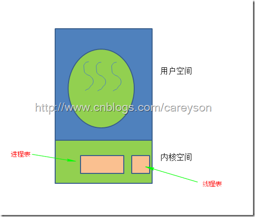
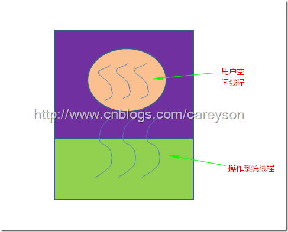

# 多进程和多线程

多进程和多线程都是并发，都可以提高处理器的利用效率。
进程是组织资源的最小单位，而线程是安排CPU执行的最小单位。

Linux自从2.6内核开始，就会把不同的线程交给不同的核心去处理。Windows也从NT.4.0开始支持这一特性。

## 什么时候该使用多线程呢？这要分四种情况讨论：

a.多核CPU——计算密集型任务。此时要尽量使用多线程，可以提高任务执行效率，例如加密解密，数据压缩解压缩（视频、音频、普通数据），否则只能使一个核心满载，而其他核心闲置。

b.单核CPU——计算密集型任务。此时的任务已经把CPU资源100%消耗了，就没必要也不可能使用多线程来提高计算效率了；相反，如果要做人机交互，最好还是要用多线程，避免用户没法对计算机进行操作。

c.单核CPU——IO密集型任务，使用多线程还是为了人机交互方便，

d.多核CPU——IO密集型任务，这就更不用说了，跟单核时候原因一样。

## linux
对于操作系统，进程就是一个数据结构。系统调用fork()可以新建一个子进程，函数pthread()可以新建一个线程。但**无论线程还是进程，都是用task_struct结构表示的，唯一的区别就是共享的数据区域不同**。

换句话说，线程看起来跟进程没有区别，只是线程的某些数据区域和其父进程是共享的，而子进程是拷贝副本，而不是共享。就比如说，mm结构和files结构在线程中都是共享的

所以说，我们的多线程程序要利用锁机制，避免多个线程同时往同一区域写入数据，否则可能造成数据错乱。

Linux 的源码(/include/linux/sched.h)：

```C
struct task_struct {
    // 进程状态
    long              state;
    // 虚拟内存结构体
    struct mm_struct  *mm;
    // 进程号
    pid_t              pid;
    // 指向父进程的指针
    struct task_struct __rcu  *parent;
    // 子进程列表
    struct list_head        children;
    // 存放文件系统信息的指针
    struct fs_struct        *fs;
    // 一个数组，包含该进程打开的文件指针
    struct files_struct        *files;
};
```
task_struct就是 Linux 内核对于一个进程的描述，也可以称为「进程描述符」。源码比较复杂，我**这里就截取了一小部分比较常见的**。

其中比较有意思的是mm指针和files指针。mm指向的是进程的虚拟内存，也就是载入资源和可执行文件的地方；files指针指向一个数组，这个数组里装着所有该进程打开的文件的指针。

先说files，它是一个文件指针数组。一般来说，一个进程会从files[0]读取输入，将输出写入files[1]，将错误信息写入files[2]。
## 注意
当然，必须要说明的是，只有 Linux 系统将线程看做共享数据的进程，不对其做特殊看待，其他的很多操作系统是对线程和进程区别对待的，线程有其特有的数据结构，我个人认为不如 Linux 的这种设计简洁，增加了系统的复杂度。

在 Linux 中新建线程和进程的效率都是很高的，对于新建进程时内存区域拷贝的问题，Linux 采用了 copy-on-write 的策略优化，也就是并不真正复制父进程的内存空间，而是等到需要写操作时才去复制。所以 Linux 中新建进程和新建线程都是很迅速的。

## 线程的好处如下:

1. 在很多程序中，需要多个线程互相同步或互斥的并行完成工作，而将这些工作分解到不同的线程中去无疑简化了编程模型。

2. 因为线程相比进程来说，更加的**轻量**，所以线程的创建和销毁的代价变得更小。

3. 线程提高了性能，虽然线程宏观上是并行的，但微观上却是串行。从CPU角度线程并无法提升性能，但如果某些线程涉及到等待资源（比如IO，等待输入）时，多线程允许进程中的其它线程继续执行而不是整个进程被阻塞，因此提高了CPU的利用率，从这个角度会提升性能。

4. 在**多CPU或多核的情况下，使用线程不仅仅在宏观上并行，在微观上也是并行的**。

## 经典线程模型

另一个看进程和线程的角度是进程模型基于两类不同的概念：资源的组织和执行。进程是组织资源的最小单位，而线程是安排CPU执行的最小单位。

## 操作系统实现线程的几种模式

在操作系统中，线程可以实现在用户模式下，也可以实现在内核模式下，也可以两者结合实现。

 

### 线程实现在用户空间下

当线程在用户空间下实现时，操作系统对线程的存在一无所知，操作系统只能看到进程，而不能看到线程。所有的线程都是在用户空间实现。在操作系统看来，每一个进程只有一个线程。过去的操作系统大部分是这种实现方式，这种方式的好处之一就是即使操作系统不支持线程，也可以通过库函数来支持线程。

在这种模式下，每一个进程中都维护着一个线程表来追踪本进程中的线程，这个表中包含表1中每个线程独占的资源，比如栈，寄存器，状态等，如图3所示。



 

这种模式当一个线程完成了其工作或等待需要被阻塞时，其调用系统过程阻塞自身，然后将CPU交由其它线程。

这种的模式的好处，首先，是在用户空间下进行进程切换的速度要远快于在操作系统内核中实现。其次，在用户空间下实现线程使得程序员可以实现自己的线程调度算法。比如进程可以实现垃圾回收器来回收线程。还有，当线程数量过多时，由于在用户空间维护线程表，不会占用大量的操作系统空间。

有好处就有坏处，这种模式最致命的缺点也是由于操作系统不知道线程的存在，因此当一个进程中的某一个线程进行系统调用时，比如缺页中断而导致线程阻塞，此时操作系统会阻塞整个进程，即使这个进程中其它线程还在工作。还有一个问题是假如进程中一个线程长时间不释放CPU，因为用户空间并没有时钟中断机制，会导致此进程中的其它线程得不到CPU而持续等待。

 

### 线程实现在操作系统内核中

在这种模式下，操作系统知道线程的存在。此时线程表存在操作系统内核中，如图4所示。



在这种模式下，所有可能阻塞线程的调用都以系统调用(System Call)的方式实现，相比在用户空间下实现线程造成阻塞的运行时调用(System runtime call)成本会高出很多。当一个线程阻塞时，操作系统可以选择将CPU交给同一进程中的其它线程，或是其它进程中的线程，而在用户空间下实现线程时，调度只能在本进程中执行，直到操作系统剥夺了当前进程的CPU。

因为在内核模式下实现进程的成本更高，一个比较好的做法是另线程回收利用，当一个线程需要被销毁时，仅仅是修改标记位，而不是直接销毁其内容，当一个新的线程需要被创建时，也同样修改被“销毁”的线程其标记位即可。

这种模式下同样还是有一些弊端，比如接收系统信号的单位是进程，而不是线程，那么由进程中的哪一个线程接收系统信号呢？如果使用了表来记录，那么多个线程注册则通过哪一个线程处理系统信号？

 

### 混合模式
还有一种实现方式是将上面两种模式进行混合，用户空间中进程管理自己的线程，操作系统内核中有一部分内核级别的线程，如图5所示。


在这种模式下，操作系统只能看到内核线程。用户空间线程基于操作系统线程运行。因此，程序员可以决定使用多少用户空间线程以及操作系统线程，这无疑具有更大的灵活性。而用户空间线程的调度和前面所说的在用户空间下执行实现线程是一样的，同样可以自定义实现。