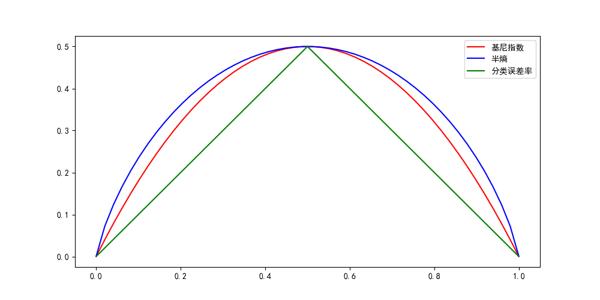
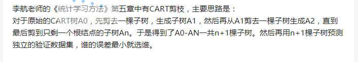
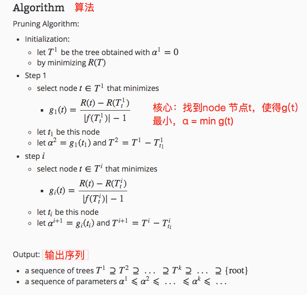
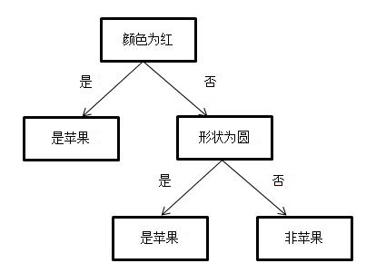
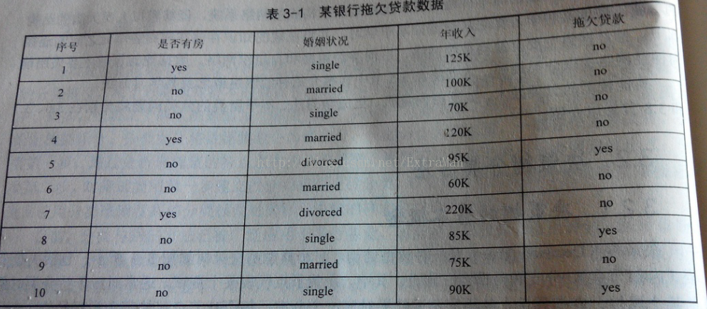
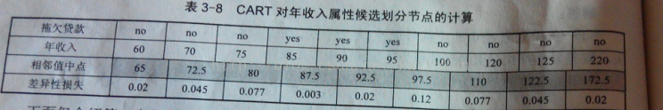
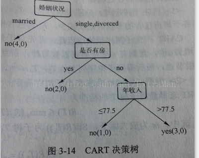
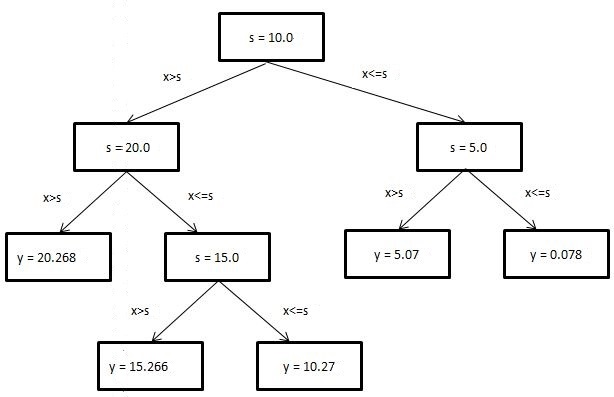

# CART（Classification And Regression Tree）
[链接](https://www.ibm.com/developerworks/cn/analytics/library/machine-learning-hands-on5-cart-tree/index.html)

**ID3 和 C4.5** 决策树,它们利用**信息增益和信息增益比**划分数据集。但是这两种决策树是有缺陷的，即按某特征划分后，该**特征将不会在后面的划分中出现**。这就导致了划分过于迅速，从而影响分类结果。在这篇文章中将要介绍的 CART（Classification And Regression Tree）树，即**分类回归树利用二分策略，有效地避免了划分过于迅速这一问题**。而且二分策略可以直接处理连续型属性值。

CART 树（分类回归树）分为分类树和回归树。顾名思义，分类树用于处理分类问题；回归树用来处理回归问题。我们知道分类和回归是机器学习领域两个重要的方向。分类问题输出特征向量对应的分类结果，回归问题输出特征向量对应的预测值。

分类树和 ID3、C4.5 决策树相似，都用来处理分类问题。**不同之处是划分方法**。分类树利用基尼指数进行二分。

基尼指数：表示两类之间的差异度(算法主要是特征下的基尼系数)，同信息增益、信息增益比作用类似，不过基尼指数相对更快(没有对数运算)

## Gini 系数与熵的关系

$$\left\{\begin{array}{l}
H(X)=-\sum_{k=1}^{K} p_{k} \ln p_{k} \\
\operatorname{Gini}(X)=\sum_{k=1}^{K} p_{k}\left(1-p_{k}\right)
\end{array}\right.$$

将 f(x)=−lnx 在 x=1 处进行一阶泰勒展开（忽略高阶无穷小）：
$$\begin{aligned}
f(x) &=f\left(x_{0}\right)+f^{\prime}\left(x_{0}\right)\left(x-x_{0}\right)+o(\cdot) \\
&=f(1)+f^{\prime}(1)(x-1)+o(\cdot) \\
&=1-x
\end{aligned}$$
因此，熵可近似转化为：
$$\begin{aligned}
H(X)=&-\sum_{k=1}^{K} p_{k} \ln p_{k}=\sum_{k=1}^{K} p_{k}\left(-\ln p_{k}\right) \\
& \simeq \sum_{k=1}^{K} p_{k}\left(1-p_{k}\right)=\operatorname{Gini}(X)
\end{aligned}$$
也就是说：基尼指数是信息熵中$﹣logP$在$P=1$处**一阶泰勒展开**后的结果！所以两者都可以用来度量数据集的纯度，用于描述决策树节点的纯度！

熵计算复杂些，所以对其用泰勒公式一阶近似得到基尼指数计算方法，**基尼指数对应的是熵**。所以信息增益(ID3)H(D)-H(D|A)应该对应基尼增益G(D)-G(D|A),这也是为何基尼指数G(D|A)要选小的，因为选小的G(D|A)才对应基尼增益最大，等同于信息增益最大。同理，用**信息增益选择也可以换成选择熵H(D|A)最小那个**。

基尼系数代表了模型的不纯度，基尼系数越小，则不纯度越低，这里与经典决策树的概念相似，都是统计分类下的样本纯度，而熵度量了事物的不确定性，信息增益度量了在知道Y以后X剩下的不确定性

误分类误差（Classification error）:
$$\phi(p, 1-p)=1-\max (p, 1-p)$$
关于分类误差率，这里你说的应该是二分类时候的分类误差率。此时当某特征对应的正类概率p为0或者1时，分类误差为0，所以你可以看到图中那个三角形的两个下面的顶点。而当p从0-0.5移动时，从负例的角度看，负例正例的分类误差率线性增大。而当p从0.5-1移动时，从正例的角度看，正例负例的分类误差概率线性从0.5-0。在上面的顶点处，意味着，对应某特征，对应的正例和负例各占50%，则分类误差率也是50%

```python
import numpy as np
from matplotlib import pyplot as plt 
import matplotlib as mpl
mpl.rcParams['font.sans-serif'] = ['simHei']
mpl.rcParams['axes.unicode_minus'] = False
 
p = np.linspace(0.0001, 0.9999 ,50)
Gini = 2 * p * (1-p)
H = (-p * np.log2(p) - (1 - p) * np.log2(1 - p))/2.0
x1 = np.linspace(0,0.5,50)
y1 = x1
x2 = np.linspace(0.5,1,50)
y2 = 1- x2
 
plt.figure(figsize=(10,5))
plt.plot(p, Gini, 'r-', label='基尼指数')
plt.plot(p, H, 'b-', label='半熵')
plt.plot(x1, y1, 'g-', label='分类误差率')
plt.plot(x2, y2, 'g-')
plt.legend()
plt.xlim(-0.01, 1.01)
plt.ylim(0, 0.51)
plt.show()
```
# CART分类树算法对于连续特征和离散特征处理的改进

对于CART分类树连续值的处理问题，其思想和C4.5是相同的，都是将连续的特征离散化。唯一的区别在于在选择划分点时的度量方式不同，C4.5使用的是信息增益比，则CART分类树使用的是基尼系数。

具体的思路如下，比如m个样本的连续特征A有m个，从小到大排列为${a_1,a_2,...,a_m}$,则CART算法取相邻两样本值的平均数，一共取得m-1个划分点，其中第i个划分点$T_i表示$为：$T_i = \frac{a_i+a_{i+1}}{2}$。对于这m-1个点，分别计算以该点作为二元分类点时的基尼系数。选择基尼系数最小的点作为该连续特征的二元离散分类点。比如取到的基尼系数最小的点为$a_t$,则小于$a_t$的值为类别1，大于$a_t$的值为类别2，这样我们就做到了连续特征的离散化。要注意的是，与ID3或者C4.5处理离散属性不同的是，如果当前节点为连续属性，则该属性后面还可以参与子节点的产生选择过程。

对于CART分类树离散值的处理问题，采用的思路是不停的二分离散特征。

回忆下ID3或者C4.5，如果某个特征A被选取建立决策树节点，如果它有A1,A2,A3三种类别，我们会在决策树上一下建立一个三叉的节点。这样导致决策树是多叉树。但是CART分类树使用的方法不同，他采用的是不停的二分，还是这个例子，CART分类树会考虑把A分成$\{A1\}和\{A2,A3\}$, $\{A2\}和\{A1,A3\}$, $\{A3\}和\{A1,A2\}$三种情况，找到基尼系数最小的组合，比如$\{A2\}和\{A1,A3\}$,然后建立二叉树节点，一个节点是A2对应的样本，另一个节点是{A1,A3}对应的节点。同时，由于这次没有把特征A的取值完全分开，后面我们还有机会在子节点继续选择到特征A来划分A1和A3。这和ID3或者C4.5不同，在ID3或者C4.5的一棵子树中，离散特征只会参与一次节点的建立。

# CART分类树建立算法的具体流程

上面介绍了CART算法的一些和C4.5不同之处，下面我们看看CART分类树建立算法的具体流程，之所以加上了建立，是因为CART树算法还有独立的剪枝算法这一块，这块我们在第5节讲。

算法输入是训练集D，基尼系数的阈值，样本个数阈值。

输出是决策树T。

我们的算法从根节点开始，用训练集递归的建立CART树。

1) 对于当前节点的数据集为D，如果样本个数小于阈值或者没有特征，则返回决策子树，当前节点停止递归。

2) 计算样本集D的基尼系数，如果基尼系数小于阈值，则返回决策树子树，当前节点停止递归。

3) 计算当前节点现有的各个特征的各个特征值对数据集D的基尼系数，对于离散值和连续值的处理方法和基尼系数的计算见第二节。缺失值的处理方法和上篇的C4.5算法里描述的相同。

4) 在计算出来的各个特征的各个特征值对数据集D的基尼系数中，选择基尼系数最小的特征A和对应的特征值a。根据这个最优特征和最优特征值，把数据集划分成两部分D1和D2，同时建立当前节点的左右节点，做节点的数据集D为D1，右节点的数据集D为D2.

5) 对左右的子节点递归的调用1-4步，生成决策树。

　　　

对于生成的决策树做预测的时候，假如测试集里的样本A落到了某个叶子节点，而节点里有多个训练样本。则对于A的类别预测采用的是这个叶子节点里概率最大的类别。
# CART回归树建立算法

CART回归树和CART分类树的建立算法大部分是类似的，所以这里我们只讨论CART回归树和CART分类树的建立算法不同的地方。

首先，我们要明白，什么是回归树，什么是分类树。两者的区别在于样本输出，如果样本输出是离散值，那么这是一颗分类树。如果果样本输出是连续值，那么那么这是一颗回归树。

除了概念的不同，CART回归树和CART分类树的建立和预测的区别主要有下面两点：

1)连续值的处理方法不同

2)决策树建立后做预测的方式不同。

对于连续值的处理，我们知道**CART分类树采用的是用基尼系数**的大小来度量特征的各个划分点的优劣情况。这比较适合分类模型，但是对于**回归模型，我们使用了常见的和方差**的度量方式，CART回归树的度量目标是，对于任意划分特征A，对应的任意划分点s两边划分成的数据集D1和D2，求出使D1和D2各自集合的均方差最小，同时D1和D2的均方差之和最小所对应的特征和特征值划分点。表达式为：

$$\underbrace{min}_{A,s}\Bigg[\underbrace{min}_{c_1}\sum\limits_{x_i \in D_1(A,s)}(y_i - c_1)^2 + \underbrace{min}_{c_2}\sum\limits_{x_i \in D_2(A,s)}(y_i - c_2)^2\Bigg]$$

其中，$c_1$为D1数据集的样本输出均值，$c_2$为D2数据集的样本输出均值。

对于决策树建立后做预测的方式，上面讲到了**CART分类树采用叶子节点里概率最大的类别作为当前节点的预测类别**。而回归树输出不是类别，它采用的是用最终**叶子的均值或者中位数**来预测输出结果。

除了上面提到了以外，CART回归树和CART分类树的建立算法和预测没有什么区别。

# CART树算法的剪枝

CART回归树和CART分类树的剪枝策略除了在度量损失的时候一个使用均方差，一个使用基尼系数，算法基本完全一样，这里我们一起来讲。

由于决策时算法很容易对训练集过拟合，而导致泛化能力差，为了解决这个问题，我们需要对CART树进行剪枝，即类似于线性回归的正则化，来增加决策树的泛化能力。但是，有很多的剪枝方法，我们应该这么选择呢？CART采用的办法是后剪枝法，即先生成决策树，然后产生所有可能的剪枝后的CART树，然后使用交叉验证来检验各种剪枝的效果，选择泛化能力最好的剪枝策略。

也就是说，CART树的剪枝算法可以概括为两步，第一步是从原始决策树生成各种剪枝效果的决策树，第二部是用交叉验证来检验剪枝后的预测能力，选择泛化预测能力最好的剪枝后的数作为最终的CART树。

首先我们看看剪枝的损失函数度量，在剪枝的过程中，对于任意的一刻子树T,其损失函数为：

$$C_{\alpha}(T_t) = C(T_t) + \alpha |T_t|$$

其中，$\alpha$为正则化参数，这和线性回归的正则化一样。$C(T_t)$为训练数据的预测误差，分类树是用基尼系数度量，回归树是均方差度量。$|T_t|$是子树T的叶子节点的数量。

当$\alpha = 0$时，即没有正则化，原始的生成的CART树即为最优子树。当$\alpha = \infty$时，即正则化强度达到最大，此时由原始的生成的CART树的根节点组成的单节点树为最优子树。当然，这是两种极端情况。一般来说，$\alpha$越大，则剪枝剪的越厉害，生成的最优子树相比原生决策树就越偏小。**对于固定的$\alpha$，一定存在使损失函数$C_{\alpha}(T)$最小的唯一子树**。

[参考链接](https://blog.csdn.net/wjc1182511338/article/details/76793164)

## 验证集剪枝
[链接](https://www.zhihu.com/question/22697086)


## 训练集交叉验证剪枝
看过剪枝的损失函数度量后，我们再来看看剪枝（基于已剪枝决策树的剪枝）的思路，对于位于节点t的任意一颗子树$T_t$（自下往上去掉非叶子节点形成），**$C(T_t)$表示子树$|T_t|$里$|T_t|$个叶子节点的预测误差**。如果没有剪枝，它的损失是

$$C_{\alpha}(T_t) = C(T_t) + \alpha |T_t|$$

如果将其剪掉，仅仅保留根节点，则损失是

$$C_{\alpha}(t) = C(t) + \alpha$$　

当$\alpha = 0$或者$\alpha$很小时，$C_{\alpha}(T_t) < C_{\alpha}(T)$ , 当$\alpha$增大到一定的程度时$C_{\alpha}(T_t) = C_{\alpha}(T)$。**当$\alpha$继续增大时不等式反向（相当于减掉这个节点更优）**，也就是说，如果满足下式：

$$\alpha = \frac{C(t)-C(T_t)}{|T_t|-1}$$

$T_t$和$T$有相同的损失函数，但是$T$节点更少，因此可以对子树$T_t$进行剪枝，也就是将它的子节点全部剪掉，变为一个叶子节点$T$。

最后我们看看CART树的交叉验证策略。上面我们讲到，可以计算出每个子树是否剪枝的阈值$\alpha$，如果我们把所有的节点是否剪枝的值$\alpha$都计算出来，然后分别针对不同的$\alpha$所对应的剪枝后的最优子树做交叉验证。这样就可以选择一个最好的$\alpha$，有了这个$\alpha$，我们就可以用对应的最优子树作为最终结果。

好了，有了上面的思路，我们现在来看看CART树的剪枝算法。

输入是CART树建立算法得到的原始决策树$T$。

输出是最优决策子树$T_\alpha$。

算法过程如下：

1）初始化$\alpha_{min}= \infty$， 最优子树集合$\omega=\{T\}$。

2）从叶子节点开始**自下而上**计算各内部节点t的训练误差损失函数$C_{\alpha}(T_t)$（回归树为均方差，分类树为基尼系数）, 叶子节点数$|T_t|$，以及正则化阈值$\alpha= min\{\frac{C(T)-C(T_t)}{|T_t|-1}, \alpha_{min}\}$, 更新$\alpha_{min}= \alpha$

3）得到所有节点的$\alpha$值的集合M。


4）从M中选择最小的值$\alpha_k$，**自上而下的访问子树t（以t为根节点？之前$T_t$为去掉子树t的子树）的内部节点**，如果$\frac{C(t)-C(T_t)}{|T_t|-1} \leq \alpha_k$时，进行剪枝。并决定叶节点t的值。如果是分类树，则是概率最高的类别，如果是回归树，则是所有样本输出的均值。这样得到$\alpha_k$对应的最优子树$T_k$（一一对应，$T_k$可能有很多剪枝，之前$T_t$只有t节点变为叶子节点，意义不同）

5）最优子树集合$\omega=\omega \cup T_k$， $M= M -\{\alpha_k\}$。

6） 如果M不为空，则回到步骤4。否则就已经得到了所有的可选最优子树集合$\omega$.

7） 采用交叉验证在$\omega$选择最优子树$T_\alpha$
   
# CART算法小结

上面我们对CART算法做了一个详细的介绍，CART算法相比C4.5算法的分类方法，采用了简化的二叉树模型，同时特征选择采用了近似的基尼系数来简化计算。当然CART树最大的好处是还可以做回归模型，这个C4.5没有。下表给出了ID3，C4.5和CART的一个比较总结。希望可以帮助大家理解。

算法 |	支持模型 |	树结构 |	特征选择 |	连续值处理 |	缺失值处理 |	 剪枝
--|:--|:--|:--|:--|:--|:--|:--|:--
ID3 |	分类 |	多叉树 |	信息增益 |	不支持 	| 不支持 	| 不支持
C4.5 |	分类 |	多叉树 |	信息增益比 |	支持 |	 支持 |	 支持
CART |	分类，回归| 	二叉树 |	基尼系数，均方差 |	支持 	| 支持 	| 支持

# 缺点

1）应该大家有注意到，无论是ID3, C4.5还是CART,在做特征选择的时候都是选择最优的一个特征来做分类决策，但是大多数，分类决策不应该是由某一个特征决定的，而是应该由一组特征决定的。这样决策得到的决策树更加准确。这个决策树叫做多变量决策树(multi-variate decision tree)。在选择最优特征的时候，多变量决策树不是选择某一个最优特征，而是选择最优的一个特征线性组合来做决策。这个算法的代表是OC1，这里不多介绍。

2）如果样本发生一点点的改动，就会导致树结构的剧烈改变。这个可以通过集成学习里面的随机森林之类的方法解决。（若样本的分布改变，会影响树的生成）
　　　
# 决策树算法小结

终于到了最后的总结阶段了，这里我们不再纠结于ID3, C4.5和 CART，我们来看看决策树算法作为一个大类别的分类回归算法的优缺点。这部分总结于scikit-learn的英文文档。

## 优点：

1）简单直观，生成的决策树很直观。

2）基本不需要预处理，不需要提前归一化，处理缺失值。

3）使用决策树预测的代价是$O(log_2m)$。 m为样本数。

4）既可以处理离散值也可以处理连续值。很多算法只是专注于离散值或者连续值。

5）可以处理多维度输出的分类问题。

6）相比于神经网络之类的黑盒分类模型，决策树在逻辑上可以得到很好的解释

7）可以交叉验证的剪枝来选择模型，从而提高泛化能力。

8） 对于异常点的容错能力好，健壮性高。

## 缺点:

1）决策树算法非常容易过拟合，导致泛化能力不强。可以通过设置节点最少样本数量和限制决策树深度来改进。

2）决策树会因为样本发生一点点的改动，就会导致树结构的剧烈改变。这个可以通过集成学习之类的方法解决。

3）寻找最优的决策树是一个NP难的问题，我们一般是通过启发式方法，容易陷入局部最优。可以通过集成学习之类的方法来改善。

4）有些比较复杂的关系，决策树很难学习，比如异或。这个就没有办法了，一般这种关系可以换神经网络分类方法来解决。

5）如果某些特征的样本比例过大，生成决策树容易偏向于这些特征。这个可以通过调节样本权重来改善。

# 分类树
## 二分

分类树利用二分划分数据。将**特征值等于切分点值的数据划分为左子树**，将特征值不等于切分点值的数据划分为右子树。

假设有 $N$ 个类，样本属于第 $n$ 类的概率为 $P_n$,则基尼指数为：

$$\operatorname{Gini}(\mathrm{P})=\sum_{n=1}^{N} p_{n}\left(1-p_{n}\right)$$

$$\operatorname{Gini}(p)=\sum_{k=1}^{K} p_{k}\left(1-p_{k}\right)=1-\sum_{k=1}^{K} p_{k}^{2}$$

若数据集按特征 A 取值是否等于切分点值划分为 D1 和 D2 两部分，则**在特征 A 下，集合 D 的基尼指数**为：
$$\operatorname{Gini}(D, A)=\frac{\left|D_{1}\right|}{D} G \operatorname{ini}\left(D_{1}\right)+\frac{\left|D_{2}\right|}{D} G \operatorname{ini}\left(D_{2}\right)$$



## 实例
### 二分类
#### 特征二分
圆的|红的|分类
--|:--:|--:
1 |	1 |	1
1 |	0 |	0
0 |	1 |	0
0 |	0 |	0
1 |	0 |	0 

选择最优特征

$$\operatorname{Gini}(D, A)=\frac{\left|D_{1}\right|}{D} G \operatorname{ini}\left(D_{1}\right)+\frac{\left|D_{2}\right|}{D} G \operatorname{ini}\left(D_{2}\right)$$

- 按特征"圆的" = 1 划分数据集，则 Gini 为：

  Gini(D, 圆的)=3/5 * Gini(D1) + 2/5 * Gini(D0)

    = 3/5 * [1/3 * 2/3 + 2/3 * 1/3] + 2/5 * [0]

    = 0.266

- 按特征"红的" = 1 划分数据集，则 Gini 为：

  Gini(D, 红的)=2/5 * Gini(D1) + 3/5 * Gini(D0)

    = 2/5 * [1/2 * 1/2 + 1/2 * 1/2] + 3/5 * [0]

    = 0.2

综上所述，Gini(D, 圆的)>Gini(D, 红的)，"红的"纯度更高，所以特征"红的" = 1 为切分点。

按最优特征划分数据集

按特征"红的"划分数据集后，有两种情况，第一种为如果是红的:0,则分类:0; 第二种为如果是红的:1, 则有如下数据子集 {圆的:1,分类：1; 圆的:0, 分类:0}

接下来需要对数据子集{圆的:1,分类：1; 圆的:0, 分类:0}继续划分。由于剩下一个特征，故按特征"圆的"划分数据集。划分后，如果是圆的:1，则分类:1；如果是圆的:0, 则分类:0。

返回的决策树为：

{'红的': {0: '类别 0', 1: {'圆的': {0: '类别 0', 1: '类别 1'}}}}

#### 特征属性多分和连续特征

[链接](https://blog.csdn.net/ExtraMan/article/details/41744003)



label：拖欠贷款{yes，no}

选择特征：

$$\operatorname{Gini}(D, A)=\frac{\left|D_{1}\right|}{D} G \operatorname{ini}\left(D_{1}\right)+\frac{\left|D_{2}\right|}{D} G \operatorname{ini}\left(D_{2}\right)$$
1. A="是否有房"
   $$G(D, A) =\frac{7}{10} \mathrm{X}\left(1-\left(\frac{3}{7}\right)^{2}-\left(\frac{4}{7}\right)^{2}\right)-\frac{3}{10} \mathrm{X} 0=0.343$$

- 特征属性多分：
2. 属性婚姻状况有三个可能的取值{married，single，divorced}，分别计算划分后的超{married}/{single,divorced},{single}/{married,divoeced},{divorced}/{single,married}的基尼系数
   - B1={married}/{single,divorced}
     $$G(D,B1)=\frac{4}{10} \times 0-\frac{6}{10} \times\left(1-\left(\frac{3}{6}\right)^{2}-\left(\frac{3}{6}\right)^{2}\right)=0.3$$

   - B2={single}/{married,divoeced}
     $$G(D,B2)=\frac{4}{10} \times 0.5-\frac{6}{10} \times\left(1-\left(\frac{1}{6}\right)^{2}-\left(\frac{5}{6}\right)^{2}\right)=0.367$$

   - B3={divorced}/{single,married}
     $$G(D,B3)=\frac{2}{10} \times 0.5-\frac{8}{10} \times\left(1-\left(\frac{2}{8}\right)^{2}-\left(\frac{6}{8}\right)^{2}\right)=0.4$$
- 连续特征：
3. 年收入属性:
   数值型属性，首先需要对数据按升序排序，然后**从小到大一次以相邻值的中间值作为分隔**将样本划分为两组.
   下面仅仅介绍中间值65作为分割点。C1={Sl,Sr},Sl作为年收入小于65的样本，Sr表示年收入大于等于65的样本

   $$G(D,C1)=\frac{1}{10} \times 0-\frac{9}{10} \times\left(1-\left(\frac{6}{9}\right)^{2}-\left(\frac{3}{9}\right)^{2}\right)==0.4$$
   相邻值中点| 65 | 72.5 | 80 | 87.5 | 92.5 | 97.5 | 110 | 122.5 | 172.5
   --|:--:|--:|--:|--:|--:|--:|--:|--:|--:
   基尼系数 | 0.4 | 0.375 | 0.343 | 0.417 | 0.4 | 0.3 | 0.343 | 0.375 | 0.4
   
   

基尼系数最小为0.3：婚姻状况B1和年收入属性（C6=97.5）选取首先出现的属性婚姻状况B1作为第一次划分



# 回归树

## 二分

回归树也利用二分划分数据。与分类树不同的是，回归树将**特征值大于切分点值的数据划分为左子树**，将特征值小于等于切分点值的数据划分为右子树。

## 平方误差

不同于分类树，回归树用平方误差选择切分点。若数据集按特征取值是否大于切分点值划分为两部分，则在特征 A 下，集合 D 的平方误差为：
$${ err }=\Sigma\left(y_{1}-\overline{y_{1}}^{2}\right)+\Sigma\left(y_{2}-\overline{y_{2}}\right)^{2}$$



## 实例
### 离散特征

面积/平米|	价格/万
--|:--:
20 |	40.1
21 |	40.3
35 |	70.4
36 |	70.2 

选择最优特征
$${ err }=\Sigma\left(y_{1}-\overline{y_{1}}^{2}\right)+\Sigma\left(y_{2}-\overline{y_{2}}\right)^{2}$$

1. 按特征"面积" = 20 划分数据集，

   y1 均值为 40.1，

   y2 均值为(40.3 + 70.4 + 70.2) / 3 = 60.3,

   则平方误差为：

   0 + （40.3 – 60.3）2 + （70.4 – 60.3）2 +（70.2 – 60.3）2

   = 600.02

2. 按特征"面积" = 21 划分数据集，则平方误差为：

   y1 均值为(40.1 + 40.3)/ 2 = 40.2，

   y2 均值为(70.4 + 70.2) / 2 = 70.3,

   则平方误差为：

   （40.1 –40.2）2 + （40.3 –40.2）2 + （70.4 –70.3）2 +（70.2 –70.3）2

   = 0.04

3. 按特征"面积" = 35 划分数据集，则平方误差为：

   y1 均值为(40.1 + 40.3 + 70.4) / 3 = 50.27，

   y2 均值为 70.2,

   则平方误差为：

   （40.1 –50.27）2 + （40.3 –50.27）2 +（70.4 –50.27）2 + 0

   = 608.05

综上所述，由于按特征"面积" = 21 比特征"面积" = 20"、面积" = 35 划分的平方误差小，所以特征"面积" = 21 为切分点。

按最优特征划分数据集

- 以特征"面积" = 21 为切分点，将数据切分为{面积 = 20,价格 = 40.1; 面积 = 21, 价格 = 40.3}， {面积 = 35,价格 = 70.4; 面积 = 36, 价格 = 70.2}两个子集。其中子集{面积 = 20,价格 = 40.1; 面积 = 21, 价格 = 40.3}的目标变量非常接近，故不继续划分，得叶节点值(40.1 + 40.3) / 2 = 40.2； 同理得子集{面积 = 35,价格 = 70.4; 面积 = 36, 价格 = 70.2}的叶节点值为 (70.4 + 70.2) / 2 = 70.3。