# 从隐马尔科夫到条件随机场
[链接](https://anxiang1836.github.io/2019/11/05/NLP_From_HMM_to_CRF/#HMM-VS-MEMM)

> 在监督学习下，分类是非常经典的一类问题，也是在实际当中遇到的最多一类任务。
>
> 下面对于整个分类模型的相关知识点进行一个贯连，作为学习条件随机场（CRF）的前序导引知识。
>
> 笔记整理自：Bilibili站上[shuhuai008](https://space.bilibili.com/97068901)强势手推讲解的[白板推导CRF系列课程](https://www.bilibili.com/video/av34444816/?p=1)，课程质量很高！

# 前序知识串联
--------------------------------------------

对于解决分类任务的模型，我们可以将其划分为硬模型和软模型。

-   **硬模型**：即为输出即为确值（对于二分类就是0 or 1）

    -   **SVM（支持向量机）**：最大支持向量的几何间隔驱动的；
    -   **PLA（感知机模型）**：误分类驱动的，$f(w)=sign(w^Tx+b)$。
-   **软模型**：即为输出是概率，这里可以再进一步细分为：

    -   **概率生成模型**。是对$P(X,Y)$进行建模。

        -   **朴素贝叶斯（Naive Bayes）**，朴素贝叶斯这里之所以叫“朴素”，是因为这里做了一个比较强的假设，即$x_i \perp x_j|y （i \ne j）$，就是在给定y的情况下，$x_i$与$x_j$是相互独立的，因此可以简写NB假设为：$P(X|y=1/0)=\prod P(x_i|y=1/0)$

        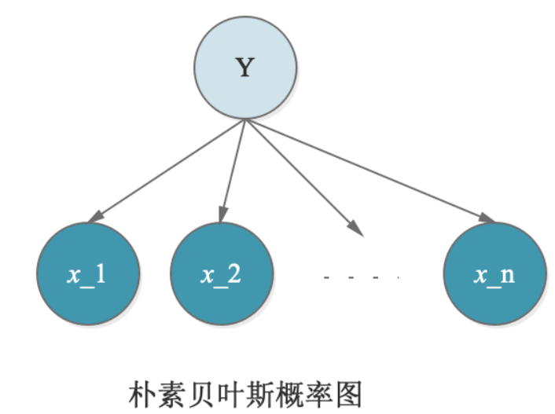

        如上，用概率图表示NB模型，这里就是也是可以解释道：由于$x_2$与$x_1$间受到$Y$的阻隔，因此，在给定y的情况下，$x_i$与$x_j$是相互独立的。

        - **隐马尔科夫（Hidden MarkovModel）**，当朴素贝叶斯模型中的Y从0/1扩展到Seq(序列)，那么，模型便扩展为了隐马尔科夫模型（HMM）。这里面也有2个假设：

            1.  齐次Markov假设
            2.  观测独立假设

            

    -   **概率判别模型**：是对$P(Y|X)$进行建模。

        例如：逻辑回归（Logistics Regression）/SoftMax
        Regression。这类问题是对于$P(y|x)$进行建模的，利用最大熵思想（Maximum Entropy Model）驱动模型。（PS：在最大熵原则下，如果给定均值和方差，那么Gaussian Dist熵最大）

        -   **MEMM（Maximum Entropy Markov  Model）最大熵马尔科夫模型**。这是结合了最大熵+HMM的优点的一个模型，属于概率判别模型。概率图模型如下：

        

        PS：这与HMM的模型有点像，但是区别在于：

        1.  HMM是生成模型，是对$P(X,Y)$进行建模；MEMM是判别模型，是对$P(Y|X)$进行建模；
        2.  在HMM中，观测变量是隐变量的输出；在MEMM中，观测变量变成输入了；
        3.  HMM中是有观测独立假设的；在MEMM中，并不是观测独立的（直观理解：在词性标注任务上，给$x_2$标注的词性$y_2$并不单单与$x_2$有关，也与上下文$x_1$、$x_3$有关，因此假设更加合理。

        MEMM的著名问题（缺点）：

        Label Bias Problem（标注偏差问题）：原因是因为局部归一化。

        -   **CRF（Condition Random Field）条件随机场模型**。为了打破MEMM的标注偏差问题，将MEMM中的有向变成了无向，解决了局部归一化问题，变成了**全局归一化**。

        

# HMM VS MEMM

## HMM模型理解

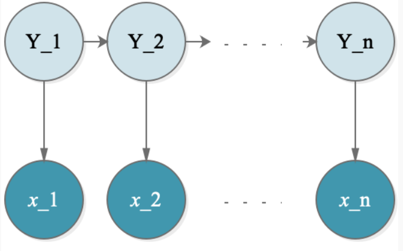

HMM可以理解为是泛化的GMM、或是泛化的NB模型。其是属于一个概率生成模型。模型参数可以用一个三元组表示：
$$\lambda = (\pi,A,B)$$
其中：$\pi$表示初始状态；$A$表示状态转移矩阵（就是$Y_t$转移到$Y_{t+1}$的概率）；$B$表示发射矩阵（就是$Y$“射”到$X$的概率）

HMM具有2个假设，（1）齐次1阶马尔科夫；（2）观测独立假设。下面对着两个强假设进行加以解释说明：

1.  **齐次1阶马尔科夫**

    > 1阶怎么理解？

    在马尔科夫链$\{y_1,y_2,…,y_n\}$中：

    1阶Markov的通俗理解：$y_3$只与$y_2$有关，$y_2$只与$y_1$有关；

    1阶Markov更专业表述：在给定$y_3$的情况下，$y_4$与$y_2$无关。

    之所以说是1阶，也就是关联链条的长度为1；如果是2阶的话，那就是在给定$y_3$和$y_4$的情况下，$y_5$与$y_2$是无关的。

    1阶Markov的目的是简化计算，因为计算链条变短了。

    > 齐次怎么理解？

    就是在马尔科夫链$\{y_1,y_2,…,y_n\}$中，马氏链中的任意$y_t$转移到$y_{t+1}$所服从的概率分布是相同的，这个就叫做齐次。

    （PS：在链中的任意节点$y_t$，其取值有$K$多种可能且都是离散的，这里所说的相同的概率分布：是指这$K$种不同状态之间相互转移的概率，这个是相同不变的）

    用标准化的语言来说：$P(y_t|y_{t+1})$这个转移概率与时间$t$无关。

    齐次1阶Markov用数学表达可以表示成：
    $$P(y_t|y_{1:t-1},x_{1:t-1})=P(y_t|y_{t-1})$$

2.  **观测独立假设**

    用通俗的表述可以理解为：在给定$Y_t$的情况下，$X_t$与其他的$X_k(k \ne t)$全都无关。

    用数学表达可以表示成：
    $$P(x_t|y_{1:t},x_{1:t-1})=P(x_t|y_t)$$

    观测独立假设的目的还是简化计算，因为不考虑观测序列的内联关系了。

    观测独立假设的来源，其实算得上是从NB上扩展来的（因为HMM算是NB的泛化嘛，[Y从0/1扩展到Seq]）。例如，判断一个邮件是否为垃圾邮件，经典NB模型解决的垃圾邮件分类问题。

    这里我们就做的假设是：每个单词之间是相互独立，当然这个假设是不太合理的，因为一句话中的词语肯定是有着一定语言学上的内在联系的。

## HMM建模

在概率图模型圈出最小单元，如上图所示：（可以很明显看出的是观测独立假设哈），这样根据这个最小单元，我们就很容易可以写出HMM的建模数学表示。

建模对象为：$P(X,Y|\lambda)$——注意：生成模型建模的是**联合概率分布**
$$\begin{aligned}
    P(X,Y|\lambda) &= \prod_{t=1}^{T} P(x_t,y_t|\lambda)\\
                   &= \prod_{t=1}^{T} P(y_t|y_{t-1},\lambda) \bullet 
                                      P(x_t|y_t,\lambda)
\end{aligned}$$

## HMM示例

这里就要带入一个很经典的例子。MaxMa在天气比较晴朗的时候有极大的可能是高兴的，而在下雨的时候有一定可能是郁闷的。**而现在我们要做的就是根据MaxMa的心情情况来猜测当前的天气信息。**

转自：[https://oldpan.me/archives/markov-random-field-deeplearning](https://oldpan.me/archives/markov-random-field-deeplearning)

在这个例子中，我们都需要计算哪些呢？

1.天气的转移概率情况？

2.不同天气导致MaxMa有不同的心情概率情况？

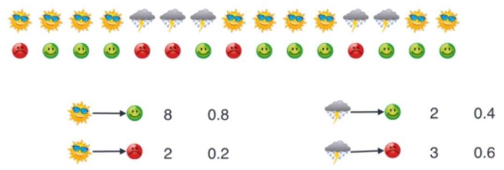

那么，构建HMM（Hidden Markov Model）所需要的概率都计算完了，模型如下。

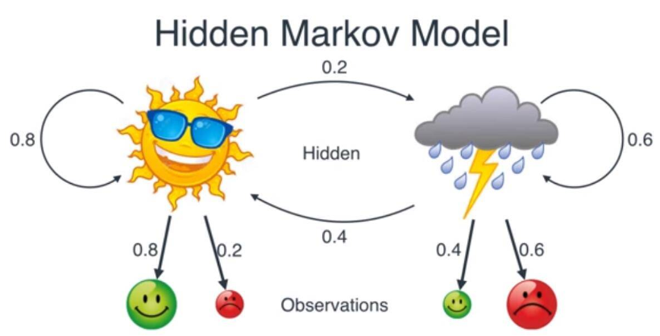

我们要通过观察MaxMa的心情来推测今天的天气。也就是说，**上面的天气变化(晴天变为阴天)是随机变化，MaxMa的心情(由天气导致的心情变化)也是随机变化，整个的过程就是所谓的双重随机过程**。

上面的过程有两个特点：

-   输出（MaxMa的心情）依然只和当前的状态(今天的天气)有关
-   想要计算观察的序列(知道MaxMa连续好多天的心情，推算出最可能的连续几天的天气情况)，只需要依照最大似然概率计算即可

用$O_i$表示观察值（MaxMa的心情），用$S_i$表示中间隐状态（天气状况），概率计算公式为：
$$P(O_1,O_2,...,O_t|S_1,S_2,...,S_t)=P(O_1|S_1)*P(O_2|S_2)*...*P(O_t|S_t)$$
若已知，MaxMa连续2天，第1天心情好，第2天心情不好。第一天的天气为晴天的概率为0.67，那么推测第二天是什么天气？

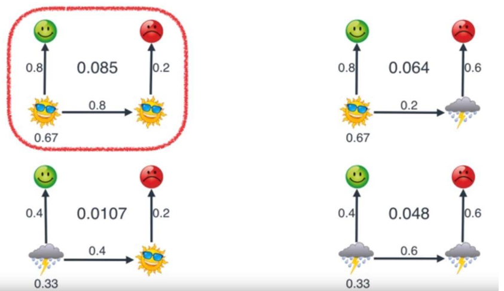

这里用左上的计算过程示例：
$$P(O_1|S_1)*P(O_2|S_2)=(0.67*0.8)*(0.8*0.2)=0.085$$
第一个中的0.67为我们之前谈到的不知道昨天是什么天气猜测为晴天的概率，第二个中的0.8是因为昨天是晴天，所以今天有0.8的概率为晴天。

### MEMM模型理解 {#MEMM模型理解}

MEMM打破了HMM的观测独立假设，那么，我们来看MEMM是怎么打破的，还是画出MEMM的最小单元，如下图。

这图与HMM的最小单元非常相似，唯一的区别在于：对于$X$与$Y$之间的发射箭头进行了反转。这时候我们看：给定$Y_t$，这时候$x_{t-1}$与$x_t$是否还是独立了么？

这是一个显然的”V”字型结构，head-to-head，在给定$Y_t$的q情况下，这时候，$x_{t-1}$与$x_t$这个路径就是个连通的了，所以就不再独立了。

于此同时，这样的处理，模型就不再是一个概率生成模型了，就变成了一个概率判别模型了。

> **补充：概率图模型的3种结构形式**
>
> 转自：[https://zhuanlan.zhihu.com/p/30139208](https://zhuanlan.zhihu.com/p/30139208)
>
> D-Separation是一种用来判断变量是否条件独立的图形化方法。换言之，对于一个DAG(有向无环图)E，D-Separation方法可以快速的判断出两个节点之间是否是条件独立的。
>
> -   **形式1：head-to-head**
>
> 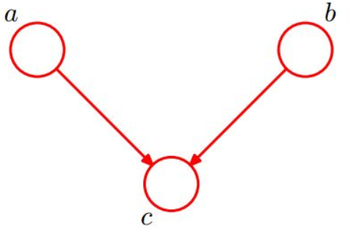
>
> 在**c未知的条件下，a、b被阻断(blocked)，是独立的**。反过来讲，在c已知的条件下，a、b是连通的，不独立。数学表示是：
> $$\begin{aligned}
    P(a,b,c)&= P(a)*P(b)*P(c|a,b)\\
    \sum_c P(a,b,c)&=\sum_c P(a)*P(b)*P(c|a,b)\\
    P(a,b)&=P(a)*P(b)
\end{aligned}$$
>
> -   **形式2：tail-to-tail**
>
> 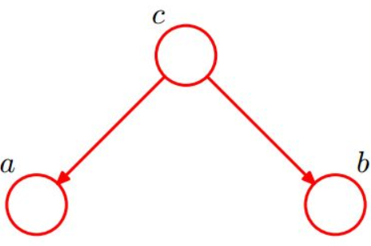
>
> 在**c给定的条件下，a，b被阻断(blocked)，是独立的**。数学表示是：
> $$\begin{aligned}
    P(a,b,c) &= P(c)*P(a|c)*P(b|c) &(1)\\
    P(a,b|c) &= \frac{P(a,b,c)}{P(c)} &(2)\\
    将(1)式带&入到(2)中：\\
    P(a,b|c)&=P(a|c)*P(b|c) &(3)
\end{aligned}$$
>
> -   形式3：head-to-tail
>
> 
>
> 在**c给定的条件下，a，b被阻断(blocked)，是独立的**。数学表示是：
>$$P(a,b,c)=P(a)*P(c|a)*P(b|c)$$
> 化简后可得：
> $$\begin{aligned}
P(a,b|c) &= \frac{P(a,b,c)}{P(c)} &(1)\\
         &= \frac{P(a)*P(c|a)*P(b|c)}{P(c)} &(2)\\
         &= \frac{P(a,c)*P(b|c)}{P(c)} &(3)\\
         &= P(a|c)*P(b|c) &(4)
\end{aligned}$$

## MEMM建模

建模对象：$P(Y|X,\lambda)$——注意：判别模型建模的是**条件概率分布**
$$P(Y|X,\lambda)=\prod_{t=1}^T P(y_t|y_{t-1},x_{1:T},\lambda)$$

## MEMM特点

-   打破了观测独立假设

> Q:为什么打破观测独立假设要好？
>
> 是因为：对于待标注的序列而言，事实上，序列的内容本不是独立的，也就是说，打破观测独立性会使得模型变得更加合理。

-   从生成式模型转到了判别式模型

> Q:为什么说在这里，判别式的模型比生成式模型要好？
>
> 是因为：任务驱动的，在这样的序列标注任务上，在给定一个待标注序列，我们更关注的是标注的是什么，因此，对于这样的任务我们只需要对条件概率建模就足矣了，而去求联合概率分布就将问题复杂化了（计算也复杂化了）。

## MEMM的缺点

这里，把整个输入$X$分成了2个部分，$X=(x_g,x_{1:T})。$即对$Y$的影响分成两个部分：全局的影响+Local的影响。

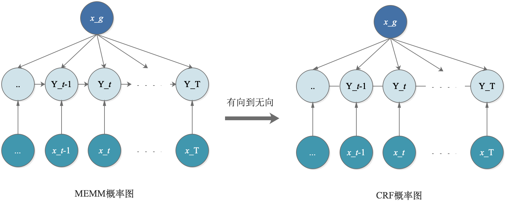

它的主要缺点是会造成Label Bias Problem，（在John Lafferty论文中，指出了MEMM会造成Label Bias Problem问题）。

我们把目标还是放到上文提到的最小单元中，来看一下它里面具有什么问题。

在这个最小单元我们把它当成一个系统，系统从$y_{t-1}$到$y_t$的这样一个转移用数学可以表示成一个函数，是受$y_{t-1}$、$y_t$与$x_t$共同作用的一个函数，系统对外是有一定能量的，这个函数被称为Mass Score，而且是大于0的。但是问题出现在：这个Mass Score被局部归一化了。条件概率熵越小，那么对于观测值的考虑越少（John Lafferty的论文）

为了能够更好地理解它的问题所在，这里举一个比较极端的例子。

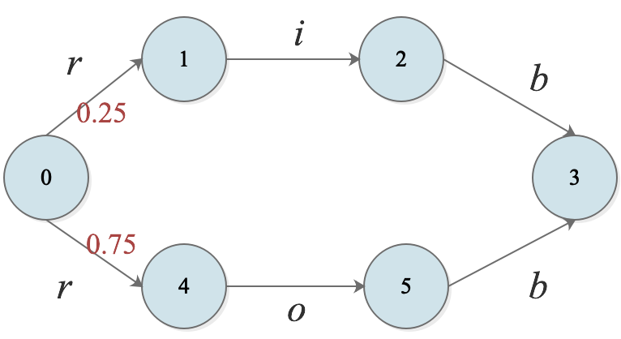

比如，我们训练好了这样的一个模型，现有一个观测序列是$[r,i,b]$。

-   在状态0时，由于$P(4|0)\>P(1|0)$，所以我们选择从$0 \to 4$转移路径；

-   问题出现在了第二步转移上：由于$P(5|4)$=1，是受到了局部归一化的影响，从4状态转移仅有1条路径选择，其转移的条件概率为1，其所具有的熵值为0。

    > 为什么从4状态向5转移的条件概率为1？
    >
    > 正是因为MEMM在每一步转移的概率都是要做**局部归一化**的，也就是说，从4状态向外转移的所有的情况加和要为1，在这里，仅有1中转移情况，所以$P(5|4)=1$

-   在这种情况下，无论观测值为什么，都不会影响$4 \to 5$的转移，但是，这样标注出来的序列$0 \to 4 \to 5 \to 3,[r,o,b]$就与客观事实不符了，这也就是问题的所在。

所以，为了解决局部归一化的问题，CRF取消了$Y$序列的转移方向，也就是取消了局部归一化，改变为了全局归一化。

> 在引入条件随机场（CRF）之前，我们再看一下，有关于随机场的相关概念。
>
> 以下部分概念定义转载自：刘建平老师的[https://www.cnblogs.com/pinard/p/7048333.html](https://www.cnblogs.com/pinard/p/7048333.html)

# 随机场-RF

“随机场”的名字取的很玄乎，其实理解起来不难。随机场是由若干个位置组成的整体，当给每一个位置中按照某种分布（或者是某种概率）随机赋予一个值之后，其全体就叫做随机场。

以词性标注为例：

假如我们有10个词形成的句子需要做词性标注。这10个词每个词的词性可以在我们已知的词性集合(名词，动词…)中去选择。当我们为每个词选择完词性后，这就形成了一个随机场。

# 马尔科夫随机场-MRF

马尔科夫随机场是随机场的特例，它假设随机场中某一个位置的赋值仅仅与和它相邻的位置的赋值有关，和与其不相邻的位置的赋值无关。

换一种表示方式，把马尔科夫随机场映射到无向图中。此无向图中的节点都与某个随机变量相关，连接着节点的边代表与这两个节点有关的随机变量之间的关系。

> 补充1：
>
> **概率无向图模型**(probabilistic undirected graphical model)又称为**马尔科夫随机场(Markov Random Field)**，或者马尔科夫网络。也就是说，两个节点之间并没有明确的前后以及方向关系，两个节点之间存在相互作用，与更远出的点没有关系。
>
> 有向图模型通常被称为信念网络(belief network)或者**贝叶斯网络(Bayesian network)**。
>
> 对于这个我们要稍加区分。

继续词性标注为例：（还是10个词的句子）

如果我们假设所有词的词性仅与和它相邻的词的词性有关时，这个随机场就特化成一个马尔科夫随机场。

比如第3个词的词性除了与自己本身的位置有关外，只与第2个词和第4个词的词性有关。

> 补充2：
>
> MRF常用于图像方面——图像分割。
>
> 图像是一个典型的马尔科夫随机场，在图像中每个点可能会和周围的点有关系有牵连，但是和远处的点或者初始点是没有什么关系的，离这个点越近对这个点的影响越大。
>
> 这个很好理解，图像中这个像素点是黑色的，那个很有可能周围也是黑色的像素，但是并不能够推断出距离这个像素点远的像素点们也是黑色的。
>
> 当然这个附近，也就是这个领域的范围和大小，是由我们自己去决定的。

## MRF因子分解定理
$$\begin{aligned}
P(x)&=\frac{1}{Z}\prod_{i=1}^{K} \psi_i(x_{ci})，x \in \mathbb{R}^{p} &(1)\\
通常&指定\psi函数为指数函数exp,可将式(1)改写为：\\
P(x)&=\frac{1}{Z}\prod_{i=1}^{K} exp[-E_i(x_{ci})]，x \in \mathbb{R}^{p} &(2)\\
\end{aligned}$$
其中，$x$是个联合概率分布，它的维度是$p$维；$\psi$表示势函数；$E$表示能量函数；$K$表示最大团的个数；$c_i$表示第$i$个最大团。

下面对上式子做一个小的变化：
$$\begin{aligned}
P(x)&=\frac{1}{Z}\prod_{i=1}^{K} exp[-E_i(x_{ci})]，x \in \mathbb{R}^{p} &(2)\\
    &=\frac{1}{Z}exp\sum_{i=1}^K F_i(x_{ci})，x \in \mathbb{R}^{p} &(3)
\end{aligned}$$
也就是将$exp$提出来，这样连乘号就变成了连加号了（$e^a\times e^b \times e^c = e^{a+b+c}$）。

> 补充：
>
> Q:什么最大团定义？
>
> 通俗理解：就是在无向图中，任意一个子图中，每个节点都能相互的连通，我们就成这个子图为最大团。
>
> 例如，有4个节点的线性链，$[a — b—c—d]$。在这个线性链中，最大团的个数就是：3个，即为$[a—b],[b—c],[c—d]$。

# 条件随机场-CRF

CRF是马尔科夫随机场的特例，它假设马尔科夫随机场中只有𝑋和𝑌两种变量，𝑋一般是给定的，而𝑌一般是在给定𝑋的条件下我们的输出。这样马尔科夫随机场就特化成了条件随机场。

在我们10个词的句子词性标注的例子中，𝑋是词，𝑌是词性。因此，如果我们假设它是一个马尔科夫随机场，那么它也就是一个CRF。

对于CRF，我们给出准确的数学语言描述：

设$X$与$Y$是随机变量，$P(Y|X)$是给定$X$时$Y$的条件概率分布，若随机变量$Y$构成的是一个马尔科夫随机场，则称条件概率分布$P(Y|X)$是条件随机场。

## 线性链条件随机场-Linear-CRF

注意在CRF的定义中，我们并没有要求𝑋和𝑌有相同的结构。

当𝑋和𝑌有相同结构，即：$X=(x_1,x_2,...,x_T),Y=(y_1,y_2,...,y_T)$

这个时候，𝑋和𝑌有相同的结构的CRF就构成了线性链条件随机场。

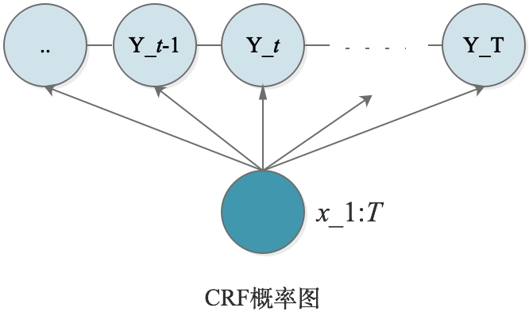

这个就很好理解了，再次回到10个词的句子词性标注问题上。构成句子的词$X$是有10个，要标注的词性$Y$也是有10个，这就是一个标准的linear-CRF。

对于Linear-CRF的数学定义是：

设$X=(x_1,x_2,..,x_t,..,x_T),Y=(y_1,y_2,..,y_t,..,y_T)$均为线性链表示的随机变量序列，在给定随机变量序列$X$的情况下，随机变量$Y$的条件概率分布$P(Y|X)$构成条件随机场，即满足马尔科夫性：
$$P(y_t|X,y_1,y_2,...,y_T)=P(y_t|X,y_{t-1},y_{t+1})$$
则称，$P(Y|X)$为线性链条件随机场。

### Linear-CRF的参数化形式 {#Linear-CRF的参数化形式}

> 首先，我们先从感性的角度来认识一下。

从《MRF因子分解定理》部分的公式(3)出发：
$$\begin{aligned}
P(Y|X) &= \frac{1}{Z} exp\sum_{i=1}^K F_i(x_{ci}) &(1)\\
根据CRF&的概率图表示，我们可以将其实际的节点带入进去，有：\\
P(Y|X) &= \frac{1}{Z} exp\sum_{t=1}^T F(y_{t-1},y_t,x_{1:T}) &(2)
\end{aligned}$$
我们单独看线性链中的最大团，根据下图可以很容易看出，对于序列的第$t$个位置，可以分解上式(2)中的$F(y_{t-1},y_t,x_{1:T})$分解为2个部分，即：$x_{1:T}$对$y_{t}$的影响以及$y_{t-1}$、$y_t$间的影响。数学化表示为：
$$F(y_{t-1},y_t,x_{1:T})=\triangle y_{t},x_{1:T} + \triangle y_{t-1},y_{t},x_{1:T}$$

其中，$\triangle y_t,x_{1:T}$为状态函数，即表示为在$t$位置上的节点$y_t$状态；$\triangle y_{t-1},y_t,x_{1:T}$为转移函数，即表示当前节点$y_t$与上一个节点$y_{t-1}$的相关性。

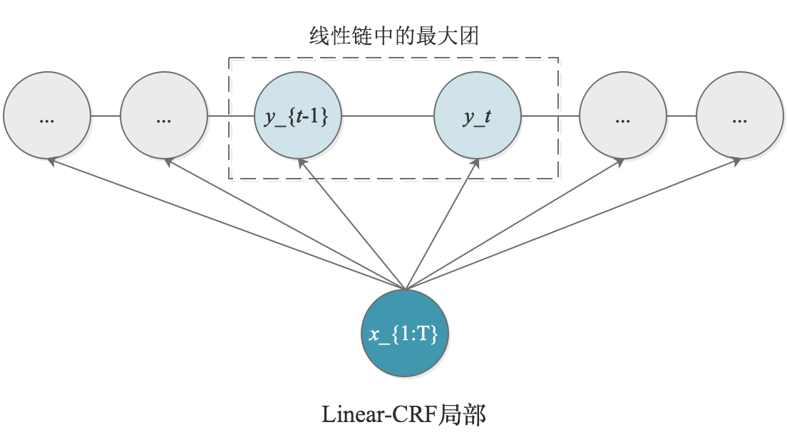

> 然后，我们从更数学一点的角度来重新认识Linear-CRF的参数化形式。

在linear-CRF中，特征函数分为两类（都是指示函数，即取值非0即1）：

1.定义在𝑌节点上的节点特征函数，这类特征函数只和当前节点有关，即为上面的$\triangle y_t,x_{1:T}$：
$$s_l(y_i,X,i),l=1,2,...,L$$
其中$L$是定义在该节点的节点特征函数的总个数，$i$是当前节点在序列的位置。

2.定义在𝑌上下文的局部特征函数，这类特征函数只和当前节点和上一个节点有关，即为上面的$\triangle y_{t-1},y_t,x_{1:T}$：
$$t_k(y_{i-1},y_i,X,i),k=1,2,..,K$$

其中$K$是定义在该节点的局部特征函数的总个数，$i$是当前节点在序列的位置。

> 【理解】之所以只有上下文相关的局部特征函数，没有不相邻节点之间的特征函数，是因为我们的linear-CRF满足马尔科夫性。

**无论是节点特征函数还是局部特征函数，它们的取值只能是0或者1。**即满足特征条件或者不满足特征条件。

同时，我们可以为每个特征函数赋予一个权值，用以表达我们对这个特征函数的信任度。

假设$t_k$的权重系数是$\lambda_k$，$s_l$的权重系数是$\mu_l$，则linear-CRF的参数化形式为：
$$P(Y|X)=\frac{1}{Z(X)}exp \sum_{i=1}^ T 
       \bigg (\sum_{k=1}^K \lambda_k t_k (y_{i-1},y_i,X,i)
       +\sum_{l=1}^L \mu_l s_l (y_i,X,i)\bigg )$$
$Y$表示的是标注序列，是一个列向量，长度为$T$；$X$表示的词语序列，也是一个列向量，长度也为$T$。

其中，$Z(X)$为规范化因子：
$$Z(X)=\sum_Y exp \sum_{i=1}^T 
           \bigg(\sum_{k=1}^K\lambda_k t_k (y_{i-1},y_i,X,i)
           +\sum_{l}^L\mu_l s_l (y_i,X,i)\bigg)$$
### Linear-CRF示例 {#Linear-CRF示例}

这里给出一个小例子，方便更好的直观理解linear-CRF。假设输入的句子是三个词，$X=(x_1,x_2,x_3)$。输出的词性标记为$Y=(y_1,y_2,y_3)$。其中，$\forall y_i \in Y,y_i \in \{1(名词),2(动词)\}$

这里，只取出值为1的特征函数：
$$\begin{aligned}
t_1 &= t_1(y_{i-1}=1,y_i=2,x,i),i=2,3 &\lambda_1=1.0\\
t_2 &= t_2(y_1=1,y_2=1,x,2) &\lambda_2=0.5\\
t_3 &= t_3(y_2=2,y_3=1,x,3) &\lambda_3=1.0\\
t_4 &= t_4(y_1=2,y_2=1,x,2) &\lambda_4=1.0\\
t_5 &= t_5(y_2=2,y_3=2,x,3) &\lambda_5=0.2\\
\\
s_1 &= s_1(y_1=1,x,1) &\mu_1=1.0\\
s_2 &= s_2(y_i=2,x,i),i=1,2 &\mu_2=0.5\\
s_3 &= s_3(y_i=1,x,i),i=2,3 &\mu_3=0.8\\
s_4 &= s_4(y_3=2,x,3) &\mu_4=0.5
\end{aligned}$$
利用上面给出的linear-CRF参数化公式，带入：
$$P(Y|X)\propto exp \sum_{i=1}^{3}\bigg [\sum_{k=1}^{5}\lambda_kt_k(y_{i-1},y_i,X,i)
+\sum_{l=1}^{4}\mu_l s_l(y_i,X,i)\bigg]$$
那么，求标记$(1,2,2)$的非规范化概率？

> PS：非规范化就是不用除$Z(X)$
$$\begin{aligned}
P(y_1=1,y_2=2,y_3=2|x)&\propto exp(\lambda_1+\lambda_5+\mu_1+\mu_2+\mu_4)\\
&\propto exp(3.2)
\end{aligned}$$
> 规范化因子$Z(X)$是考虑到全部的可能标注序列再一起做归一化的。
>
> 比如一个序列中每个位置都有2种词性可能的话，那么，对于长度为3的序列$Y$，词性标注就是有$2^3=8$种可能。把这8种可能的$P(Y|X)$概率做加和，得到的就是规范化因子$Z(X)$。
>
> 这个操作也是CRF不同于MEMM的地方，**全局归一化**哦！！

### Linear-CRF的简化表示 {#Linear-CRF的简化表示}

> 其实从示例也可以看出，特征函数整的有点复杂了，那我要是词性更多，句长更长，那得麻烦到啥程度啊，所以，还是要对特征函数进行整理，统一起来。

#### 数值表示

假设，共有$K=K_1+K_2$个特征函数，其中，$K_1$个局部特征函数$t_k$，$K_2$个节点特征函数$s_l$。我们用1个特征函数$f_k(y_{i-1},y_i,X,i)$来统一表示：
$$f_k(y_{i-1},y_i,X,i)=
\left\{
            \begin{aligned}
                        t_k & (y_{i-1},y_i,X,i) & k &= 1,2,..,K_1\\\\
                        s_l & (y_i,X,i)                 & k &= K_1+l,l=1,2,...,K_2
            \end{aligned}
\right.$$
对$f_k(y_{i-1},y_i,X,i)$在各个序列位置求和得到：
$$f_k(Y,X)=\sum_{i=1}^T f_k(y_{i-1},y_i,X,i)$$
同时也统一$f_k(y_{i-1},y_i,x,i)$对应的权重系数$w_k$：
$$w_k=
\left\{
    \begin{aligned}
        &\lambda_k & k &= 1,2,..,K_1\\\\
        &\mu_l     & k &= K_1+l,l=1,2,...,K_2
    \end{aligned}
\right.$$
这样，Linear-CRF的简化工作就到这里结束啦：
$$P(Y|X)=\frac{1}{Z(X)}exp\sum_{k=1}^K w_kf_k(Y,X)$$
其中，规范化因子：
$$Z(X)=\sum_Y exp\sum_{k=1}^Kw_kf_k(Y,X)$$

#### 向量表示

如果对$f_k(Y,X)$和$w_k$进行向量化表示，$F(Y,X)$和$W$都是$K \times 1$的列向量：
$$W  = 
\left [
 \begin{aligned}
    w_1\\
    w_2\\
    ...\\
    w_K
 \end{aligned}
\right]
F(Y,X) = 
\left[
    \begin{aligned}
   f_1(Y,X)\\
   f_2(Y,X)\\
   .........\\
   f_K(Y,X)
    \end{aligned}
\right]$$
那么Linear-CRF的向量内积形式可以表示为：
$$\begin{aligned}
P_W(Y|X) &= \frac{exp(W \bullet F(Y,X))}{Z(X,W)}\\\\
         &= \frac{exp(W \bullet F(Y,X))}{\sum_Y exp(W \bullet F(Y,X))}
\end{aligned}$$
> 向量化的意义：
>
> 就是为了干掉连加的形式，为后面的训练提供更加合理的计算支持。

### Linear-CRF要解决的3个问题 {#Linear-CRF要解决的3个问题}

-   Inference：计算条件概率分布，即给定X序列，算出序列中每个位置所对应标注的概率，即：$P(y_t|X)$
-   Learning：把参数学习出来（parameter estimation），也就是给定$N$个训练数据，求上面向量表示的$W$的参数值，即：$\hat{W}=argmax\prod_{i=1}^N P(Y^{(i)}|X^{(i)})$

-   Decoding：给定X序列，找到一个最有可能的标注序列，即：$\hat{Y}=argmax P(Y|X)$，其中，$Y=y_1y_2..y_T$

#### ")问题一：条件概率(前向-后向) {#问题一：条件概率-前向-后向}

> 问题一要解决的问题是：给定$P(Y|X)$，求出$P(y_t=i|X)$

我们把Linear-CRF参数化形式中的初始公式拿过来，因为$P(Y|X)$的概率值是给定的，所以我们可以用这个公式来计算$P(y_t=i|X)$
$$P(Y|X) = \frac{1}{Z} \prod_{t=1}^T \psi_t(y_{t-1},y_t,x_{1:T})$$

其中，$X$与$x_{1:T}$是表达相同含义。那么，我们如何利用该公式进行计算呢？
$$\begin{aligned}
P(y_t=i|X) &= \sum_{y_1y_2..y_T}P(Y|X) &(1)\\\\
P(y_t=i|X) &= \sum_{y<1:t-1>} 
            \sum_{y<t+1:T>} 
                \frac{1}{Z(X)}\prod_{t'=1}^T \psi_{t'}(y_{t'-1},t_{t'},X) &(2)
\end{aligned}$$
可以看到，如果按照上式进行求解的话，不加任何的技巧，计算量实在是太大了，复杂度极高，实际是不可行的。因此，我们要对式子进行简化。仔细分析一下，尽管后面是一个连乘，但是，每一个乘子的势函数只与2个状态有关，例如：在时刻$t=5$，那么乘子就应该是$\psi_5(y_4,y_5,X)$。所以，我们可以从这里下手，调整运算的次序，进而简化计算的。

下面将公式(2)进行整理展开，展开的思路为，我们以$y_t$为核心点，将序列Y切成2段，$y_0:y_{t-1}$是一段，$y_{t+1}:y_T$是一段：
$$\begin{aligned}
  P(y_t=i|X) &=\frac{1}{Z(X)} \triangle_左 \cdot \triangle_右 \\\\
  \triangle_左 &= \sum_{y<1:t-1>} \psi_1(y_0,y_1,X)\cdot \psi_2(y_1,y_2,X) \cdot ...
                  \psi_t(y_{t-1},y_t=i,X)\\\\
  \triangle_右 &= \sum_{y<t+1:T>} \psi_t(y_t,y_{t+1},X)\cdot \psi_{t+1}(y_{t+1},y_{t+2},X)         
                        \cdot ... \psi_T(y_{T-1},y_T,X)\\\\
\end{aligned}$$
我们先看对$y_0$求和的部分。在连乘式中，只有$\psi_1$是包含$y_0$的，因此，因此可以将对$y_0$的求和分配到$\psi_1$，即为：$\sum_{y_0}\psi_1(y_0,y_1,X)$。再看$y_1$，由于$y_1$在$\psi_1$和$\psi_2$中都存在，因此，对$y_1$的求和要在上一个求和基础上把$\psi_2$乘进去，然后进行叠加求和，即：$\sum_{y_1}\bigg(\psi_2(y_1,y_2,X) \cdot \sum_{y_0}[\psi_1(y_0,y_1,X)]\bigg)$。那么，以此类推，可以对$\triangle_左$和$\triangle_右$进行简化，将加和符号分配到其所对应的位置。

然后，我们尝试将其改写为递推公式。为了能够方便简洁书写，引入2个概念定义：

> 开始写前向的递推公式咯\~！

$\alpha_t(y_t=i|X)$：序列位置$t$的标记是$i$时，在**位置$t$之前**的部分标记序列的非规范化概率；【前向】

我们定义序列的起点处：
$$\alpha_0(y_0|X)=
\left\{
    \begin{aligned}
        & 1 & y_0 = start\\
        & 0 & else  
    \end{aligned}
\right.$$
结合着$\triangle_左$的展开形式和$\alpha_t$的定义，我们还是从$t=1$开始写起：
$$\alpha_1(y_1=i|X)= \sum_{j \in S} \bigg(\psi_1(y_0=j,y_1=i,X) \cdot\alpha_0(y_0=j|X) \bigg)
$$
其中，$S$表示$y_t$可以取到的值，比如在词性标注中，$S$就是表示所有的词性集合。（PS：上式中的$\alpha_0=1$，可以再带入进行一步整理，不过为了能够找到递推感觉，我就不再做整理了）。怎么样，怎么样，看到有什么规律了没有，递推的感觉是不是就上来了，很容易就可以写出在$t$位置/时刻的递推公式为，这也是**【前向递推公式】：**
$$\alpha_t(y_t=i|X)=\sum_{j \in S} \bigg(\psi_t(y_{t-1}=j,y_t=i,X) \cdot\alpha_{t-1}(y_{t-1}=j|X) \bigg)$$

> 然后是后向的递推公式哦\~！

$\beta_t(y_t=i|X)$：序列位置$t$的标记是$i$时，在**位置$t$之后**的部分标记序列的非规范化概率；【后向】

我们定义序列的终点处：
$$\beta_{T+1}=\left\{
    \begin{aligned}
        & 1 & y_{T+1}=stop\\
        & 0 & else
    \end{aligned}
\right.$$
结合着$\triangle_右$的展开形式和$\beta_t$的定义，我们从$t$开始写起：
$$\beta_{t}(y_t=i|X)=\sum_{j \in S} \bigg(\psi_t(y_t=i,y_{t+1}=j,X) \cdot \beta_{t+1}(y_{t+1}=j|X) \bigg)$$
> 最后，终于可以下结论咯！！

因此，根据上面的前向-后向递推公式，我们就可以把$P(y_t=i|X)$进行公式表示为：
$$P(y_t=i|X)=\frac{1}{Z(X)} \alpha_t(y_t=i|X) \cdot \beta_t(y_t=i|X)$$
#### ")问题二：训练学习(参数估计) {#问题二：训练学习-参数估计}

> 问题二解决的问题是：给定$N$个训练数据$(Y^{(i)},X^{(i)}),1 \le i \le N$，训练求出模型的参数$W$的值，即：$\hat{W}=\mathop{argmax}_W \prod_{i=1}^N P(Y^{(i)}|X^{(i)})$

我们这里用简化后的Linear-CRF参数化形式进行分析。
$$\begin{aligned}
P_W(Y|X) &= \frac{exp(W \bullet F(Y,X))}{Z(X,W)} &(1)\\
\hat{W} &= \mathop{argmax}_W \prod_{i=1}^N P(Y^{(i)}|X^{(i)}) &(2)
\end{aligned}$$
将式(1)带入到式(2)中，由于是连乘不好计算，所以我们取log将其转换成连加形式（并不影响argmax的结果）：
$$\begin{aligned}
    \hat{W} &= \mathop{argmax}_W \bigg(log\prod_{i=1}^N P(Y^{(i)}|X^{(i)})\bigg)
             = \mathop{argmax}_W \sum_{i=1}^N log \bigg[P(Y^{(i)}|X^{(i)})\bigg] &(3)\\\\
            把&式(1)带入式(3)，可得：\\\\
    \hat{W} &= \mathop{argmax}_W \sum_{i=1}^N \bigg(-logZ(X^{(i)},W) +
                        W \bullet F(Y^{(i)},X^{(i)}) \bigg) &(4)\\\\
    \hat{W} &= \mathop{argmax}_W \sum_{i=1}^N \bigg[-log \bigg(\sum_Y exp(W \bullet F(Y,X^{(i)})\bigg) +W \bullet F(Y^{(i)},X^{(i)}) \bigg] &(4)\\\\
    \hat{W} &= \mathop{argmax}_W L(W,X^{(i)},Y^{(i)})  &(5)
\end{aligned}$$
> Q:为什么式(4)中的一大坨可以看成是$L(W,X^{(i)})$？
>
> 我们来开$F(Y,X)$，它的表达式是：$F(Y,X)=[f_1(Y,X),f_2(Y,X),…,f_K(Y,X)]^T$。这里面$K$是所有特征函数个数，而每一个$f_k(Y,X)$的表达式是：
>$$f_k(Y,X)=\sum_{i=1}^T f_k(y_{i-1},y_i,X,i)$$
> 【注】：这里是特征函数的规则，可以举个小例子，$f_k(y_2=名词,y_3=动词,X,3)=1$。
>
> 这样，问题就落入了经典的最优化问题。。

下面，我们用梯度上升法进行求解，对L求参数W的偏导数：
$$\begin{aligned}
    \nabla_W L &= \sum_{i=1}^N\bigg(-E[F(Y,X^{(i)})]+ 
                      \textbf{1} \bullet F(Y,X^{(i)})\bigg) &(6)\\\\
               &= \sum_{i=1}^N\bigg[-\sum_Y \bigg( P(Y|X^{(i)}) \cdot 
                     F(Y,X^{(i)})\bigg)+ \textbf{1} \bullet F(Y,X^{(i)})
                     \bigg] &(7)
\end{aligned}$$
> Q:$-logZ(X^{(i)},W)$是怎么运算得来的$-E(F(Y,X^{(i)}))$？
>
> 这里引入一个新的概念：log-partition Function。这里是对这个log-partition Function进行求导，具体理论来源于指数族分布相关知识（有时间再补一补吧）。
>
> 转载自：[http://www.doc88.com/p-2781062025129.html](http://www.doc88.com/p-2781062025129.html)
>
> 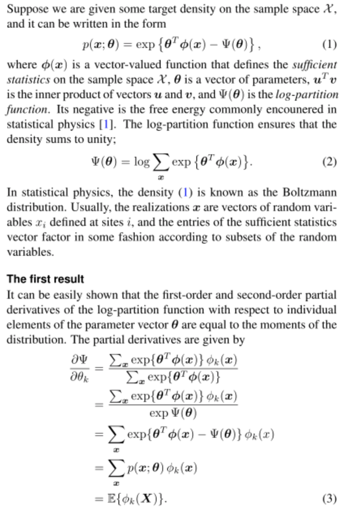

我们看公式(7)的前半部分$\sum_Y\bigg(P(Y|X^{(i)}) \cdot
F(Y,X^{(i)})\bigg)$，我们试图将其进行简化。先看，最外的求和：是对于序列$Y$的每个位置$y_1:y_T$进行的求和操作；再看内层的$F(Y,X^{(i)})$，它是由$K$个$f_k(Y,X)$组成的，每个$f_k(Y,X)$可以表示成：$\sum_{t=1}^T
f_k(y_{t-1},y_t,X,i)$。也就是说，每一步的加和只涉及到$y_{t-1}$和$y_t$，哎呦，简化思路是不是就来了？

下面再对这部分的简化进行推导一下，为了能够进行整理，我们将$F(Y,X^{(i)})$进行写开：
$$\begin{aligned}
\sum_Y \bigg( P(Y|X^{(i)}) \cdot F(Y,X^{(i)})\bigg) &=
   \sum_{k=1}^K \bigg[ 
      \sum_Y \bigg(
           P(Y|X^{(i)}) \cdot \sum_{t=1}^T f_k(y_{t-1},y_t,X^{(i)},i)
             \bigg)
                \bigg] &(1)\\\\
将对于t的加和提出来，整理得：\\
&= \sum_{k=1}^K \bigg[
   \sum_{t=1}^T \bigg(
     \sum_Y P(Y|X^{(i)}) \cdot f_k(y_{t-1},y_t,X^{(i)},i)
                \bigg)
                \bigg] &(2)\\\\
\end{aligned}$$
接下来，按照上文说到，我们要对$y_{t-1},y_t$进行动手，所以，这里将$\sum_Y$进行拆解成4部分：
$$\begin{aligned}
 式(2) &= \sum_{k=1}^K \bigg[ \sum_{t=1}^T \bigg(
   \sum_{y<1:t-2>} \sum_{y_{t-1}} \sum_{y_t} \sum_{y<t+1:T>}
     P(Y|X^{(i)}) \cdot f_k(y_{t-1},y_t,X^{(i)},i)
\bigg) \bigg] &(3)\\\\
将y_{t-1} & ,y_t提出来，得：\\
&= \sum_{k=1}^K \bigg[ \sum_{t=1}^T \sum_{y_{t-1}} \sum_{y_t} \bigg(
   \sum_{y<1:t-2>} \sum_{y<t+1:T>}
     P(Y|X^{(i)}) \cdot f_k(y_{t-1},y_t,X^{(i)},i)
\bigg) \bigg] &(4)\\\\
整理内&层的概率分布可以得到一个联合概率分布，得：\\
&= \sum_{k=1}^K \bigg[ \sum_{t=1}^T \sum_{y_{t-1}} \sum_{y_t} \bigg(
     P(y_{t-1},y_t|X^{(i)}) \cdot f_k(y_{t-1},y_t,X^{(i)},i)
\bigg) \bigg] &(5)\\\\
\end{aligned}$$
这里，概率联合概率分布的推导与$P(y_t|X)$基本完全类似，也是考虑叠加前向的概率和后向概率的递推，最后得出，而$f_k$是我们定义的特征函数，拿到数据也是可以计算的，因此，这样一个复杂的式子就化简得到了。

剩下的就是按照梯度上升法进行计算了，（PS：实际的使用中，梯度上升法收敛速度太慢，我们会采用其他的计算方式，这里仅做理论指引了）。

> Q：整个公式推导中，大面上看都是$X^{(i)}$。那么，$Y^{(i)}$在哪里监督了？
>
> 监督就是监督在了计算前向后向递推里面，我们是已知$P(Y|X)$，但是我们没有办法对其进行描述和表述，那么，Linear-CRF参数化表示就是解决这个问题，从监督数据出发，设计了一些特征函数，但是这表示的不充分；进而，结合着特征函数、目前的参数值以及已知的数据$X^{(i)},Y^{(i)}$，通过前向后向的递推，是可计算得出$P(y_{t-1},y_t|X^{(i)})$；最后，这个计算得到的联合概率分布被用到了梯度的计算中，我们得到了从监督数据出发的梯度计算公式根据梯度上升法，一步一步最后做梯度上升，修正参数。
>
> 因此，训练的步骤大致就是：
>
> 1.初始化参数；
>
> 2.计算当前数据和参数下的梯度；
>
> 3.根据梯度，做小步幅的参数调整；
>
> 4.用这套参数去做评估：IF：效果不是很好，那么重新返回步骤2；ELSE：效果不错咯，保存参数了，退出。

#### 问题三：Vitebi解码预测序列标注 {#问题三：Vitebi解码预测序列标注}

> 这个问题，所要解决的问题是：给定条件随机场的条件概率$P(Y|X)$和一个观测序列$X$，求出满足$P(Y|X)$最大的序列$Y$。
>
> 维特比算法本身是一个动态规划算法，利用了两个局部状态和对应的递推公式，从局部递推到整体，进而得解。对于具体不同的问题，仅仅是这两个局部状态的定义和对应的递推公式不同而已。