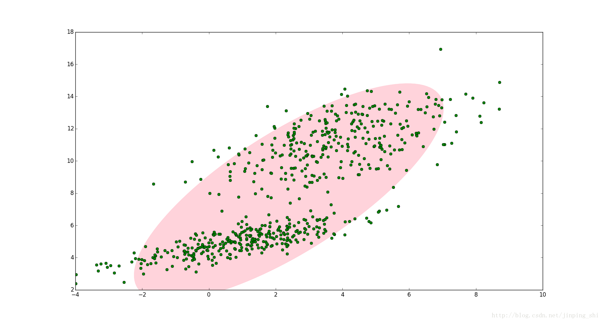
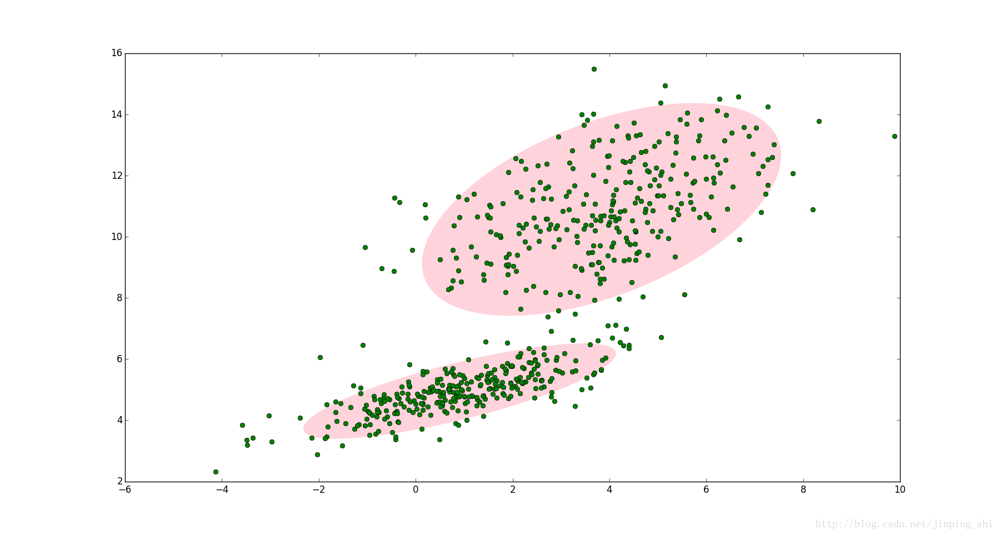

#EM算法引入

EM算法也称期望最大化（Expectation-Maximum,简称EM）算法，它是一个基础算法，是很多机器学习领域算法的基础，比如隐式马尔科夫算法（HMM）， LDA主题模型的变分推断等等。本文就对EM算法的原理做一个总结。
- E: 结合观测数据，可计算在给定参数条件下选取每个模型的概率，得到**隐变量数据Z的条件概率分布**
- M: **通过E步概率最大似然法计算参数（E步概率计算隐藏变量参数，E步概率与观测数据结合计算正常变量参数）**

EM算法解决这个的思路是使用启发式的迭代方法，既然我们无法直接求出模型分布参数，那么我们可以先猜想隐含数据（EM算法的E步），接着基于观察数据和猜测的隐含数据一起来极大化对数似然，求解我们的模型参数（EM算法的M步)。由于我们之前的隐藏数据是猜测的，所以此时得到的模型参数一般还不是我们想要的结果。不过没关系，我们基于当前得到的模型参数，继续猜测隐含数据（EM算法的E步），然后继续极大化对数似然，求解我们的模型参数（EM算法的M步)。以此类推，不断的迭代下去，直到模型分布参数基本无变化，算法收敛，找到合适的模型参数。

从上面的描述可以看出，EM算法是迭代求解最大值的算法，同时算法在每一次迭代时分为两步，E步和M步。一轮轮迭代更新隐含数据和模型分布参数，直到收敛，即得到我们需要的模型参数。

一个最直观了解EM算法思路的是K-Means算法，见之前写的K-Means聚类算法原理。在K-Means聚类时，每个聚类簇的质心是隐含数据。我们会假设K
个初始化质心，即EM算法的E步；然后计算得到每个样本最近的质心，并把样本聚类到最近的这个质心，即EM算法的M步。重复这个E步和M步，直到质心不再变化为止，这样就完成了K-Means聚类。
# EM算法的推导

对于$m$个样本观察数据$x=(x^{(1)},x^{(2)},...x^{(m)})$中，找出样本的模型参数$\theta$, 极大化模型分布的对数似然函数如下：
$$\theta = arg \max \limits_{\theta}\sum\limits_{i=1}^m logP(x^{(i)};\theta)$$

如果我们得到的观察数据有未观察到的隐含数据$z=(z^{(1)},z^{(2)},...z^{(m)})$，此时我们的极大化模型分布的对数似然函数如下：
$$\theta = arg \max \limits_{\theta}\sum\limits_{i=1}^m logP(x^{(i)};\theta) = arg \max \limits_{\theta}\sum\limits_{i=1}^m log\sum\limits_{z^{(i)}}P(x^{(i)}， z^{(i)};\theta) $$

上面这个式子是没有 办法直接求出$\theta$的。因此需要一些特殊的技巧，我们首先对这个式子进行缩放如下：
$$\begin{aligned} \sum\limits_{i=1}^m log\sum\limits_{z^{(i)}}P(x^{(i)}， z^{(i)};\theta)   & = \sum\limits_{i=1}^m log\sum\limits_{z^{(i)}}Q_i(z^{(i)})\frac{P(x^{(i)}， z^{(i)};\theta)}{Q_i(z^{(i)})} \\ & \geq  \sum\limits_{i=1}^m \sum\limits_{z^{(i)}}Q_i(z^{(i)})log\frac{P(x^{(i)}， z^{(i)};\theta)}{Q_i(z^{(i)})} \end{aligned}$$

上面第(1)式引入了一个未知的新的分布$Q_i(z^{(i)})$，第(2)式用到了Jensen不等式：
$$log\sum\limits_j\lambda_jy_j \geq \sum\limits_j\lambda_jlogy_j\;\;,  \lambda_j \geq 0, \sum\limits_j\lambda_j =1$$

或者说由于对数函数是凹函数，所以有:
$$f(E(x)) \geq E(f(x))\;\; 如果f(x) 是凹函数$$

此时如果要满足Jensen不等式的等号，则有：
$$\frac{P(x^{(i)}， z^{(i)};\theta)}{Q_i(z^{(i)})} =c, c为常数$$

由于$Q_i(z^{(i)})$是一个分布，所以满足：
$$ \sum\limits_{z}Q_i(z^{(i)}) =1 $$

从上面两式，我们可以得到:
$$Q_i(z^{(i)})  = \frac{P(x^{(i)}， z^{(i)};\theta)}{\sum\limits_{z}P(x^{(i)}， z^{(i)};\theta)} =  \frac{P(x^{(i)}， z^{(i)};\theta)}{P(x^{(i)};\theta)} = P( z^{(i)}|x^{(i)};\theta))$$

如果$Q_i(z^{(i)}) = P( z^{(i)}|x^{(i)};\theta)$, 则第(2)式是我们的包含隐藏数据的对数似然的一个下界。如果我们能极大化这个下界，则也在尝试极大化我们的对数似然。即我们需要最大化下式:
$$ arg \max \limits_{\theta} \sum\limits_{i=1}^m \sum\limits_{z^{(i)}}Q_i(z^{(i)})log\frac{P(x^{(i)}， z^{(i)};\theta)}{Q_i(z^{(i)})}$$

去掉上式中为常数的部分，则我们需要极大化的对数似然下界为:
$$ arg \max \limits_{\theta} \sum\limits_{i=1}^m \sum\limits_{z^{(i)}}Q_i(z^{(i)})log{P(x^{(i)}, z^{(i)};\theta)}$$

上式也就是我们的EM算法的M步，那E步呢？注意到上式中$Q_i(z^{(i)})$是一个分布，因此$\sum\limits_{z^{(i)}}Q_i(z^{(i)})log{P(x^{(i)}， z^{(i)};\theta)}$可以理解为$logP(x^{(i)}， z^{(i)};\theta)$基于条件概率分布$Q_i(z^{(i)})$的期望。

至此，我们理解了EM算法中E步和M步的具体数学含义。
# EM算法流程

现在我们总结下EM算法的流程。

输入：观察数据$x=(x^{(1)},x^{(2)},...x^{(m)})$，联合分布$p(x,z ;\theta)$, 条件分布$p(z|x; \theta)$, 最大迭代次数$J$。

1) 随机初始化模型参数$\theta$的初值$\theta^{0}$。

2) for j  from 1 to J开始EM算法迭代：

   1) E步：计算联合分布的条件概率期望:
   $$Q_i(z^{(i)}) = P( z^{(i)}|x^{(i)}，\theta^{j}) $$
   $$L(\theta, \theta^{j}) = \sum\limits_{i=1}^m\sum\limits_{z^{(i)}}Q_i(z^{(i)})log{P(x^{(i)}， z^{(i)};\theta)}$$

   2) M步：极大化$L(\theta, \theta^{j})$,得到$\theta^{j+1}$: 
   $$\theta^{j+1} = arg \max \limits_{\theta}L(\theta, \theta^{j}) $$

   3) 如果$\theta^{j+1}$已收敛，则算法结束。否则继续回到步骤a)进行E步迭代。

输出：模型参数$\theta$。
# EM算法的收敛性思考

EM算法的流程并不复杂，但是还有两个问题需要我们思考：

1） EM算法能保证收敛吗？

2） EM算法如果收敛，那么能保证收敛到全局最大值吗？　　

首先我们来看第一个问题, EM算法的收敛性。要证明EM算法收敛，则我们需要证明我们的对数似然函数的值在迭代的过程中一直在增大。即:
$$\sum\limits_{i=1}^m logP(x^{(i)};\theta^{j+1}) \geq \sum\limits_{i=1}^m logP(x^{(i)};\theta^{j})$$

由于
$$L(\theta, \theta^{j}) = \sum\limits_{i=1}^m\sum\limits_{z^{(i)}}P( z^{(i)}|x^{(i)};\theta^{j}))log{P(x^{(i)}， z^{(i)};\theta)}$$

令:
$$H(\theta, \theta^{j}) =  \sum\limits_{i=1}^m\sum\limits_{z^{(i)}}P( z^{(i)}|x^{(i)};\theta^{j}))log{P( z^{(i)}|x^{(i)};\theta)}$$

上两式相减得到:
$$ \sum\limits_{i=1}^m logP(x^{(i)};\theta) = L(\theta, \theta^{j}) - H(\theta, \theta^{j})$$

在上式中分别取$\theta$为$\theta^j$和$\theta^{j+1}$，并相减得到:
$$\sum\limits_{i=1}^m logP(x^{(i)};\theta^{j+1})  - \sum\limits_{i=1}^m logP(x^{(i)};\theta^{j}) = [L(\theta^{j+1}, \theta^{j}) - L(\theta^{j}, \theta^{j}) ] -[H(\theta^{j+1}, \theta^{j}) - H(\theta^{j}, \theta^{j}) ] $$

要证明EM算法的收敛性，我们只需要证明上式的右边是非负的即可。

由于$\theta^{j+1}$使得$L(\theta, \theta^{j})$极大，因此有:
$$L(\theta^{j+1}, \theta^{j}) - L(\theta^{j}, \theta^{j})  \geq 0$$

而对于第二部分，我们有:
$$ \begin{aligned} H(\theta^{j+1}, \theta^{j}) - H(\theta^{j}, \theta^{j})  & = \sum\limits_{i=1}^m\sum\limits_{z^{(i)}}P( z^{(i)}|x^{(i)};\theta^{j})log\frac{P( z^{(i)}|x^{(i)};\theta^{j+1})}{P( z^{(i)}|x^{(i)};\theta^j)} \\ & \leq  \sum\limits_{i=1}^mlog(\sum\limits_{z^{(i)}}P( z^{(i)}|x^{(i)};\theta^{j})\frac{P( z^{(i)}|x^{(i)};\theta^{j+1})}{P( z^{(i)}|x^{(i)};\theta^j)}) \\ & = \sum\limits_{i=1}^mlog(\sum\limits_{z^{(i)}}P( z^{(i)}|x^{(i)};\theta^{j+1})) = 0  \end{aligned}$$

其中第（4）式用到了Jensen不等式，只不过和第二节的使用相反而已，第（5）式用到了概率分布累积为1的性质。

至此，我们得到了：$\sum\limits_{i=1}^m logP(x^{(i)};\theta^{j+1})  - \sum\limits_{i=1}^m logP(x^{(i)};\theta^{j})  \geq 0$, 证明了EM算法的收敛性。

从上面的推导可以看出，EM算法可以保证收敛到一个稳定点，但是却不能保证收敛到全局的极大值点，因此它是局部最优的算法，当然，如果我们的优化目标$L(\theta, \theta^{j}) $是凸的，则EM算法可以保证收敛到全局最大值，这点和梯度下降法这样的迭代算法相同。至此我们也回答了上面提到的第二个问题。

# EM算法的一些思考

如果我们从算法思想的角度来思考EM算法，我们可以发现我们的算法里已知的是观察数据，未知的是隐含数据和模型参数，在E步，我们所做的事情是固定模型参数的值，优化隐含数据的分布，而在M步，我们所做的事情是固定隐含数据分布，优化模型参数的值。比较下其他的机器学习算法，其实很多算法都有类似的思想。比如SMO算法（支持向量机原理(四)SMO算法原理），坐标轴下降法(Lasso回归算法： 坐标轴下降法与最小角回归法小结), 都使用了类似的思想来求解问题。
# example
概率模型有时候既含有观测变量，又含有隐变量或潜在变量，如果概率模型的变量都是观测变量，那么给定数据，可以直接用极大似然估计法，或贝叶斯估计方法估计模型参数，但是当模型含有隐变量时，就不能简单的使用这些方法，EM算法就是含有隐变量的概率模型参数的极大似然估计法，或极大后验概率估计法，我们讨论极大似然估计，极大后验概率估计与其类似。
参考统计学习方法书中的一个例子来引入EM算法， 假设有3枚硬币，分别记做A、B、C，这些硬币正面出现的概率分别是$\pi$、$p$、$q$，进行如下实验：

- 先掷硬币A，根据结果选出硬币B和硬币C，正面选硬币B，反面选硬币C
- 通过选择出的硬币，掷硬币的结果出现正面为1，反面为0
如此独立地重复n次实验，我们当前规定n=10，则10次的结果如下所示：
$$
1,1,0,1,0,0,1,0,1,1
$$
假设只通过观测到掷硬币的结果，不能观测掷硬币的过程，问如何估计三个硬币出现正面的概率？
我们来构建这样一个三硬币模型：
$$
\begin{aligned}
P(y|\theta) &=\sum_{z}P(y,z|\theta)=\sum_{z}P(z|\theta)P(y|z,\theta) \\
  &=\pi p^{y}(1-p)^{1-y}+(1-\pi)q^{y}(1-q)^{1-y}
\end{aligned}
$$

- 若$y=1$，表示这此看到的是正面，这个正面有可能是B的正面，也可能是C的正面，则$P(1|\theta)=\pi p+(1-\pi)q$
- 若$y=0$，则$P(0|\theta)=\pi (1-p)+(1-\pi)(1-q)$

y是观测变量，表示一次观测结果是1或0，z是隐藏变量，表示掷硬币A的结果，这个是观测不到结果的，$\theta=(\pi,p,q)$表示模型参数，将观测数据表示为$Y=(Y_1,Y_2,...,Y_n)^{T}$，未观测的数据表示为$Z=(Z_1,Z_2,...,Z_n)^{T}$，则观测函数的似然函数是：
$$
\begin{aligned}
P(Y|\theta)&=\sum_{Z}P(Z|\theta)P(Y|Z,\theta)\\
&=\prod_{i=0} ( \pi p^{y_i}(1-p)^{1-y_{i}}+(1-\pi)q^{y_{i}}(1-q)^{1-y_{i}})
\end{aligned}
$$
考虑求模型参数$\theta=(\pi,p,q)$的极大似然估计，即：
$$
\hat{\theta}=arg\max_{\theta}logP(Y|\theta)
$$
这个问题没有解析解，只有通过迭代方法来求解，EM算法就是可以用于求解这个问题的一种迭代算法，下面给出EM算法的迭代过程：
- 首先选取初始值，记做$\theta^{0}=(\pi^{0},p^{0},q^{0})$，第i次的迭代参数的估计值为$\theta^{i}=(\pi^{i},p^{i},q^{i})$

- E步：计算在模型参数$\pi^{i}，p^{i}，q^{i}$下观测变量$y_i$来源于硬币B的概率：
  $$
  \mu^{i+1}_j=\frac{\pi^{i}(p^{i})^{y_j}(1-p^i)^{1-y_j}}{\pi^{i}(p^{i})^{y_j}(1-p^i)^{1-y_j}+(1-\pi^{i})(q^{i})^{y_j}(1-p^i)^{1-y_j}}
  $$
  备注一下：这个公式的分母是$P(Y|\theta)$，分子表示是来源与B硬币的概率。

- M步：计算模型参数的新估计值：

因为出现B硬币是A硬币出现正面的结果，所以A硬币正面概率就是$\mu_{j}$的平均值。
$$
\pi^{i+1}=\frac{1}{n}\sum_{j=1}^{n}\mu_{j}^{i+1} 
$$
B硬币出现正面的概率:
$$
p^{i+1}=\frac{\sum_{j=1}^{n}\mu_{j}^{i+1}y_j}{\sum_{j=1}^{n}\mu_{j}^{i+1}}
$$
C硬币出现正面的概率:
$$
q^{i+1}=\frac{\sum_{j=1}^{n}(1-\mu_{j}^{i+1})y_j}{\sum_{j=1}^{n}(1-\mu_{j}^{i+1})}
$$
$(1-\mu_{j}^{i+1})$表示出现C硬币的概率。

闭环形成，从$P(Y|\theta)$ 到 $\pi、p、q$一个闭环流程，接下来可以通过迭代法来做完成。针对上述例子，我们假设初始值为$\pi^{0}=0.5，p^{0}=0.5，q^{0}=0.5$，因为对$y_i=1$和$y_i=0$均有$\mu_j^{1}=0.5$，利用迭代公式计算得到$\pi^{1}=0.5，p^{1}=0.6，q^{1}=0.6$，继续迭代得到最终的参数：
$$\widehat{\pi^{0}}=0.5，\widehat{p^{0}}=0.6，\widehat{q^{0}}=0.6$$
如果一开始初始值选择为：$\pi^{0}=0.4，p^{0}=0.6，q^{0}=0.7$，那么得到的模型参数的极大似然估计是$\widehat{\pi}=0.4064，\widehat{p}=0.5368，\widehat{q}=0.6432$，这说明**EM算法与初值的选择有关，选择不同的初值可能得到不同的参数估计值**。

这个例子中你只观察到了硬币抛完的结果，并不了解A硬币抛完之后，是选择了B硬币抛还是C硬币抛，这时候概率模型就存在着隐含变量！

# 高斯混合分布
EM算法的一个重要应用场景就是高斯混合模型的参数估计。高斯混合模型就是由多个高斯模型组合在一起的混合模型（可以理解为多个高斯分布函数的线性组合，理论上高斯混合模型是可以拟合任意类型的分布），例如对于下图中的数据集如果用一个高斯模型来描述的话显然是不合理的：

两个高斯模型可以拟合数据集，如图所示：

如果有多个高斯模型，公式表示为：
$$
P(y|\theta)=\sum_{k=1}^{K}a_k\phi(y|\theta_{k}) \\
\phi(y|\theta_{k})=\frac{1}{\sqrt{2\pi}\delta_{k}}exp(-\frac{(y-\mu_{k})^2}{2 \delta_{k}^{2}}) \\
a_k>0,\sum a_k =1
$$
$\phi(y|\theta_{k})$表示为第k个高斯分布密度模型，定义如上，其中$a_k$表示被选中的概率。在本次模型$P(y|\theta)$中，观测数据是已知的，而观测数据具体来自哪个模型是未知的，有点像之前提过的三硬币模型，我们来对比一下，A硬币就像是概率$a_k$，用来表明具体的模型，而B、C硬币就是具体的模型，只不过这里有很多个模型，不仅仅是B、C这两个模型。我们用$\gamma_{jk}$来表示，则：
$$
\gamma_{jk} =
\begin{cases}
1& \text{第j个观测数据来源于第k个模型}\\
0& \text{否则}
\end{cases}
$$
所以一个观测数据$y_j$的隐藏数据$(\gamma_{j1},\gamma_{j2},...,\gamma_{jk})$，那么完全似然函数就是：

$$
P(y,\gamma|\theta)= \prod_{k=1}^{K}\prod_{j=1}^{N}[a_{k}\phi(y|\theta_{k})]^{\gamma_{jk}}
$$

取对数之后等于：

$$
\begin{aligned}
log(P(y,\gamma|\theta))&=log( \prod_{k=1}^{K}\prod_{j=1}^{N}[a_{k}\phi(y|\theta_{k})]^{\gamma_{jk}})\\
&=\sum_{K}^{k=1}\bigg(\sum_{j=1}^{N}(\gamma_{jk}) log(a_k)+\sum_{j=1}^{N}( \gamma_{jk})\bigg[log(\frac{1}{\sqrt{2\pi}})-log(\delta_{k})-\frac{(y_i-\mu_{k})^2}{2 \delta_{k}^{2}}\bigg]\bigg)
\end{aligned}
$$

- E 步 ：
$$
\begin{aligned}
Q(\theta.\theta^i) &= E[log(P(y,\gamma|\theta))]\\
&=\sum_{K}^{k=1}\bigg(\sum_{j=1}^{N}(E\gamma_{jk}) log(a_k)+\sum_{j=1}^{N}(E\gamma_{jk})\bigg[log(\frac{1}{\sqrt{2\pi}})-log(\delta_{k})-\frac{(y_i-\mu_{k})^2}{2 \delta_{k}^{2}}\bigg]\bigg)
\end{aligned}
$$
其中我们定义$\hat{\gamma_{jk}}$：
$$
\hat{\gamma_{jk}} = E(\gamma_{jk}|y,\theta)=\frac{a_k\phi(y_i|\theta_{k})}{\sum_{k=1}^{K}a_k\phi(y_i|\theta_{k}) }\\
j=1,2,..,N；k=1,2,...,K\\
n_k=\sum_{j=i}^{N}E\gamma_{jk}
$$
于是化简得到：
$$
\begin{aligned}
Q(\theta.\theta^i) &= \sum_{K}^{k=1}\bigg(n_k log(a_k)+\sum_{j=1}^{N}(E\gamma_{jk})\bigg[log(\frac{1}{\sqrt{2\pi}})-log(\delta_{k})-\frac{(y_i-\mu_{k})^2}{2 \delta_{k}^{2}}\bigg]\bigg)
\end{aligned}
$$

E 步 在代码设计上只有$\hat{\gamma_{jk}}$有用，用于M步的计算。

- M步，
$$
\theta^{i+1}=arg \max_{\theta}Q(\theta,\theta^i)
$$
对$Q(\theta,\theta^i)$求导，得到每个未知量的偏导，使其偏导等于0，求解得到：
$$
\hat{\mu_k}=\frac{\sum_{j=1}^{N}\hat{\gamma_{jk}}y_i}{\sum_{j=1}^{N}\hat{\gamma_{jk}}}
\\
\\
\hat{\delta_k}=\frac{\sum_{j=1}^{N}\hat{\gamma_{jk}}(y_i-\mu_k)^2}{\sum_{j=1}^{N}\hat{\gamma_{jk}}}
\\
\\
\\
\hat{a_k}=\frac{\sum_{j=1}^{N}\hat{\gamma_{jk}} }{N}
$$
给一个初始值，来回迭代就可以求得值内容。这一块主要用到了$Q(\theta.\theta^i)$的导数，并且用到了E步的$\hat{\gamma_{jk}}$。
# 参考
[什么是EM算法？](https://www.cnblogs.com/kerwins-AC/p/9550374.html)

[EM算法原理总结](https://www.cnblogs.com/pinard/p/6912636.html)

[EM算法与高斯混合模型](https://www.cnblogs.com/jiangxinyang/p/9278608.html)