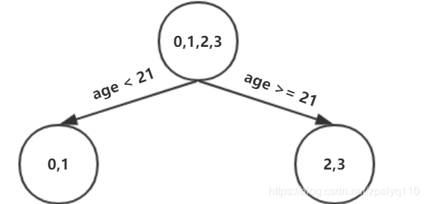

# GBDT
[链接1](https://blog.csdn.net/zpalyq110/article/details/79527653)

[链接2](https://www.cnblogs.com/pinard/p/6140514.html)

Gradient Boosting Decision Tree，梯度提升树

## Decision Tree：CART回归树

首先，GBDT使用的决策树是**CART回归树**，无论是处理回归问题还是二分类以及多分类，GBDT使用的决策树通通都是都是CART回归树。**为什么不用CART分类树呢？因为GBDT每次迭代要拟合的是梯度值，是连续值所以要用回归树。**
对于回归树算法来说最重要的是寻找最佳的划分点，那么回归树中的可划分点包含了所有特征的所有可取的值。在**分类树中最佳划分点的判别标准是熵或者基尼系数，都是用纯度来衡量的**，但是**在回归树中的样本标签是连续数值，所以再使用熵之类的指标不再合适，取而代之的是平方误差，它能很好的评判拟合程度**。

回归树生成算法：
- 输入：训练数据集DD:
- 输出：回归树f(x).

在训练数据集所在的输入空间中，递归的将每个区域划分为两个子区域并决定每个子区域上的输出值，构建二叉决策树：

1. 选择最优切分变量(feature)j与切分点(the value of feature)s，求解平方误差最小，c为均值（如步骤2的公式2）：
   $$\min _{j, s}\left[\min _{c_{1}} \sum_{x_{i} \in R_{1}(j, s)}\left(y_{i}-c_{1}\right)^{2}+\min _{c_{2}} \sum_{x_{i} \in R_{2}(j, s)}\left(y_{i}-c_{2}\right)^{2}\right]$$
   遍历变量j，对固定的切分变量j扫描切分点s，选择使得上式达到最小值的对(j,s).
   
2. 用选定的对(j,s)划分区域并决定相应的输出值$\hat{c}_{m}$（**所在区域标签的均值**）：
   $$\begin{array}{c}
   R_{1}(j, s)=x\left|x^{(j)} \leq s, R_{2}(j, s)=x\right| x^{(j)}>s \\
   \hat{c}_{m}=\frac{1}{N} \sum_{x_{1} \in R_{m}(j, s)} y_{i}, x \in R_{m}, m=1,2
   \end{array}$$

3. 继续对两个子区域调用步骤（1）和（2），直至满足停止条件。

4. 将输入空间划分为M个区域 $R_1,R_2,...R_M$​，生成决策树（**符合区域的均值$\hat{c}_{m}$累加**）：

   $$f(x)=\sum_{m=1}^{M} \hat{c}_{m} I\left(x \in R_{m}\right)$$

## 提升树（Boosting Tree）

先来个通俗理解：假如有个人30岁，我们首先用20岁去拟合，发现损失有10岁，这时我们用6岁去拟合剩下的损失，发现差距还有4岁，第三轮我们用3岁拟合剩下的差距，差距就只有一岁了。如果我们的迭代轮数还没有完，可以继续迭代下面，每一轮迭代，拟合的岁数误差都会减小。最后将每次拟合的岁数加起来便是模型输出的结果。

提升树算法：
1. 初始化$f_0(x)=0$
2. 对$m=1,2,...,M$
   1. 计算残差
      $$r_{m i}=y_{i}-f_{m-1}(x), i=1,2, \ldots, N$$ 
   2. 拟合残差$r_{m i}$​学习一个回归树，得到$h_m(x)$
   3. 更新$f_m(x)=f_{m−1}+h_m(x)$
3. 得到回归问题提升树
   $$f_{M}(x)=\sum_{m=1}^{M} h_{m}(x)$$

- 上面伪代码中的残差是什么？
  
在提升树算法中，假设我们前一轮迭代得到的强学习器是$f_{t−1}(x)$;

损失函数是$L(y,f_{t−1}(x))$

我们本轮迭代的目标是找到一个弱学习器$h_t(x)$,最小化让本轮的损失$L(y,ft(x))=L(y,ft−1(x)+ht(x))$

当采用平方损失函数时：
$$\begin{array}{c}
L\left(y, f_{t-1}(x)+h_{t}(x)\right) \\
=\left(y-f_{t-1}(x)-h_{t}(x)\right)^{2} \\
=\left(r-h_{t}(x)\right)^{2}
\end{array}$$
这里，
$$r=y-f_{t-1}(x)$$
是当前模型拟合数据的残差（residual）。所以，对于提升树来说只需要简单地拟合当前模型的残差。

## Gradient Boosting： 拟合负梯度

梯度提升树（Grandient Boosting）是提升树（Boosting Tree）的一种改进算法。

当损失函数是平方损失和指数损失函数时，梯度提升树每一步优化是很简单的，但是对于一般损失函数而言，往往每一步优化起来不那么容易，针对这一问题，Friedman提出了梯度提升树算法，这是利用**最速下降的近似方法**，其**关键是利用损失函数的负梯度作为提升树算法中的残差的近似值**。

### 回归问题
第t轮的第i个样本的损失函数的负梯度为：
$$-\left[\frac{\left.\partial L\left(y, f\left(x_{i}\right)\right)\right)}{\partial f\left(x_{i}\right)}\right]_{f(x)=f_{t-1}(x)}$$
不同的损失函数将会得到不同的负梯度，如果选择**平方损失**:
$$L\left(y, f\left(x_{i}\right)\right)=\frac{1}{2}\left(y-f\left(x_{i}\right)\right)^{2}$$

$$-\left[\frac{\left.\partial L\left(y, f\left(x_{i}\right)\right)\right)}{\partial f\left(x_{i}\right)}\right]_{f(x)=f_{t-1}(x)}=y-f\left(x_{i}\right)$$
此时我们发现**GBDT的负梯度恰好就是残差**，所以说对于回归问题，我们要拟合的就是残差。

### [另外（from王峰辉）](https://www.cnblogs.com/pinard/p/6140514.html#!comments)：
在我的理解中，adaboost和GBDT不一样的地方最明显的就是损失函数那里了，**adaboost的目标是找到一个可以使当前损失函数最小的弱分类器，具体的数学解是偏导数等于零的解**（分类器权重$\alpha$），关于这个说法可以看一下李航的统计学习方法。而GBDT不同的地方是说让偏导数等于零这个解不是对所有的损失函数有效的，在adaboost里面做分类的时候，指数函数做损失函数，这个解是可求的，但是换成一般函数怎么办呢？然后就在损失函数$f_{t-1}(x)$那里做**一阶泰勒展开**，容易做了，因为展开后的方程变成了**一个常数加上一阶梯度和新的弱分类器的乘积**，所以梯度和弱分类器的乘积越小，损失函数就越小，所以要拿逆梯度来拟合新的弱分类器，这时候可以把弱分类器分类作为步长，让损失函数沿着梯度在做你梯度下降。这应该是典型的不同的地方吧。至于一些正则项的存在很大程度是为了限制步长和弱分类器的复杂度，限制弱分类器的复杂度就不用说了，限制步长就是因为在逆梯度方向一步不能迈的太大。

f(x)在a处的泰勒一阶展开：
$$f(a+\Delta x)=f(a)+f^{\prime}(a) \Delta x$$
令a=$f_{t-1}(x)$，则f为损失函数L,损失$L(y,a)$为常数，$f'(a)$是一阶梯度，x是新的弱分类器。

### 分类问题
二分类和多分类的损失函数都是$logloss$.

这里我们再看看GBDT分类算法，GBDT的分类算法从思想上和GBDT的回归算法没有区别，但是由于样本输出不是连续的值，而是**离散的类别，导致我们无法直接从输出类别去拟合类别输出的误差**。

为了解决这个问题，主要有两个方法，一个是**用指数损失函数，此时GBDT退化为Adaboost算法**。另一种方法是用**类似于逻辑回归**的**对数似然损失函数**的方法。也就是说，我们用的是类别的预测概率值和真实概率值的差来拟合损失。本文仅讨论用对数似然损失函数的GBDT分类。而对于对数似然损失函数，我们又有二元分类和多元分类的区别。

#### 二元GBDT分类算法

对于二元GBDT，如果用类似于逻辑回归的对数似然损失函数，则损失函数为：
$$L(y, f(x)) = log(1+ exp(-yf(x)))$$

其中$y \in\{-1, +1\}$。则此时的负梯度误差为
$$r_{ti} = -\bigg[\frac{\partial L(y, f(x_i)))}{\partial f(x_i)}\bigg]_{f(x) = f_{t-1}(x)} = y_i/(1+exp(y_if(x_i)))$$

对于生成的决策树，我们各个叶子节点的最佳负梯度拟合值为
$$c_{tj} = \underbrace{arg\; min}_{c}\sum\limits_{x_i \in R_{tj}} log(1+exp(-y_i(f_{t-1}(x_i) +c)))$$

由于上式比较难优化，我们一般使用[近似值代替](https://statweb.stanford.edu/~jhf/ftp/trebst.pdf)
$$c_{tj} = \sum\limits_{x_i \in R_{tj}}r_{ti}\bigg /  \sum\limits_{x_i \in R_{tj}}|r_{ti}|(1-|r_{ti}|)$$
- 推导（类似XGBoost）：
  二元分类的损失函数是：
  $$L(y, f(x)) = log(1+ exp(-yf(x)))$$

  其每个样本的一阶导数为：
  $$g_i=-r_i= -y_i/(1+exp(y_if(x_i)))$$

  其每个样本的二阶导数为：
  $$h_i =\frac{exp(y_if(x_i)}{(1+exp(y_if(x_i))^2} = |g_i|(1-|g_i|) $$

  由于没有正则化项，则$c_{tj} = -\frac{g_i}{h_i}$，即可得到GBDT二分类叶子节点区域的近似值。

除了负梯度计算和叶子节点的最佳负梯度拟合的线性搜索，二元GBDT分类和GBDT回归算法过程相同。

#### 多元GBDT分类算法

多元GBDT要比二元GBDT复杂一些，对应的是多元逻辑回归和二元逻辑回归的复杂度差别。假设类别数为K，则此时我们的对数似然损失函数为：
$$L(y, f(x)) = -  \sum\limits_{k=1}^{K}y_klog\;p_k(x) $$

其中如果样本输出类别为k，则$y_k=1$。第k类的概率$p_k(x)$的表达式为：
$$p_k(x) = exp(f_k(x)) \bigg / \sum\limits_{l=1}^{K} exp(f_l(x)) $$

集合上两式，我们可以计算出第$t$轮的第$i$个样本对应类别$l$的负梯度误差为
$$r_{til} = -\bigg[\frac{\partial L(y_i, f(x_i)))}{\partial f(x_i)}\bigg]_{f_k(x) = f_{l, t-1}\;\; (x)} = y_{il} - p_{l, t-1}(x_i)$$

观察上式可以看出，其实这里的误差就是样本$i$对应类别$l$的真实概率（~~t轮预测概率？~~）和$t-1$轮预测概率的差值。

对于生成的决策树，我们各个叶子节点的最佳负梯度拟合值为
$$c_{tjl} = \underbrace{arg\; min}_{c_{jl}}\sum\limits_{i=0}^{m}\sum\limits_{k=1}^{K} L(y_k, f_{t-1, l}(x) + \sum\limits_{j=0}^{J}c_{jl} I(x_i \in R_{tjl}))$$

由于上式比较难优化，我们一般使用近似值代替
$$c_{tjl} =  \frac{K-1}{K} \; \frac{\sum\limits_{x_i \in R_{tjl}}r_{til}}{\sum\limits_{x_i \in R_{til}}|r_{til}|(1-|r_{til}|)}$$

除了负梯度计算和叶子节点的最佳负梯度拟合的线性搜索，多元GBDT分类和二元GBDT分类以及GBDT回归算法过程相同。

## GBDT常用损失函数

这里我们再对常用的GBDT损失函数做一个总结。

### 分类算法
其损失函数一般有对数损失函数和指数损失函数两种:

1) 如果是指数损失函数，则损失函数表达式为
   $$L(y, f(x)) = exp(-yf(x))$$

   其负梯度计算和叶子节点的最佳负梯度拟合参见Adaboost原理篇。

2) 如果是对数损失函数，分为二元分类和多元分类两种，参见上述。

### 回归算法
常用损失函数有如下4种:

1) 均方差，这个是最常见的回归损失函数了
   $$L(y, f(x)) =(y-f(x))^2$$

2) 绝对损失，这个损失函数也很常见
   $$L(y, f(x)) =|y-f(x)|$$

   对应负梯度误差为：
   $$sign(y_i-f(x_i))$$

3) Huber损失，它是均方差和绝对损失的折衷产物，对于远离中心的异常点，采用绝对损失，而中心附近的点采用均方差。这个界限一般用分位数点度量。损失函数如下：

   $$L(y, f(x))=
   \begin{cases}
   \frac{1}{2}(y-f(x))^2& {|y-f(x)| \leq \delta}\\
   \delta(|y-f(x)| - \frac{\delta}{2})& {|y-f(x)| > \delta}
   \end{cases}$$

   对应的负梯度误差为：

   $$r(y_i, f(x_i))=
   \begin{cases}
   y_i-f(x_i)& {|y_i-f(x_i)| \leq \delta}\\
   \delta sign(y_i-f(x_i))& {|y_i-f(x_i)| > \delta}
   \end{cases}$$

4) 分位数损失。它对应的是分位数回归的损失函数，表达式为
   $$L(y, f(x)) =\sum\limits_{y \geq f(x)}\theta|y - f(x)| + \sum\limits_{y < f(x)}(1-\theta)|y - f(x)| $$

   其中$\theta$为分位数，需要我们在回归前指定。对应的负梯度误差为：

   $$r(y_i, f(x_i))=
   \begin{cases}
   \theta& { y_i \geq f(x_i)}\\
   \theta - 1 & {y_i < f(x_i) }
   \end{cases}$$

对于**Huber损失和分位数损失，主要用于健壮回归，也就是减少异常点对损失函数的影响**。

## GBDT的正则化

和Adaboost一样，我们也需要对GBDT进行正则化，防止过拟合。GBDT的正则化主要有三种方式。

1. 第一种是和Adaboost类似的正则化项，即步长(learning rate)。定义为$\nu$,对于前面的弱学习器的迭代
   $$f_{k}(x) = f_{k-1}(x) + h_k(x) $$

   如果我们加上了正则化项，则有
   $$f_{k}(x) = f_{k-1}(x) + \nu h_k(x) $$

   $\nu$的取值范围为$0 < \nu \leq 1$。对于同样的训练集学习效果，较小的$\nu$意味着我们需要更多的弱学习器的迭代次数。通常我们用步长和迭代最大次数一起来决定算法的拟合效果。

2. 第二种正则化的方式是通过子采样比例（subsample）。取值为(0,1]。注意这里的子采样和随机森林不一样，随机森林使用的是放回抽样，而这里是**不放回抽样**。如果取值为1，则全部样本都使用，等于没有使用子采样。如果取值小于1，则只有一部分样本会去做GBDT的决策树拟合。**选择小于1的比例可以减少方差(这里讲的是减小泛化时的方差，即针对测试集数据来说的，用以防止过拟合，并不是减小训练数据集的方差)，即防止过拟合，但是会增加样本拟合的偏差，因此取值不能太低。推荐在[0.5, 0.8]之间**。

   使用了子采样的GBDT有时也称作**随机梯度提升树**(Stochastic Gradient Boosting Tree, **SGBT**)。由于使用了子采样，程序可以通过采样分发到不同的任务去做boosting的迭代过程，最后形成新树，从而减少弱学习器难以并行学习的弱点。并行学习主要是针对单颗树特征处理和选择的并行（特征排序）以及在模型完成后进行预测时的并行。（不使用子采样也可以并行学习？）

3. 第三种是对于弱学习器即CART回归树进行正则化剪枝。在决策树原理篇里我们已经讲过，这里就不重复了。

# GBDT算法原理

上面两节分别将Decision Tree和Gradient Boosting介绍完了，下面将这两部分组合在一起就是我们的GBDT了。

GBDT算法：
1. 初始化弱学习器
   $$f_{0}(x)=\arg \min _{c} \sum_{i=1}^{N} L\left(y_{i}, c\right)$$
2. 对$m=1,2,...,M$有:
   
   1. 对每个样本$i=1,2,...,N$，计算负梯度，即残差
      $$r_{i m}=-\left[\frac{\partial L\left(y_{i}, f\left(x_{i}\right)\right)}{\partial f\left(x_{i}\right)}\right]_{f(x)=f_{m-1}(x)}$$

   2.  **将上步得到的残差作为样本新的真实值（label）**，并将数据$\left(x_{i}, r_{i m}\right), i=1,2,...,N$作为下棵树的训练数据，得到一颗新的回归树$f_m(x)$其对应的叶子节点区域为$R_{j m}, j=1,2, \ldots, J$。其中$J$为回归树t的叶子节点的个数。
   
   3. 对**叶子区域**$j=1,2,..J$计算最佳拟合值
      $$\Upsilon_{j m}=\underbrace{\arg \min }_{\Upsilon} \sum_{x_{i} \in R_{j m}} L\left(y_{i}, f_{m-1}\left(x_{i}\right)+\Upsilon\right)$$

   4. 更新强学习器
      $$f_{m}(x)=f_{m-1}(x)+\sum_{j=1}^{J} \Upsilon_{j m} I\left(x \in R_{j m}\right)$$

3. 得到最终学习器
   $$f(x)=f_{M}(x)=f_{0}(x)+\sum_{m=1}^{M} \sum_{j=1}^{J} \Upsilon_{j m} I\left(x \in R_{j m}\right)$$

## 注意
但要注意，基于残差 GBDT 容易对异常值敏感，举例：

很明显后续的模型会对第 4 个值关注过多，这不是一种好的现象，所以一般回归类的损失函数会用绝对损失或者 Huber 损失函数来代替平方损失函数。

- Absolute loss (more robust to outliers,对异常值更健壮)
$$
L(y, F)=|y-F|
$$
- Huber loss (more robust to outliers)
$$
L(y, F)=\left\{\begin{array}{ll}
\frac{1}{2}(y-F)^{2} & |y-F| \leq \delta \\
\delta(|y-F|-\delta / 2) & |y-F|>\delta
\end{array}\right.
$$

GBDT 的 Boosting 不同于 Adaboost 的 Boosting，GBDT 的每一步残差计算其实**变相地增大了被分错样本的权重，而对与分对样本的权重趋于0**，这样后面的树就能专注于那些被分错的样本。

# 优缺点

## 优点

1) 可以自动进行特征组合，拟合非线性数据；可以灵活处理各种类型的数据，包括连续值和离散值。

2) 在相对少的调参时间情况下，预测的准确率也可以比较高。这个是相对SVM来说的。

3) 使用一些健壮的损失函数，对异常值的鲁棒性非常强。比如 Huber损失函数和Quantile损失函数。

## 缺点

1) 由于弱学习器之间存在依赖关系，难以并行训练数据。不过可以通过自采样的SGBT来达到部分并行。

## 与 Adaboost 的对比
### 相同：

    都是 Boosting 家族成员，使用弱分类器；
    都使用前向分布算法；

### 不同：

    迭代思路不同：Adaboost 是通过提升错分数据点的权重来弥补模型的不足（利用错分样本），而 GBDT 是通过算梯度来弥补模型的不足（利用残差）；
    损失函数不同：AdaBoost 采用的是指数损失，GBDT 使用的是绝对损失或者 Huber 损失函数；

# 回归实例

一组数据，特征为年龄、体重，身高为标签值。共有5条数据，前四条为训练样本，最后一条为要预测的样本。
编号 |	年龄(岁) |	体重（kg）| 	身高(m)(**标签值**)
--|:--:|--:|--:
0 |	5 |	20 |	1.1
1 |	7 |	30 |	1.3
2 |	21 |	70 |	1.7
3 |	30 |	60 |	1.8
4(要预测的) |	25 |	65 |	？

## 训练

参数设置：

    学习率：learning_rate=0.1
    迭代次数：n_trees=5
    树的深度：max_depth=3

1. 初始化弱学习器:
   $$f_{0}(x)=\arg \min _{c} \sum_{i=1}^{N} L\left(y_{i}, c\right)$$
   **损失函数为平方损失**，因为平方损失函数是一个凸函数，直接求导，倒数等于零，得到c:

   $$\sum_{i=1}^{N} \frac{\left.\partial L\left(y_{i}, c\right)\right)}{\partial c}=\sum_{i=1}^{N} \frac{\partial\left(\frac{1}{2}\left(y_{i}-c\right)^{2}\right)}{\partial c}=\sum_{i=1}^{N} c-y_{i}$$
   $$\sum_{i=1}^{N} c-y_{i}=0$$

   令导数等于0
   $$c=\left(\sum_{i=1}^{N} y_{i}\right) / N$$
   所以**初始化时，c取值为所有训练样本标签值的均值**。c=(1.1+1.3+1.7+1.8)/4=1.475，此时得到初始学习器$f_0(x)$
   $$f_0(x)=c=1.475$$
2. 对迭代轮数$m=1，2,…,M$:
   
   由于我们设置了迭代次数：n_trees=5，这里的M=5。

   计算负梯度，根据上文损失函数为平方损失时，负梯度就是残差，再直白一点就是 y与上一轮得到的学习器$f_{m−1}$​的差值

   此时将残差作为样本的真实值(标签值)来训练弱学习器$f_1(x)$，即下表数据
   编号 |	年龄(岁) |	体重（kg）| 	标签值(残差)
   |--:|--:|--:|--:
   0 |	5 |	20 |	-0.375=1.1-1.475
   1 |	7 |	30 |	-0.175=1.3-1.475
   2 |	21 |	70 |	0.225=1.7-1.475
   3 |	30 |	60 |	0.325=1.8-1.475

   接着，寻找回归树的最佳划分节点，遍历每个特征的每个可能取值。从年龄特征的5开始，到体重特征的70结束，分别计算分裂后两组数据的平方损失（Square Error），$SE_l$​左节点平方损失，$SE_r$右节点平方损失，找到使平方损失和$SE_{sum}=SE_l+SE_r$最小的那个划分节点，即为最佳划分节点。

   例如：以年龄7为划分节点，将小于7的样本划分为到左节点，大于等于7的样本划分为右节点。左节点包括$x_0$​，右节点包括样本$x_1,x_2,x_3$​，$SE_l=0,SE_r=0.140,SE_{sum}=0.140$，所有可能划分情况如下表所示：
   
   example:年龄5时，大于5的样本id：1，2，3，4。均值$x=(-0.375-0.175+0.225+0.325)/4=0$,$SE_r=(-0.375-0)^2+(-0.175-0)^2+0.225^2+0.325^2=0.3275$

   以上划分点是的总平方损失最小为0.025有两个划分点：年龄21和体重60，所以随机选一个作为划分点，这里我们选 年龄21
   现在我们的第一棵树长这个样子：
   
   我们设置的**参数中树的深度max_depth=3，现在树的深度只有2，需要再进行一次划分**，这次划分要对左右两个节点分别进行划分：

   对于左节点，只含有0,1两个样本，根据下表我们选择**年龄7**划分
   
   example:年龄5时，大于5的样本id：1，2。均值$x=(-0.375-0.175)/2=-0.275$,$SE_r=(-0.375+0.275)^2+(-0.175+0.275)^2=0.020$
   
   对于右节点，只含有2,3两个样本，根据下表我们选择**年龄30**划分（也可以选体重70）
   
   现在我们的第一棵树长这个样子：
   
   此时我们的**树深度满足了设置**，还需要做一件事情，给这每个叶子节点分别赋一个参数$\Upsilon$，来拟合残差。
   $$\Upsilon_{j 1}=\underbrace{\arg \min }_{\Upsilon} \sum_{x_{i} \in R_{j 1}} L\left(y_{i}, f_{0}\left(x_{i}\right)+\Upsilon\right)$$
   这里其实和上面初始化学习器是一个道理，平方损失，求导，令导数等于零，化简之后得到每个叶子节点的参数$\Upsilon$，其实就是**标签值的均值**。这个地方的标签值不是原始的$y$，而是本轮要拟合的标签残差 $y−f_0(x)$.
   根据上述划分结果，为了方便表示，规定从左到右为第1,2,3,4个叶子结点:
   $$\begin{aligned}
   &\left(x_{0} \in R_{11}\right), \quad \Upsilon_{11}=-0.375\\
   &\left(x_{1} \in R_{21}\right), \quad \Upsilon_{21}=-0.175\\
   &\left(x_{2} \in R_{31}\right), \quad \Upsilon_{31}=0.225\\
   &\left(x_{3} \in R_{41}\right), \quad \Upsilon_{41}=0.325
   \end{aligned}$$
3. 此时可更新强学习器，需要用到参数学习率：learning_rate=0.1，用$lr$表示。
   $$f_{1}(x)=f_{0}(x)+{lr} \times \sum_{j=1}^{4} \Upsilon_{j 1} I\left(x \in R_{j 1}\right)$$
   - 为什么要用学习率呢？这是**Shrinkage**的思想，如果每次都全部加上（学习率为1）很容易一步学到位导致过拟合。
   重复步骤2，直到 m>5 结束，最后**生成5棵树**。
4. 得到最后的强学习器$f_{5}(x)$：
   $$f(x)=f_{5}(x)=f_{0}(x)+{lr} \times\sum_{m=1}^{5} \sum_{j=1}^{4} \Upsilon_{j m} I\left(x \in R_{j m}\right)$$
5. 预测样本5：(利用全部树)
   $f_0(x)=1.475$

   在$f_1(x)$中，样本4的年龄为25，大于划分节点21岁，又小于30岁，所以被预测为0.2250。

   在f2(x)f2​(x)中，样本4的…此处省略…所以被预测为0.2025

   在f3(x)f3​(x)中，样本4的…此处省略…所以被预测为0.1823

   在f4(x)f4​(x)中，样本4的…此处省略…所以被预测为0.1640

   在f5(x)f5​(x)中，样本4的…此处省略…所以被预测为0.1476

   最终预测结果：
   $$f(x)=1.475+0.1∗(0.225+0.2025+0.1823+0.164+0.1476)=1.56714$$