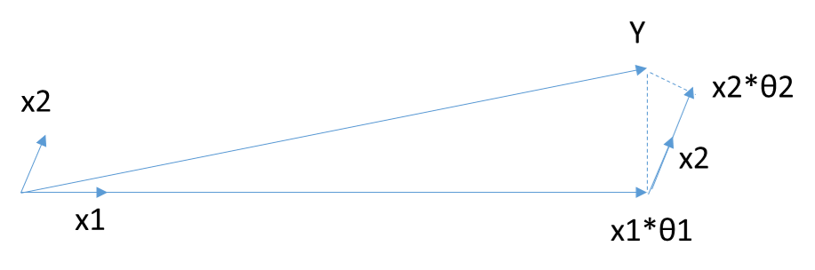

# Lasso

## feature selection

和lasso可以产生差不多效果的两种feature selection的方法，forward stagewise selection和最小角回归least angle regression（LARS）。

Lasso和PCA都可以用于筛选特征并降维。但是Lasso是直接将不重要的特征丢弃，而PCA是将所有的特征放在一起综合考虑，降维后的特征已经和之前的原始特征不能一一对应的。

如果你的目的是筛选特征，并且**降维后有解释性**，那么就使用Lasso来筛，如果你的目的只是降维并训练模型，解释性要求不高，那么使用PCA。

## 回归

lasso的求解过程中里面涉及到soft-thresholding，关于软阈值，你可以看看这篇总结和对应的参考文献，由于是解析解，比坐标轴下降还简单：
https://blog.csdn.net/jbb0523/article/details/52103257

Lasso回归有时也叫做线性回归的L1正则化，和Ridge回归的主要区别就是在正则化项，Ridge回归用的是L2正则化，而Lasso回归用的是L1正则化。Lasso回归的损失函数表达式如下：　

$J(\mathbf\theta) = \frac{1}{2n}(\mathbf{X\theta} - \mathbf{Y})^T(\mathbf{X\theta} - \mathbf{Y}) + \alpha||\theta||_1$

其中n为样本个数，$\alpha$为常数系数，需要进行调优。$||\theta||_1$为L1范数。

**Lasso回归使得一些系数变小，甚至还是一些绝对值较小的系数直接变为0，因此特别适用于参数数目缩减与参数的选择，因而用来估计稀疏参数的线性模型**。

但是Lasso回归有一个很大的问题，导致我们需要把它单独拎出来讲，就是它的**损失函数不是连续可导的**，由于L1范数用的是绝对值之和，导致损失函数有不可导的点。也就是说，**我们的最小二乘法，梯度下降法，牛顿法与拟牛顿法对它统统失效了**。那我们怎么才能求有这个L1范数的损失函数极小值呢？
 
OK，本章主角，两种全新的求极值解法坐标轴下降法（coordinate descent）和最小角回归法（ Least Angle Regression， LARS）该隆重出场了。　　
# 坐标轴下降法coordinate descent

[理论证明](https://blog.csdn.net/u013802188/article/details/40476989)

坐标轴下降法顾名思义，是沿着坐标轴的方向去下降，这和梯度下降不同。梯度下降是沿着梯度的负方向下降。不过梯度下降和坐标轴下降的共性就都是迭代法，通过启发式的方式一步步迭代求解函数的最小值。

坐标轴下降法的数学依据主要是这个结论（此处不做证明）：一个可微的凸函数$J(\theta)$, 其中$\theta$是nx1的向量，即有n个维度。如果在某一点$\overline\theta$，使得$J(\theta)$在每一个坐标轴$\overline\theta_i$(i = 1,2,...n)上都是最小值，那么$J(\overline\theta_i)$就是一个全局的最小值。

于是我们的优化目标就是在$\theta$的n个坐标轴上(或者说向量的方向上)对损失函数做迭代的下降，当所有的坐标轴上的$\theta_i$(i = 1,2,...n)都达到收敛时，我们的损失函数最小，此时的$\theta$即为我们要求的结果。

下面我们看看具体的算法过程：

1. 首先，我们把$\theta$向量随机取一个初值。记为$\theta^{(0)}$ ，上面的括号里面的数字代表我们迭代的轮数，当前初始轮数为0.

2. 对于第k轮的迭代。我们从$\theta_1^{(k)}$开始，到$\theta_n^{(k)}$为止，依次求$\theta_i^{(k)}$。$\theta_i^{(k)}$的表达式如下：

   $$\theta_i^{(k)}  \in \underbrace{argmin}_{\theta_i} J(\theta_1^{(k)}, \theta_2^{(k)}, ... \theta_{i-1}^{(k)}, \theta_i, \theta_{i+1}^{(k-1)}, ..., \theta_n^{(k-1)})$$ 

   也就是说$\theta_i^{(k)}$是使$J(\theta_1^{(k)}, \theta_2^{(k)}, ... \theta_{i-1}^{(k)}, \theta_i, \theta_{i+1}^{(k-1)}, ..., \theta_n^{(k-1)})$最小化时候的$\theta_i$的值。此时$J(\theta)$只有$ \theta_i^{(k)}$是变量，其余均为常量，因此最小值容易通过求导求得。

   如果上面这个式子不好理解，我们具体一点，在第k轮，$\theta$向量的n个维度的迭代式如下：

   $$\theta_1^{(k)}  \in \underbrace{argmin}_{\theta_1} J(\theta_1, \theta_2^{(k-1)}, ... , \theta_n^{(k-1)})$$

   $$\theta_2^{(k)}  \in \underbrace{argmin}_{\theta_2} J(\theta_1^{(k)}, \theta_2, \theta_3^{(k-1)}... , \theta_n^{(k-1)})$$

   $$...$$

   $$\theta_n^{(k)}  \in \underbrace{argmin}_{\theta_n} J(\theta_1^{(k)}, \theta_2^{(k)}, ... , \theta_{n-1}^{(k)}, \theta_n)$$

3. 检查$\theta^{(k)}$向量和$\theta^{(k-1)}$向量在各个维度上的变化情况，如果在所有维度上变化都足够小，那么$\theta^{(k)}$即为最终结果，否则转入2，继续第k+1轮的迭代。

以上就是坐标轴下降法的求极值过程，可以和梯度下降做一个比较：
1) 坐标轴下降法在每次迭代中在当前点处沿一个坐标方向进行一维搜索 ，固定其他的坐标方向，找到一个函数的局部极小值。而梯度下降总是沿着梯度的负方向求函数的局部最小值。
2) 坐标轴下降优化方法是一种非梯度优化算法。在整个过程中依次循环使用不同的坐标方向进行迭代，一个周期的一维搜索迭代过程相当于一个梯度下降的迭代。
3) 梯度下降是利用目标函数的导数来确定搜索方向的，该梯度方向可能不与任何坐标轴平行。而坐标轴下降法法是利用当前坐标方向进行搜索，不需要求目标函数的导数，只按照某一坐标方向进行搜索最小值。
4) 两者都是迭代方法，且每一轮迭代，都需要O(mn)的计算量(m为样本数，n为系数向量的维度)

# 最小角回归法LARS

第四节介绍了坐标轴下降法求解Lasso回归的方法，此处再介绍另一种常用方法， 最小角回归法(Least Angle Regression，LARS)。

在介绍最小角回归前，我们先看看两个预备算法，好吧，这个算法真没有那么好讲。
## 前向选择（Forward Selection）算法

第一个预备算法是前向选择（Forward Selection）算法。

前向选择算法的原理是是一种典型的贪心算法。要解决的问题是对于:

$\mathbf{Y = X\theta}$这样的线性关系，如何求解系数向量$\mathbf{\theta}$的问题。其中$\mathbf{Y}$为 mx1的向量，$\mathbf{X}$为mxn的矩阵，$\mathbf{\theta}$为nx1的向量。m为样本数量，n为特征维度。

把矩阵$\mathbf{X}$看做n个mx1的向量$\mathbf{X_i}$(i=1,2,...n)，在$\mathbf{Y}$的$\mathbf{X}$变量$\mathbf{X_i}$(i =1,2,...n)中，选择和目标$\mathbf{Y}$最为接近(余弦距离最大)的一个变量$\mathbf{X_k}$，用$\mathbf{X_k}$来逼近$\mathbf{Y}$,得到下式：

$$\overline{\mathbf{Y}} = \mathbf{X_k\theta_k}$$

其中： $\mathbf{\theta_k}= \mathbf{\frac{<X_k, Y>}{||X_k||_2}}$，即：$\overline{\mathbf{Y}}$ 是 $\mathbf{Y}$在 $\mathbf{X_k}$上的投影。那么，可以定义残差(residual): $\mathbf{Y_{yes}} = \mathbf{Y - \overline{Y}}$。由于是投影，所以很容易知道 $\mathbf{Y_{yes}} 和\mathbf{X_k}$是正交的。再以$\mathbf{Y_{yes}}$为新的因变量，去掉$\mathbf{X_k}$后，剩下的自变量的集合$\mathbf\{X_i,i=1,2,3...k−1,k+1,...n\}$为新的自变量集合，重复刚才投影和残差的操作，直到残差为0，或者所有的自变量都用完了，才停止算法。

当$\mathbf{X}$只有2维时，例子如上图，和$\mathbf{Y}$最接近的是$\mathbf{X_1}$，首先在$\mathbf{X_1}$上面投影，残差如上图长虚线。此时$X_1\theta_1$模拟了$\mathbf{Y}$，$\theta_1$模拟了$\mathbf{ \theta}$(仅仅模拟了一个维度)。接着发现最接近的是$\mathbf{X_2}$，此时用残差接着在$\mathbf{X_2}$投影，残差如图中短虚线。由于没有其他自变量了，此时$X_1\theta_1+X_2\theta_2$模拟了$\mathbf{Y}$,对应的模拟了两个维度的$\theta$即为最终结果，此处$\theta$计算设计较多矩阵运算，这里不讨论。

此算法对每个变量只需要执行一次操作，效率高，速度快。但也容易看出，当自变量不是正交的时候，由于每次都是在做投影，所有算法只能给出一个局部近似解。因此，这个简单的算法太粗糙，还不能直接用于我们的Lasso回归。
 
## 前向梯度（Forward Stagewise）算法

第二个预备算法是前向梯度（Forward Stagewise）算法。

前向梯度算法和前向选择算法有类似的地方，也是在$\mathbf{Y}$的$\mathbf{X}$变量$\mathbf{X_i}$(i =1,2,...n)中，选择和目标$\mathbf{Y}$最为接近(余弦距离最大)的一个变量$\mathbf{X_k}$，用$\mathbf{X_k}$来逼近$\mathbf{Y}$，但是前向梯度算法不是粗暴的用投影，而是每次在最为接近的自变量$\mathbf{X_t}$的方向移动一小步，然后再看残差$\mathbf{Y_{yes}}$和哪个$\mathbf{X_i}$(i =1,2,...n)最为接近。此时我们也不会把$\mathbf{X_t}$ 去除，因为我们只是前进了一小步，有可能下面最接近的自变量还是$\mathbf{X_t}$。如此进行下去，直到残差$\mathbf{Y_{yes}} $减小到足够小，算法停止。

当$\mathbf{X}$只有2维时，例子如上图，和$\mathbf{Y}$最接近的是$\mathbf{X_1}$，首先在$\mathbf{X_1}$上面走一小段距离，此处$\varepsilon$为一个较小的常量，发现此时的残差还是和\$\mathbf{X_1}$最接近。那么接着沿$\mathbf{X_1}$走，一直走到发现残差不是和$\mathbf{X_1}$最接近，而是和$\mathbf{X_2}$最接近，此时残差如上图长虚线。接着沿着$\mathbf{X_2}$走一小步，发现残差此时又和$\mathbf{X_1}$最接近，那么开始沿着$\mathbf{X_1}$走，走完一步后发现残差为0，那么算法停止。此时$\mathbf{Y}$由刚才所有的所有步相加而模拟，对应的算出的系数$\theta$即为最终结果。此处$\theta$计算设计较多矩阵运算，这里不讨论。

当算法在$\varepsilon$很小的时候，可以很精确的给出最优解，当然，其计算的迭代次数也是大大的增加。和前向选择算法相比，前向梯度算法更加精确，但是更加复杂。

有没有折中的办法可以综合前向梯度算法和前向选择算法的优点，做一个**折中**呢？有！这就是终于要出场的最小角回归法。

##  最小角回归(Least Angle Regression， LARS)算法

好吧，最小角回归(Least Angle Regression， LARS)算法终于出场了。最小角回归法对前向梯度算法和前向选择算法做了折中，保留了前向梯度算法一定程度的精确性，同时简化了前向梯度算法一步步迭代的过程。具体算法是这样的：　

首先，还是找到与因变量$\mathbf{Y}$最接近或者相关度最高的自变量$\mathbf{X_k}$，使用类似于前向梯度算法中的残差计算方法，得到新的目标$\mathbf{Y_{yes}}$，此时不用和前向梯度算法一样小步小步的走。而是直接向前走直到出现一个$\mathbf{X_t}$，使得$\mathbf{X_t}$和$\mathbf{Y_{yes}}$的相关度和$\mathbf{X_k}$与$\mathbf{Y_{yes}}$的相关度是一样的，此时残差$\mathbf{Y_{yes}}$就在$\mathbf{X_t}$和$\mathbf{X_k}$的角平分线方向上，此时我们开始沿着这个残差角平分线走，直到出现第三个特征$\mathbf{X_p}$和$\mathbf{Y_{yes}}$的相关度足够大的时候，即$\mathbf{X_p}$到当前残差$\mathbf{Y_{yes}}$的相关度和$\theta_t$，$\theta_k$与$\mathbf{Y_{yes}}$的一样。将其也叫入到$\mathbf{Y}$的逼近特征集合中，并用$\mathbf{Y}$的逼近特征集合的共同角分线，作为新的逼近方向。以此循环，直到$\mathbf{Y_{yes}}$足够的小，或者说所有的变量都已经取完了，算法停止。此时对应的系数$\theta$即为最终结果。

当$\theta$只有2维时，例子如上图，和$\mathbf{Y}$最接近的是$\mathbf{X_1}$，首先在$\mathbf{X_1}$上面走一段距离，一直到残差在$\mathbf{X_1}$和$\mathbf{X_2}$的角平分线上，此时沿着角平分线走，直到残差最够小时停止，此时对应的系数$\beta$即为最终结果。此处$\theta$计算设计较多矩阵运算，这里不讨论。

最小角回归法是一个适用于高维数据的回归算法，
### 主要的优点有：

1）特别适合于特征维度n 远高于样本数m的情况。

2）算法的最坏计算复杂度和最小二乘法类似，但是其计算速度几乎和前向选择算法一样

3）可以产生分段线性结果的完整路径，这在模型的交叉验证中极为有用

### 主要的缺点是：

由于LARS的迭代方向是根据目标的残差而定，所以该算法对样本的噪声极为敏感。

### [实现](https://blog.csdn.net/xbinworld/article/details/44284293)

$X=(x_1, x_2, ...,x_n)^T \in \mathbb{R}^{n\times m}$表示数据矩阵，其中$x_i \in \mathbb{R}^m$表示一个**m维长度**的数据样本；$y=(y_1, y_2, ...,y_m)^T \in \mathbb{R}^{m}$表示数据的label

给定线性无关按行排列的数据$X=(x_1,...,x_n)^T$，数据label $y$。不妨假设X中心化且列（即特征）归一化，y去中心化（减去均值）,即

$$\sum_{i = 1}^n y_i = 0,\quad   \sum_{i=1}^n x_{ij}=0, \quad \sum_{i=1}^n x_{ij}^2 = 1,\quad j=1,2,\ldots ,m.$$

目标是找到一个$\hat{ \beta }$为下问题的解：
$\hat{\beta} = argmin_{\beta} \|y - \hat{\mu}\|, \quad s.t. \|\beta\|_1 \le t$

其中$\hat{\mu} = X\beta$, t越小，解越稀疏。

LARS的过程如下：
1. 初始化 $\mu = 0,\beta = 0$
2. 计算相关系数: $c=c(\mu)=X^T(y-\mu) \in R^{m \times 1}$（这里有$|{x}_j|=1$，与理论中角度$\theta=c$对应。）
3. 计算最大相关度和对应的下标集合$C=\max_j\{|c_j|\},\quad A = \{j| |c_j| = C\}$
4. 计算(**假设A中有n个下标**)
   $$X_A = (...,x_j,...)_{j\in A} \in R^{m \times n}$$

   $$G_A = X_A^TX_A  \in R^{n \times n},\quad A_\mathbf{A}=(1_\mathbf{A}^T G_\mathbf{A}^{-1} 1_\mathbf{A})^{-1/2} \in R^{1 \times 1}$$

   其中$1_\mathbf{A} \in R^{n \times 1}$表示全1列向量，长度和$\mathbf{A}$中的元素个数一样。对于$X_\mathbf{A}$的角平分线方向上的单位向量$u_\mathbf{A}$可以表示为： 
   $$u_A=X_A \omega_A  \in R^{m \times 1},\quad \omega_A = A_A G_A^{-1} 1_\mathbf{A} \in R^{n \times 1}$$
   即$u_\mathbf{A}$和每一个${x}_j$都有相同的角度（小于90度）（内积相同），并且
   $$\begin{aligned}
   X_{\mathbf{A}}^{T}u_\mathbf{A} = A_\mathbf{A}1_\mathbf{A} \in R^{n \times 1}, and \quad \|u_\mathbf{A}\|^2=1
   \end{aligned}$$
   总共n个样本，每个样本x与$u_\mathbf{A}$的内积都是$A_A$。

5. 更新
   $$\mu^+= \mu + \gamma \mu_A \in R^{m \times 1}$$

   其中
   $$\gamma = min^+_{j\in A^C} \left\{ \frac{C - c_j}{A_A - a_j},\frac{C+c_j}{A_A +a_j} \right\}$$

   $$a = X^T \mu_A \in R^{n \times 1}$$

   $$A = A\cup \{j\} , 最小γ值对应的维度j$$

   ~~$$C=C-\gamma A_A$$~~

6. 更新$\beta$
   $$\beta^+ = \beta + \gamma \delta_A$$

   其中$\delta_A$是上面$\omega_A$通过填充$0(j \notin A,\delta_A(j) = 0)$，将其扩展成和数据个数一样维度。
7. 如果$\beta$满足约束，转到4.

过程解释
最小角回归的过程，和forward stagewise（见[2]）的区别在于方向和步长的更新选择上。最小角回归选择的方向，使得更新方向总是位于已选择的特征的角平分线上。 

# 总结

Lasso回归是在ridge回归的基础上发展起来的，如果模型的特征非常多，需要压缩，那么Lasso回归是很好的选择。一般的情况下，普通的线性回归模型就够了。

另外，本文对最小角回归法怎么求具体的$\theta$参数值没有提及，仅仅涉及了原理，如果对具体的算计推导有兴趣，可以参考Bradley Efron的论文《Least Angle Regression》，网上很容易找到。 　