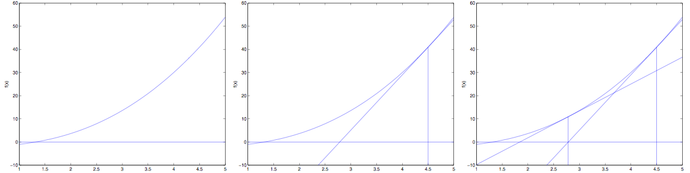

# 线性回归
[链接](https://www.cnblogs.com/pinard/p/6004041.html)

## 模型函数和损失函数

线性回归遇到的问题一般是这样的。我们有m个样本，每个样本对应于n维特征和一个结果输出，如下：

$$(x_1^{(0)}, x_2^{(0)}, ...x_n^{(0)}, y_0), (x_1^{(1)}, x_2^{(1)}, ...x_n^{(1)},y_1), ... (x_1^{(m)}, x_2^{(m)}, ...x_n^{(m)}, y_m)$$

我们的问题是，对于一个新的$(x_1^{(x)}, x_2^{(x)}, ...x_n^{(x)}$, 他所对应的$y_x$是多少呢？ 如果这个问题里面的y是连续的，则是一个回归问题，否则是一个分类问题。

对于n维特征的样本数据，如果我们决定使用线性回归，那么对应的模型是这样的：

$$h_\theta(x_1, x_2, ...x_n) = \theta_0 + \theta_{1}x_1 + ... + \theta_{n}x_{n}$$

其中$\theta_i(i = 0,1,2... n)$为模型参数，$x_i(i = 0,1,2... n)$为每个样本的n个特征值。这个表示可以简化，我们增加一个特征$x_0 = 1$ ，这样
$$h_\theta(x_0, x_1, ...x_n) = \sum\limits_{i=0}^{n}\theta_{i}x_{i}$$

进一步用矩阵形式表达更加简洁如下：

$$h_\mathbf{\theta}(\mathbf{X}) = \mathbf{X\theta}$$

其中， 假设函数$h_\mathbf{\theta}(\mathbf{X})$为$m \times 1$的向量,$\mathbf{\theta}$为$n \times 1$的向量，里面有n个代数法的模型参数。$\mathbf{X}$为mxn维的矩阵。m代表样本的个数，n代表样本的特征数。

得到了模型，我们需要求出需要的损失函数，一般线性回归我们用均方误差作为损失函数。损失函数的代数法表示如下：

$$J(\theta_0, \theta_1..., \theta_n) = \sum\limits_{i=1}^{m}(h_\theta(x_0^{(i)}, x_1^{(i)}, ...x_n^{(i)}) - y_i)^2$$

进一步用矩阵形式表达损失函数：

$$J(\mathbf\theta) = \frac{1}{2}(\mathbf{X\theta} - \mathbf{Y})^T(\mathbf{X\theta} - \mathbf{Y})$$

由于矩阵法表达比较的简洁，后面我们将统一采用矩阵方式表达模型函数和损失函数。

## 损失函数解释：极大似然估计（概率角度的诠释）

下面我们用极大似然估计，来解释为什么要用均方误差作为性能度量

我们可以把目标值和变量写成如下等式：

$$
y^{(i)} = \theta^T x^{(i)}+\epsilon^{(i)}
$$

$\epsilon$表示我们未观测到的变量的印象，即随机噪音。我们假定$\epsilon$是独立同分布，服从高斯分布。（根据中心极限定理）

$$
p(\epsilon^{(i)}) = \frac{1}{\sqrt{2\pi}\sigma}exp\left(-\frac{(\epsilon^{(i)})^2}{2\sigma^2}\right)$$


因此，

$$
p(y^{(i)}|x^{(i)};\theta) = \frac{1}{\sqrt{2\pi}\sigma}exp\left(-\frac{(y^{(i)}-\theta^T x^{(i)})^2}{2\sigma^2}\right)
$$

我们建立极大似然函数，即描述数据遵从当前样本分布的概率分布函数。由于样本的数据集独立同分布，因此可以写成

$$
L(\theta) = p(\vec y | X;\theta) = \prod^n_{i=1}\frac{1}{\sqrt{2\pi}\sigma}exp\left(-\frac{(y^{(i)}-\theta^T x^{(i)})^2}{2\sigma^2}\right)
$$

选择$\theta$，使得似然函数最大化，这就是极大似然估计的思想。

为了方便计算，我们计算时通常对对数似然函数求最大值：

$$\begin{aligned}
l(\theta) 
&= log L(\theta) = log \prod^n_{i=1}\frac{1}{\sqrt{2\pi}\sigma}exp\left(-\frac{(y^{(i)}-\theta^T x^{(i)})^2} {2\sigma^2}\right) \\
& = \sum^n_{i=1}log\frac{1}{\sqrt{2\pi}\sigma}exp\left(-\frac{(y^{(i)}-\theta^T x^{(i)})^2}{2\sigma^2}\right) \\
& = nlog\frac{1}{{\sqrt{2\pi}\sigma}} - \frac{1}{\sigma^2} \cdot \frac{1}{2}\sum^n_{i=1}((y^{(i)}-\theta^T x^{(i)})^2
\end{aligned}$$

显然，最大化$l(\theta)$即最小化 $\frac{1}{2}\sum^n_{i=1}((y^{(i)}-\theta^T x^{(i)})^2$。

这一结果即均方误差，因此用这个值作为代价函数来优化模型在统计学的角度是合理的。

## 线性回归损失函数、代价函数、目标函数
* 损失函数(Loss Function)：度量单样本预测的错误程度，损失函数值越小，模型就越好。
* 代价函数(Cost Function)：度量全部样本集的平均误差。
* 目标函数(Object Function)：代价函数和正则化函数，最终要优化的函数。

常用的损失函数包括：0-1损失函数、平方损失函数、绝对损失函数、对数损失函数等；常用的代价函数包括均方误差、均方根误差、平均绝对误差等。

- 思考题：既然代价函数已经可以度量样本集的平均误差，为什么还要设定目标函数？

- 回答：
当模型复杂度增加时，有可能对训练集可以模拟的很好，但是预测测试集的效果不好，出现过拟合现象，这就出现了所谓的“结构化风险”。结构风险最小化即为了防止过拟合而提出来的策略，定义模型复杂度为$J(F)$，目标函数可表示为：

$$\underset{f\in F}{min}\, \frac{1}{n}\sum^{n}_{i=1}L(y_i,f(x_i))+\lambda J(F)$$

通常，随着模型复杂度的增加，训练误差会减少；但测试误差会先减小后增加。我们的最终目的时试测试误差达到最小，这就是我们为什么需要选取适合的目标函数的原因。

## 线性回归的优化方法

### 1、梯度下降法

设定初始参数$\theta$,不断迭代，使得$J(\theta)$最小化：
$$\theta_j:=\theta_j-\alpha\frac{\partial{J(\theta)}}{\partial\theta_j}$$

$$\begin{aligned}
\frac{\partial{J(\theta)}}{\partial\theta_j} 
&= \frac{\partial}{\partial\theta_j}\frac{1}{2}\sum_{i=1}^{n}(f_\theta(x)^{(i)}-y^{(i)})^2 \\
&= 2*\frac{1}{2}\sum_{i=1}^{n}(f_\theta(x)^{(i)}-y^{(i)})*\frac{\partial}{\partial\theta_j}(f_\theta(x)^{(i)}-y^{(i)}) \\
&= \sum_{i=1}^{n}(f_\theta(x)^{(i)}-y^{(i)})*\frac{\partial}{\partial\theta_j}(\sum_{j=0}^{d}\theta_jx_j^{(i)}-y^{(i)}))\\
&= \sum_{i=1}^{n}(f_\theta(x)^{(i)}-y^{(i)})x_j^{(i)} \\
\end{aligned}$$

即：

$$
\theta_j = \theta_j + \alpha\sum_{i=1}^{n}(y^{(i)}-f_\theta(x)^{(i)})x_j^{(i)}
$$

注：下标j表示第j个参数，上标i表示第i个数据点。

将所有的参数以向量形式表示，可得：

$$
\theta = \theta + \alpha\sum_{i=1}^{n}(y^{(i)}-f_\theta(x)^{(i)})x^{(i)}
$$

由于这个方法中，参数在每一个数据点上同时进行了移动，因此称为**批梯度下降法**，对应的，我们可以每一次让参数只针对一个数据点进行移动，即：

$$
\theta = \theta + \alpha(y^{(i)}-f_\theta(x)^{(i)})x^{(i)}
$$

这个算法成为**随机梯度下降法**，随机梯度下降法的好处是，当数据点很多时，运行效率更高；缺点是，因为每次只针对一个样本更新参数，未必找到最快路径达到最优值，甚至有时候会出现参数在最小值附近徘徊而不是立即收敛。但当数据量很大的时候，随机梯度下降法经常优于批梯度下降法。

当J为凸函数时，梯度下降法相当于让参数$\theta$不断向J的最小值位置移动

梯度下降法的缺陷：如果函数为非凸函数，有可能找到的并非全局最优值，而是局部最优值。

### 2、最小二乘法矩阵求解

令<br>
$$ X = \left[ \begin{array} {cccc}
(x^{(1)})^T\\
(x^{(2)})^T\\
\ldots \\
(x^{(n)})^T
\end{array} \right] $$

其中，

$$x^{(i)} = \left[ \begin{array} {cccc}
x_1^{(i)}\\
x_2^{(i)}\\
\ldots \\
x_d^{(i)}
\end{array} \right]$$

由于

$$Y = \left[ \begin{array} {cccc}
y^{(1)}\\
y^{(2)}\\
\ldots \\
y^{(n)}
\end{array} \right]$$

$h_\theta(x)$可以写作

$$h_\theta(x)=X\theta$$

对于向量来说，有

$$z^Tz = \sum_i z_i^2$$

因此可以把损失函数写作

$$J(\theta)=\frac{1}{2}(X\theta-Y)^T(X\theta-Y)$$

为最小化$J(\theta)$,对$\theta$求导可得：

$$\begin{aligned}
\frac{\partial{J(\theta)}}{\partial\theta} 
&= \frac{\partial}{\partial\theta} \frac{1}{2}(X\theta-Y)^T(X\theta-Y) \\
&= \frac{1}{2}\frac{\partial}{\partial\theta} (\theta^TX^TX\theta - Y^TX\theta-\theta^T X^TY - Y^TY) \\
\end{aligned}$$

中间两项互为转置，由于求得的值是个标量，矩阵与转置相同，因此可以写成

$$\begin{aligned}
\frac{\partial{J(\theta)}}{\partial\theta} 
&= \frac{1}{2}\frac{\partial}{\partial\theta} (\theta^TX^TX\theta - 2\theta^T X^TY - Y^TY) \\
\end{aligned}$$

令偏导数等于零，由于最后一项和$\theta$无关，偏导数为0。

因此，

$$\frac{\partial{J(\theta)}}{\partial\theta}  = \frac{1}{2}\frac{\partial}{\partial\theta} \theta^TX^TX\theta - \frac{\partial}{\partial\theta} \theta^T X^TY
$$

利用矩阵求导性质，

$$\frac{\partial \vec x^T\alpha}{\partial \vec x} =\alpha $$

和

$$\frac{\partial A^TB}{\partial \vec x} = \frac{\partial A^T}{\partial \vec x}B + \frac{\partial B^T}{\partial \vec x}A$$

$$\begin{aligned}
\frac{\partial}{\partial\theta} \theta^TX^TX\theta 
&= \frac{\partial}{\partial\theta}{(X\theta)^TX\theta}\\
&= \frac{\partial (X\theta)^T}{\partial\theta}X\theta + \frac{\partial (X\theta)^T}{\partial\theta}X\theta \\
&= 2X^TX\theta
\end{aligned}$$

$$\frac{\partial{J(\theta)}}{\partial\theta} = X^TX\theta - X^TY$$

令导数等于零，

$$X^TX\theta = X^TY$$

$$\theta = (X^TX)^{(-1)}X^TY$$

注：CS229视频中吴恩达的推导利用了矩阵迹的性质，可自行参考学习。

### 3、牛顿法



通过图例可知(参考吴恩达CS229),

$$f(\theta)' = \frac{f(\theta)}{\Delta},\Delta = \theta_0 - \theta_1$$

$$可求得，\theta_1 = \theta_0 - \frac {f(\theta_0)}{f(\theta_0)'}$$

重复迭代，可以让逼近取到$f(\theta)$的最小值

当我们对损失函数$l(\theta)$进行优化的时候，实际上是想要取到$l'(\theta)$的~~最小值~~等于0时的值，因此迭代公式为：

$$
\theta :=\theta-\frac{l'(\theta)}{l''(\theta)}
$$

$$
当\theta是向量值的时候，\theta :=\theta - H^{-1}\nabla_{\theta}l(\theta)
$$

其中，$\nabla_{\theta}l(\theta)$是$l(\theta)$对$\theta_i$的偏导数，$H$是$J(\theta)$的海森矩阵，<br>
$$H_{ij} = \frac{\partial ^2l(\theta)}{\partial\theta_i\partial\theta_j}$$

- 问题：请用泰勒展开法推导牛顿法公式。

Answer：将$f(x)$用泰勒公式展开到第二阶，

$f(x) = f(x_0) + f'(x_0)(x - x_0)+\frac{1}{2}f''(x_0)(x - x_0)^2$

对上式求导，并令导数等于0，求得x值

$$f'(x) = f'(x_0) + f''(x_0)x -f''(x_0)x_0 = 0$$

可以求得，

$$x = x_0 - \frac{f'(x_0)}{f''(x_0)}$$

牛顿法的收敛速度非常快，但海森矩阵的计算较为复杂，尤其当参数的维度很多时，会耗费大量计算成本。我们可以用其他矩阵替代海森矩阵，用拟牛顿法进行估计，

### 4、拟牛顿法

拟牛顿法的思路是用一个矩阵替代计算复杂的海森矩阵H，因此要找到符合H性质的矩阵。

要求得海森矩阵符合的条件，同样对泰勒公式求导$f'(x) = f'(x_0) + f''(x_0)x -f''(x_0)x_0$

令$x = x_1$，即迭代后的值，代入可得：

$$f'(x_1) = f'(x_0) + f''(x_0)x_1 - f''(x_0)x_0$$

更一般的，

$$f'(x_{k+1}) = f'(x_k) + f''(x_k)x_{k+1} - f''(x_k)x_k$$

$$f'(x_{k+1}) - f'(x_k)  = f''(x_k)(x_{k+1}- x_k)= H(x_{k+1}- x_k)$$

$x_k$为第k个迭代值

即找到矩阵G，使得它符合上式。
常用的拟牛顿法的算法包括DFP，BFGS等，作为选学内容，有兴趣者可自行查询材料学习。

## 4、线性回归的评价指标

均方误差(MSE):$\frac{1}{m}\sum^{m}_{i=1}(y^{(i)} - \hat y^{(i)})^2$

均方根误差(RMSE)：$\sqrt{MSE} = \sqrt{\frac{1}{m}\sum^{m}_{i=1}(y^{(i)} - \hat y^{(i)})^2}$

平均绝对误差(MAE)：$\frac{1}{m}\sum^{m}_{i=1} | (y^{(i)} - \hat y^{(i)} |$

但**以上评价指标都无法消除量纲不一致而导致的误差值差别大的问题，最常用的指标是$R^2$,可以避免量纲不一致问题**

$$R^2: = 1-\frac{\sum^{m}_{i=1}(y^{(i)} - \hat y^{(i)})^2}{\sum^{m}_{i=1}(\bar y - \hat y^{(i)})^2} =1-\frac{\frac{1}{m}\sum^{m}_{i=1}(y^{(i)} - \hat y^{(i)})^2}{\frac{1}{m}\sum^{m}_{i=1}(\bar y - \hat y^{(i)})^2} = 1-\frac{MSE}{VAR}$$

我们可以把$R^2$理解为，回归模型可以成功解释的数据方差部分在数据固有方差中所占的比例，$R^2$越接近1，表示可解释力度越大，模型拟合的效果越好。

# 线性回归的算法

对于线性回归的损失函数$J(\mathbf\theta) = \frac{1}{2}(\mathbf{X\theta} - \mathbf{Y})^T(\mathbf{X\theta} - \mathbf{Y})$，我们常用的有两种方法来求损失函数最小化时候的$\mathbf{\theta}$参数：一种是梯度下降法，一种是最小二乘法。由于已经在其它篇中单独介绍了梯度下降法和最小二乘法，可以点链接到对应的文章链接去阅读。

1. 如果采用梯度下降法，则$\mathbf{\theta}$的迭代公式是这样的：

   $\mathbf\theta= \mathbf\theta - \alpha\mathbf{X}^T(\mathbf{X\theta} - \mathbf{Y})$

   通过若干次迭代后，我们可以得到最终的$\mathbf{\theta}$的结果

2. 如果采用最小二乘法，则$\mathbf{\theta}$的结果公式如下：

   $$\mathbf{\theta} = (\mathbf{X^{T}X})^{-1}\mathbf{X^{T}Y}$$

 

3. 当然线性回归，还有其他的常用算法，比如牛顿法和拟牛顿法，这里不详细描述。

# 线性回归的推广：多项式回归

回到我们开始的线性模型，$h_\theta(x_1, x_2, ...x_n) = \theta_0 + \theta_{1}x_1 + ... + \theta_{n}x_{n}$, 如果这里不仅仅是x的一次方，比如增加二次方，那么模型就变成了多项式回归。这里写一个只有两个特征的p次方多项式回归的模型：

$$h_\theta(x_1, x_2) = \theta_0 + \theta_{1}x_1 + \theta_{2}x_{2} + \theta_{3}x_1^{2} + \theta_{4}x_2^{2} + \theta_{5}x_{1}x_2$$

我们令$x_0 = 1, x_1 = x_1, x_2 = x_2, x_3 =x_1^{2}, x_4 = x_2^{2}, x_5 =  x_{1}x_2$ ,这样我们就得到了下式：

$$h_\theta(x_1, x_2) = \theta_0 + \theta_{1}x_1 + \theta_{2}x_{2} + \theta_{3}x_3 + \theta_{4}x_4 + \theta_{5}x_5$$

可以发现，我们又重新回到了线性回归，这是一个五元线性回归，可以用线性回归的方法来完成算法。对于每个二元样本特征$(x_1,x_2)$,我们得到一个五元样本特征$(1, x_1, x_2, x_{1}^2, x_{2}^2, x_{1}x_2)$，通过这个改进的五元样本特征，我们重新把不是线性回归的函数变回线性回归。

# 线性回归的推广：广义线性回归

在上一节的线性回归的推广中，我们对样本特征端做了推广，这里我们对于特征y做推广。比如我们的输出$\mathbf{Y}$不满足和$\mathbf{X}$的线性关系，但是$ln\mathbf{Y}$ 和$\mathbf{X}$满足线性关系，模型函数如下：

$$ln\mathbf{Y} = \mathbf{X\theta}$$

这样对与每个样本的输入y，我们用 lny去对应， 从而仍然可以用线性回归的算法去处理这个问题。我们把 Iny一般化，假设这个函数是单调可微函数$\mathbf{g}(.)$,则一般化的广义线性回归形式是：

$\mathbf{g}(\mathbf{Y}) = \mathbf{X\theta}$ 或者 $\mathbf{Y} = \mathbf{g^{-1}}(\mathbf{X\theta})$

这个函数$\mathbf{g}(.)$我们通常称为联系函数。
# 线性回归的正则化
为了防止模型的过拟合，我们在建立线性模型的时候经常需要加入正则化项。一般有L1正则化和L2正则化。
## Lasso回归
线性回归的L1正则化通常称为Lasso回归，它和一般线性回归的区别是在损失函数上增加了一个L1正则化的项，L1正则化的项有一个常数系数$\alpha$来调节损失函数的均方差项和正则化项的权重，具体Lasso回归的损失函数表达式如下：　　

$J(\mathbf\theta) = \frac{1}{2}(\mathbf{X\theta} - \mathbf{Y})^T(\mathbf{X\theta} - \mathbf{Y}) + \alpha||\theta||_1$

其中n为样本个数，$\alpha$为常数系数，需要进行调优。$||\theta||_1$为L1范数。

 Lasso回归可以使得一些特征的系数变小，甚至还是一些绝对值较小的系数直接变为0。增强模型的泛化能力。

 Lasso回归的求解办法一般有坐标轴下降法（coordinate descent）和最小角回归法（ Least Angle Regression），由于它们比较复杂，在我的这篇文章单独讲述： 线程回归的正则化-Lasso回归小结

## Ridge回归
线性回归的L2正则化通常称为Ridge回归，它和一般线性回归的区别是在损失函数上增加了一个L2正则化的项，和Lasso回归的区别是Ridge回归的正则化项是L2范数，而Lasso回归的正则化项是L1范数。具体Ridge回归的损失函数表达式如下：

$J(\mathbf\theta) = \frac{1}{2}(\mathbf{X\theta} - \mathbf{Y})^T(\mathbf{X\theta} - \mathbf{Y}) + \frac{1}{2}\alpha||\theta||_2^2$

其中$\alpha$为常数系数，需要进行调优。$||\theta||_2$为L2范数。

Ridge回归在不抛弃任何一个特征的情况下，缩小了回归系数，使得模型相对而言比较的稳定，但和Lasso回归比，这会使得模型的特征留的特别多，模型解释性差。

Ridge回归的求解比较简单，一般用最小二乘法。这里给出用最小二乘法的矩阵推导形式，和普通线性回归类似。

令$J(\mathbf\theta)$的导数为0，得到下式：

$\mathbf{X^T(X\theta - Y) + \alpha\theta} = 0$

整理即可得到最后的$\theta$的结果：

$\mathbf{\theta = (X^TX + \alpha E)^{-1}X^TY}$

其中E为单位矩阵。

　

除了上面这两种常见的线性回归正则化，还有一些其他的线性回归正则化算法，区别主要就在于正则化项的不同，和损失函数的优化方式不同，这里就不累述了。

# 无偏性
一般基于最小二乘法的回归都是无偏估计。这是因为：
$$
\begin{aligned}
θ' &= (X^TX)^{-1}X^TY \\
&= (X^TX)^{-1}X^T(Xθ + U) \\
&= (X^TX)^{-1}X^TXθ + (X^TX)^{-1}X^TU \\
&= θ + (X^TX)^{-1}X^TU
\end{aligned}
$$
两边取期望有：
$$E(θ') = θ + (X^TX)^{-1}X^TE(U) = θ$$
由于最小二乘法的残差符合正态分布，所以这里$E(U) = 0$

而Ridge回归
$$
\begin{aligned}
θ' &= (X^TX+\alpha E)^{-1}X^TY \\
&= (X^TX+\alpha E)^{-1}X^T(Xθ + U) \\
&= (X^TX+\alpha E)^{-1}X^TXθ + (X^TX+\alpha E)^{-1}X^TU
\end{aligned}
$$

两边取期望有：
$E(θ') = (X^TX+\alpha E)^{-1}X^TXθ$ 不等于θ 

# sklearn.linear_model参数详解：

fit_intercept : **默认为True**,是否计算该模型的**截距**。如果使用中心化的数据，可以考虑设置为False,不考虑截距。注意这里是考虑，一般还是要考虑截距

normalize: **默认为false**. 当fit_intercept设置为false的时候，这个参数会被自动忽略。如果为True,回归器会标准化输入参数：减去平均值，并且除以相应的二范数。当然啦，在这里还是建议将标准化的工作放在训练模型之前。通过设置sklearn.preprocessing.StandardScaler来实现，而在此处设置为false

copy_X : 默认为True, 否则X会被改写

n_jobs: int 默认为1. 当-1时默认使用全部CPUs ??(这个参数有待尝试)

可用属性：

coef_:训练后的输入端模型系数，如果label有两个，即y值有两列。那么是一个2D的array

intercept_: 截距

可用的methods:
```
fit(X,y,sample_weight=None):
X: array, 稀疏矩阵 [n_samples,n_features]
y: array [n_samples, n_targets]
sample_weight: 权重 array [n_samples]
在版本0.17后添加了sample_weight

get_params(deep=True)： 返回对regressor 的设置值

predict(X): 预测 基于 R^2值
score： 评估
```