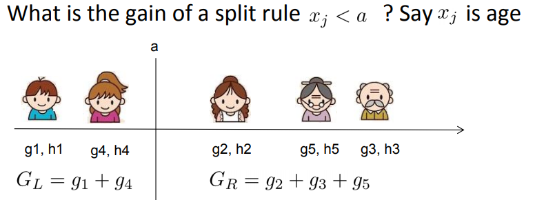
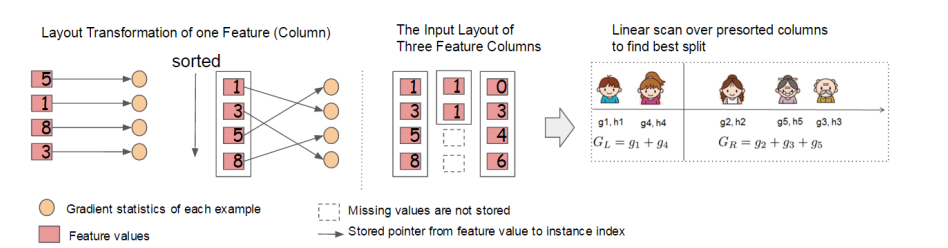

# XGBoost
[链接](https://www.cnblogs.com/pinard/p/10979808.html)

本文主要参考了XGBoost的[论文](https://arxiv.org/pdf/1603.02754.pdf)和陈天奇的[PPT](https://homes.cs.washington.edu/~tqchen/pdf/BoostedTree.pdf)。

GBDT的算法库XGBoost没有单独拿出来分析。虽然XGBoost是GBDT的一种高效实现，但是里面也加入了很多独有的思路和方法.

## [调参](https://machinelearningmastery.com/tune-number-size-decision-trees-xgboost-python/)

## 从GBDT到XGBoost

作为GBDT的高效实现，XGBoost是一个上限特别高的算法，因此在算法竞赛中比较受欢迎。简单来说，对比原算法GBDT，XGBoost主要从下面三个方面做了优化：

1. 算法本身的优化：在算法的弱学习器模型选择上，对比GBDT只支持决策树，还可以直接很多其他的弱学习器。在算法的损失函数上，除了本身的损失，还加上了正则化部分。在算法的优化方式上，GBDT的损失函数只对误差部分做负梯度（一阶泰勒）展开，而XGBoost损失函数对误差部分做二阶泰勒展开，更加准确。算法本身的优化是我们后面讨论的重点。

2. 算法运行效率的优化：对每个弱学习器，比如决策树建立的过程做并行选择，找到合适的子树分裂特征和特征值。在并行选择之前，先对所有的特征的值进行排序分组，方便前面说的并行选择。对分组的特征，选择合适的分组大小，使用CPU缓存进行读取加速。将各个分组保存到多个硬盘以提高IO速度。

3. 算法健壮性的优化：对于缺失值的特征，通过枚举所有缺失值在当前节点是进入左子树还是右子树来决定缺失值的处理方式。算法本身加入了L1和L2正则化项，可以防止过拟合，泛化能力更强。

在上面三方面的优化中，第一部分算法本身的优化是重点也是难点。现在我们就来看看算法本身的优化内容。

## XGBoost损失函数

在看XGBoost本身的优化内容前，我们先回顾下GBDT的回归算法迭代的流程，详细算法流程见梯度提升树(GBDT)原理小结第三节，对于GBDT的第t颗决策树，主要是走下面4步：

1) 对样本i=1,2，...m，计算负梯度
$$r_{ti} = -\bigg[\frac{\partial L(y_i, f(x_i)))}{\partial f(x_i)}\bigg]_{f(x) = f_{t-1}\;\; (x)}$$

2) 利用$(x_i,r_{ti})\;\; (i=1,2,..m)$, 拟合一颗CART回归树,得到第t颗回归树，其对应的叶子节点区域为$R_{tj}, j =1,2,..., J$。其中J为回归树t的叶子节点的个数。

3) 对叶子区域j =1,2,..J,计算最佳拟合值
$$c_{tj} = \underbrace{arg\; min}_{c}\sum\limits_{x_i \in R_{tj}} L(y_i,f_{t-1}(x_i) +c)$$

4) 更新强学习器
$$f_{t}(x) = f_{t-1}(x) + \sum\limits_{j=1}^{J}c_{tj}I(x \in R_{tj}) $$

上面第一步是得到负梯度(平方损失下等于残差)，或者是泰勒展开式的一阶导数。第二步是第一个优化求解，即基于残差拟合一颗CART回归树，得到J个叶子节点区域。第三步是第二个优化求解，在第二步优化求解的结果上，对每个节点区域再做一次线性搜索，得到每个叶子节点区域的最优取值。最终得到当前轮的强学习器。

从上面可以看出，我们要求解这个问题，需要求解当前决策树最优的所有J个叶子节点区域和每个叶子节点区域的最优解$c_{tj}$。GBDT采样的方法是分两步走，先求出最优的所有J个叶子节点区域，再求出每个叶子节点区域的最优解。

对于XGBoost，它期望把**第2步和第3步合并在一起做**，即一次求解出决策树最优的所有J个叶子节点区域和每个叶子节点区域的最优解$c_{tj}$。在讨论如何求解前，我们先看看XGBoost的损失函数的形式。

在GBDT损失函数$L(y, f_{t-1}(x)+ h_t(x))$的基础上，我们加入正则化项如下：
$$\Omega(h_t) = \gamma J + \frac{\lambda}{2}\sum\limits_{j=1}^Jw_{tj}^2$$

这里的$J$是叶子节点的个数，而$w_{tj}$是第j个叶子节点的最优值。**这里的$w_{tj}$和我们GBDT里使用的$c_{tj}$是一个意思**，只是XGBoost的论文里用的是$w$表示叶子区域的值，因此这里和论文保持一致。

最终XGBoost的损失函数可以表达为：
$$L_t=\sum\limits_{i=1}^mL(y_i, f_{t-1}(x_i)+ h_t(x_i)) + \gamma J + \frac{\lambda}{2}\sum\limits_{j=1}^Jw_{tj}^2 $$

 最终我们要极小化上面这个损失函数，得到第t个决策树最优的所有J个叶子节点区域和每个叶子节点区域的最优解$w_{tj}$。XGBoost没有和GBDT一样去拟合泰勒展开式的一阶导数，而是期望直接基于损失函数的二阶泰勒展开式来求解。现在我们来看看这个损失函数的二阶泰勒展开式：

$$\begin{aligned} L_t & = \sum\limits_{i=1}^mL(y_i, f_{t-1}(x_i)+ h_t(x_i)) + \gamma J + \frac{\lambda}{2}\sum\limits_{j=1}^Jw_{tj}^2 \\ & \approx   \sum\limits_{i=1}^m( L(y_i, f_{t-1}(x_i)) + \frac{\partial L(y_i, f_{t-1}(x_i) }{\partial f_{t-1}(x_i)}h_t(x_i) + \frac{1}{2}\frac{\partial^2 L(y_i, f_{t-1}(x_i) }{\partial f_{t-1}^2(x_i)} h_t^2(x_i)) +  \gamma J + \frac{\lambda}{2}\sum\limits_{j=1}^Jw_{tj}^2  \end{aligned}$$

为了方便，我们把**第i个样本在第t个弱学习器**的一阶和二阶导数分别记为
$$g_{ti} = \frac{\partial L(y_i, f_{t-1}(x_i) }{\partial f_{t-1}(x_i)}, \; h_{ti} = \frac{\partial^2 L(y_i, f_{t-1}(x_i) }{\partial f_{t-1}^2(x_i)}$$

则我们的损失函数现在可以表达为：
$$L_t \approx \sum\limits_{i=1}^m( L(y_i, f_{t-1}(x_i)) + g_{ti}h_t(x_i) + \frac{1}{2} h_{ti} h_t^2(x_i)) +  \gamma J + \frac{\lambda}{2}\sum\limits_{j=1}^Jw_{tj}^2$$

损失函数里面$L(y_i, f_{t-1}(x_i))$是常数，对最小化无影响，可以去掉，同时由于**每个决策树的第j个叶子节点的取值最终会是同一个值$h_t(x_i)=w_{tj}$**,因此我们的损失函数可以继续化简。

$$\begin{aligned} L_t & \approx \sum\limits_{i=1}^m g_{ti}h_t(x_i) + \frac{1}{2} h_{ti} h_t^2(x_i)) +  \gamma J + \frac{\lambda}{2}\sum\limits_{j=1}^Jw_{tj}^2  \\ & = \sum\limits_{j=1}^J (\sum\limits_{x_i \in R_{tj}}g_{ti}w_{tj} +  \frac{1}{2} \sum\limits_{x_i \in R_{tj}}h_{ti} w_{tj}^2) +  \gamma J + \frac{\lambda}{2}\sum\limits_{j=1}^Jw_{tj}^2 \\ & =  \sum\limits_{j=1}^J [(\sum\limits_{x_i \in R_{tj}}g_{ti})w_{tj} + \frac{1}{2}( \sum\limits_{x_i \in R_{tj}}h_{ti}+ \lambda) w_{tj}^2] + \gamma J   \end{aligned}$$

我们把每个叶子节点区域样本的一阶和二阶导数的和单独表示如下：
$$G_{tj} = \sum\limits_{x_i \in R_{tj}}g_{ti},\; H_{tj} =  \sum\limits_{x_i \in R_{tj}}h_{ti}$$

最终损失函数的形式可以表示为：
$$L_t  =  \sum\limits_{j=1}^J [G_{tj}w_{tj} + \frac{1}{2}(H_{tj}+\lambda)w_{tj}^2] + \gamma J   $$

现在我们得到了最终的损失函数，那么回到前面讲到的问题，我们如何一次求解出决策树最优的所有J个叶子节点区域和每个叶子节点区域的最优解$w_{tj}$呢？
## XGBoost损失函数的优化求解

关于如何一次求解出决策树最优的所有J个叶子节点区域和每个叶子节点区域的最优解$w_{tj}$，我们可以把它拆分成2个问题：

1) 如果我们已经求出了第t个决策树的J个最优的叶子节点区域，如何求出每个叶子节点区域的最优解$w_{tj}$？

2) 对当前决策树做子树分裂决策时，应该如何选择哪个特征和特征值进行分裂，使最终我们的损失函数$L_t$最小？

对于第一个问题，其实是比较简单的，我们直接基于损失函数对$w_{tj}$求导并令导数为0即可。这样我们得到叶子节点区域的最优解$w_{tj}$表达式为：
$$w_{tj} = - \frac{G_{tj}}{H_{tj} + \lambda}$$

这个叶子节点的表达式不是XGBoost首创，实际上在GBDT的分类算法里，已经在使用了。大家在梯度提升树(GBDT)原理小结第4.1节中叶子节点区域值的近似解表达式为：
$$c_{tj} = \sum\limits_{x_i \in R_{tj}}r_{ti}\bigg /  \sum\limits_{x_i \in R_{tj}}|r_{ti}|(1-|r_{ti}|)$$

它其实就是使用了上式来计算最终的$c_{tj}$。注意到二元分类的损失函数是：
$$L(y, f(x)) = log(1+ exp(-yf(x)))$$

其每个样本的一阶导数为：
$$g_i=-r_i= -y_i/(1+exp(y_if(x_i)))$$

其每个样本的二阶导数为（对数损失函数，那么标签值就要使用{-1，1}，$|y_i|=1$）：
$$h_i =\frac{exp(y_if(x_i)}{(1+exp(y_if(x_i))^2} = |g_i|(1-|g_i|) $$

由于没有正则化项，则$c_{tj} = -\frac{g_i}{h_i}$，即可得到GBDT二分类叶子节点区域的近似值。GBDT原论文中介绍的这个叶子节点区域值的近似解是用**牛顿迭代法**得到的，使用了一**阶泰勒展开的牛顿迭代法得到的近似解 与 函数使用了二阶泰勒展开求导得到的极小值点，在结果上是一致的**。 

现在我们回到XGBoost，我们已经解决了第一个问题。现在来看XGBoost优化拆分出的第二个问题：如何选择哪个特征和特征值进行分裂，使最终我们的损失函数$L_t$最小？

在GBDT里面，我们是直接拟合的CART回归树，所以树节点分裂使用的是均方误差。XGBoost这里不使用均方误差，而是使用贪心法，即每次分裂都期望最小化我们的损失函数的误差。

原损失函数:
$$L_t  =  \sum\limits_{j=1}^J [G_{tj}w_{tj} + \frac{1}{2}(H_{tj}+\lambda)w_{tj}^2] + \gamma J   $$
注意到在我们$w_{tj} = - \frac{G_{tj}}{H_{tj} + \lambda}$取最优解的时候，原损失函数对应的表达式为：
$$L_t = -\frac{1}{2}\sum\limits_{j=1}^J\frac{G_{tj}^2}{H_{tj} + \lambda} +\gamma J$$

如果我们每次做左右子树分裂时，可以最大程度的减少损失函数的损失就最好了。也就是说，假设当前节点左右子树的一阶二阶导数和为$G_L,H_L,G_R,H_L$, 则我们期望最大化下式（分裂了子树，那么叶子节点的个数加1. 不分裂地损失减分裂的损失，差值即是损失的减小量，优化点：对于同一特征，总损失不变，可以最小化分裂损失，可并行计算？并行主要体现在**分裂时各个特征上的计算可以并行**，在**单个特征上按顺序进行**。）：
$$-\frac{1}{2}\frac{(G_L+G_R)^2}{H_L+H_R+ \lambda} +\gamma J  -(  -\frac{1}{2}\frac{G_L^2}{H_L + \lambda}  -\frac{1}{2}\frac{G_{R}^2}{H_{R} + \lambda}+ \gamma (J+1) ) $$　

整理下上式后，我们期望最大化的是：
$$\max \frac{1}{2}\frac{G_L^2}{H_L + \lambda} + \frac{1}{2}\frac{G_R^2}{H_R+\lambda}  - \frac{1}{2}\frac{(G_L+G_R)^2}{H_L+H_R+ \lambda} - \gamma$$　

也就是说，我们的决策树**分裂标准**不再使用CART回归树的均方误差，而是上式了。

具体如何分裂呢？举个简单的年龄特征的例子如下，假设我们选择年龄这个 特征的值a作为决策树的分裂标准，则可以得到左子树2个人，右子树三个人，这样可以分别计算出左右子树的一阶和二阶导数和，进而求出最终的上式的值。

然后我们使用其他的不是值a的划分标准，可以得到其他组合的一阶和二阶导数和，进而求出上式的值。最终我们找出可以使上式最大的组合，以它对应的特征值来分裂子树。

至此，我们解决了XGBoost的2个优化子问题的求解方法。

## XGBoost算法主流程

这里我们总结下XGBoost的算法主流程，基于决策树弱分类器。不涉及运行效率的优化和健壮性优化的内容。

- 输入是训练集样本$I=\{(x_,y_1),(x_2,y_2), ...(x_m,y_m)\}$， 最大迭代次数T, 损失函数L， 正则化系数$\lambda,\gamma$。

- 输出是强学习器f(x)

对$f_0(x)$做初始化。通过参数base_score 可以指定初始预测值。默认是0.5。

对迭代轮数t=1,2,...T有：

1) 计算第i个样本(i-1,2,..m)在当前轮损失函数L基于$f_{t-1}(x_i)$的一阶导数$g_{ti}$，二阶导数$h_{ti}$,计算所有样本的一阶导数和$G_t = \sum\limits_{i=1}^mg_{ti}$,二阶导数和$H_t = \sum\limits_{i=1}^mh_{ti}$

2) 基于当前节点尝试分裂决策树，默认分数score=0，G和H为当前需要分裂的节点的一阶二阶导数之和。

   对特征序号 k=1,2...K:

   a) $G_L=0, H_L=0$

   b.1) 将样本按**特征k**从小到大排列，**默认所有样本放入右子树**，依次取出第i个样本，依次计算当前样本放入左子树后，左右子树一阶和二阶导数和：
   $$G_L = G_L+ g_{ti}, G_R=G-G_L$$
   $$H_L = H_L+ h_{ti}, H_R=H-H_L$$

   b.2) 尝试更新最大的分数：
   $$score = max(score, \frac{1}{2}\frac{G_L^2}{H_L + \lambda} + \frac{1}{2}\frac{G_R^2}{H_R+\lambda}  - \frac{1}{2}\frac{(G_L+G_R)^2}{H_L+H_R+ \lambda} -\gamma )$$

3) 基于**最大score**对应的划分特征和特征值分裂子树。

4) 如果**最大score为0，则当前决策树建立完毕**，计算所有叶子区域的$w_{tj}$（普通决策树的叶子值取值比较简单，平均下或者投个票就出来了，而**XGBoost里的弱学习器决策树还需要去做一个线性搜索**，看看怎么才能让全局损失最小。）, 得到弱学习器$h_t(x)$，更新强学习器$f_t(x)$,进入下一轮弱学习器迭代.如果最大score不是0，则转到第2)步继续尝试分裂决策树。

## XGBoost算法运行效率的优化

在第2,3,4节我们重点讨论了XGBoost算法本身的优化，在这里我们再来看看XGBoost算法运行效率的优化。

大家知道,Boosting算法的弱学习器是没法并行迭代的，但是单个弱学习器里面**最耗时的是决策树的分裂过程**，XGBoost针对这个分裂做了比较大的并行优化。对于不同的特征的**特征划分点**，XGBoost分别在**不同的线程中并行选择分裂的最大增益**。

同时，对训练的每个特征**排序**并且**排序结果以块的结构存储**在内存中，方便后面迭代重复使用，减少计算量。计算量的减少参见上面第4节的算法流程，首先**默认所有的样本都在右子树**，然后从小到大迭代，依次放入左子树，并寻找最优的分裂点。这样做可以减少很多不必要的比较。

具体的过程如下图所示：

此外，通过**设置合理的分块的大小，充分利用了CPU缓存**进行读取加速（cache-aware access）。使得数据读取的速度更快。另外，通过将**分块进行压缩（block compressoin）并存储到硬盘上，并且通过将分块分区到多个硬盘上实现了更大的IO**。

## XGBoost算法健壮性的优化

最后我们再来看看XGBoost在算法健壮性的优化，除了上面讲到的正则化项提高算法的泛化能力外，XGBoost还对特征的缺失值做了处理。
### 缺失值

XGBoost没有假设缺失值一定进入左子树还是右子树，则是**尝试通过枚举所有缺失值在当前节点是进入左子树，还是进入右子树更优来决定一个处理缺失值默认的方向**，这样处理起来更加的灵活和合理。

在计算G，H时，存在缺失值得样本是可以有贡献的，可以参看G，H的计算公式，他是损失函数对上一轮弱学习器的一阶和二阶导数，并不和特征强相关。

也就是说，上面第4节的算法的步骤a),b.1)和b.2)会执行2次，第一次假设 **特征k** **所有有缺失值的样本**都走左子树，第二次假设特征k所有缺失值的样本都走右子树。然后每次都是针对没有缺失值的特征k的样本走上述流程(即在左右子树移动)，而不是所有的的样本。

如果是所有的缺失值走右子树，使用上面第4节的a),b.1)和b.2)即可。如果是所有的样本走左子树，则上面第4节的a)步要变成：
$$G_R=0, H_R=0$$

b.1)步要更新为：
$$G_R = G_R+g_{ti}, G_L=G-G_R$$
$$H_R = H_R+h_{ti}, H_L=H-H_R$$

## XGBoost小结

不考虑深度学习，则XGBoost是算法竞赛中最热门的算法，它将GBDT的优化走向了一个极致。当然，后续微软又出了LightGBM，在内存占用和运行速度上又做了不少优化，但是从算法本身来说，优化点则并没有XGBoost多。

何时使用XGBoost，何时使用LightGBM呢？个人建议是优先选择XGBoost，毕竟调优经验比较多一些，可以参考的资料也多一些。如果你使用XGBoost遇到的内存占用或者运行速度问题，那么尝试LightGBM是个不错的选择。