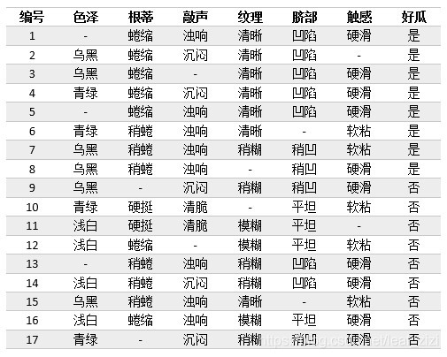

离散值**onehot后代表bool值组合**，没有数值上的关系。

如果你定义的损失函数是交叉熵损失函数，那么一般标签值属于{0,1}，如果你定义的是类似GBDT这样的对数损失函数，那么标签值就要使用{-1，1}。

# 信息论
## 信息熵：
$$H(X)=-\sum_{i=1}^{n} p_{i} \log p_{i}$$
二分类信息熵画图：

```python
import numpy as np
import math
import matplotlib.pyplot as plt
plt.figure(1)
x=[]
y=[]
a=np.linspace(0.01,0.99,100)
def f1(x):
    # 以e为底
    y=x*math.log(x)+(1-x)*math.log(1-x)
    return -y
for i in a:
    x.append(i)
    y.append(f1(i))
plt.plot(x,y)
plt.show()
```
## 两个变量X和Y的联合熵
$$H(X, Y)=-\sum_{i=1}^{n} p\left(x_{i}, y_{i}\right) \log p\left(x_{i}, y_{i}\right)$$

## 条件熵
对X与Y是否独立没有要求，详细了解这一块的推导过程，可以看<信息论基础>这本书的第二章。 
$$H(X | Y)=-\sum_{i=1}^{n} p\left(x_{i}, y_{i}\right) \log p\left(x_{i} | y_{i}\right)=\sum_{j=1}^{n} p\left(y_{j}\right) H\left(X | y_{j}\right)$$

## 互信息或者信息增益I(X,Y)
度量了X在知道Y以后**不确定性减少程度**

信息增益是对称的，I(A,D)=I(D,A)

$$I(X,Y)=H(X)-H(X|Y)$$

# 特征属性示例图：


# ID3
[链接](https://www.cnblogs.com/pinard/p/6050306.html)

1970年代，昆兰的大牛找到了用信息论中的熵来度量决策树的决策选择过程，这个算法叫做ID3。

用信息增益大小来判断当前节点应该用什么特征来构建决策树，用计算出的信息增益最大的特征来建立决策树的当前节点。
$$Ent(D)=-\sum_{i=1}^{|Y|} p_{i} \log p_{i}$$
$$\operatorname{Gain}(D, a)=\operatorname{Ent}(D)-\sum_{v=1}^{V} \frac{\left|D^{v}\right|}{|D|} \operatorname{Ent}\left(D^{v}\right)$$
注：选取某个特征作为结点的时候，可以不用计算经验熵H(D),只要计算经验条件熵H(D|A)，只需要求经验条件熵最小的值就可以

## 不足

ID3算法虽然提出了新思路，但是还是有很多值得改进的地方。　　

a)ID3**没有考虑连续特征**，比如长度，密度都是连续值，无法在ID3运用。这大大限制了ID3的用途。

b)ID3采用信息增益大的特征优先建立决策树的节点。很快就被人发现，**在相同条件下，取值比较多的特征比取值少的特征信息增益大**（当特征类别数较多时候，这个不确定性减少程度**一般**会多一些，因为此时特征类别数较多，每个类别里的样本数量较少，样本更容易被划分的散落到各个特征类别，即样本不确定性变小）。比如一个变量有2个值，各为1/2，另一个变量为3个值，各为1/3，其实他们都是完全不确定的变量，但是取3个值的比取2个值的信息增益大。如果校正这个问题呢？

c) ID3算法对于**缺失值的情况没有做考虑**

d) 没有考虑**过拟合**的问题（现在的算法库里面的ID3算法一般也会考虑过拟合的问题了，而且也可以剪枝了，我说的是历史上1979年出来的ID3，那时候这个算法还很简单，没有考虑这么多细节问题。 ）

# C4.5
ID3 算法的作者昆兰基于上述不足，对ID3算法做了改进，这就是C4.5算法，也许你会问，为什么不叫ID4，ID5之类的名字呢?那是因为决策树太火爆，他的ID3一出来，别人二次创新，很快 就占了ID4， ID5，所以他另辟蹊径，取名C4.0算法，后来的进化版为C4.5算法。

ID3算法有四个主要的不足，一是不能处理连续特征，第二个就是用信息增益作为标准容易偏向于取值较多的特征，最后两个是缺失值处理的问题和过拟合问题。昆兰在C4.5算法中改进了上述4个问题。

1. 对于第一个问题，不能处理连续特征， C4.5的思路是将连续的特征离散化。比如m个样本的连续特征A有m个，从小到大排列为${a_1,a_2,...,a_m}$,则C4.5取相邻两样本值的平均数，一共取得m-1个划分点，其中第i个划分点$T_i表示$为：$T_i = \frac{a_i+a_{i+1}}{2}$。对于这m-1个点，分别计算以该点作为二元分类点时的信息增益。选择信息增益最大的点作为该连续特征的二元离散分类点。比如取到的增益最大的点为$a_t$,则小于$a_t$的值为类别1，大于$a_t$的值为类别2，这样我们就做到了连续特征的离散化。要注意的是，与离散属性不同的是，如果当前节点为连续属性，则该属性后面还可以参与子节点的产生选择过程。

2. 对于第二个问题，信息增益作为标准容易偏向于取值较多的特征的问题。我们引入一个信息增益比的变量$I_R(X,Y)$，它是信息增益（互信息）和**特征熵**的比值。表达式如下：
   
   $$Ent(D)=-\sum_{i=1}^{|Y|} p_{i} \log p_{i}$$
   $$\operatorname{Gain}(D, a)=\operatorname{Ent}(D)-\sum_{v=1}^{V} \frac{\left|D^{v}\right|}{|D|} \operatorname{Ent}\left(D^{v}\right)$$

   $$I_R(D,A) = \frac{I(A,D)}{H_A(D)}$$

   其中D为样本特征输出的集合，A为样本特征，对于特征熵$H_A(D)$, 表达式如下：

   $$H_A(D) = -\sum\limits_{i=1}^{n}\frac{|D_i|}{|D|}log_2\frac{|D_i|}{|D|}$$

   其中**n为特征A的类别数，$D_i$为特征A的第i个取值对应的样本个数。**$|D|$为样本个数。

   特征数越多的特征对应的特征熵越大，它作为分母，可以校正信息增益容易偏向于取值较多的特征的问题。

3. 对于第三个缺失值处理的问题，主要需要解决的是两个问题，一是在样本某些特征缺失的情况下选择划分的属性，二是选定了划分属性，对于在该属性上缺失特征的样本的处理。
   
   [链接](https://blog.csdn.net/leaf_zizi/article/details/83503167)

   1. 对于第一个子问题，对于某一个有缺失特征值的特征A。C4.5的思路是将数据分成两部分，对每个样本设置一个权重（初始可以都为1），然后划分数据，一部分是有特征值A的数据D1，另一部分是没有特征A的数据D2. 然后对于没有缺失特征A的数据集D1来和对应的A特征的各个特征值一起计算加权重后的信息增益比，最后乘上一个系数，这个系数是无特征A缺失的样本加权后所占加权总样本的比例。
   
      简单来说：**对于有缺失值的属性，其信息增益就是无缺失值样本所占的比例乘以无缺失值样本子集的信息增益。**

      示例（参考上图）：

      色泽：
      $$\operatorname{Ent}(\tilde{D})=-\left(\frac{6}{14} \log _{2} \frac{6}{14}+\frac{8}{14} \log _{2} \frac{8}{14}\right)=0.985$$
      另 $\tilde{D}^{1}, \tilde{D}^{2}, \tilde{D}^{3}$ 分别表示 "色泽" 属性上取值为 “青绿"、乌黑"、"浅白" 的样本子集。
      $$\operatorname{Ent}\left(\tilde{D}^{1}\right)=-\left(\frac{2}{4} \log _{2} \frac{2}{4}+\frac{2}{4} \log _{2} \frac{2}{4}\right)=1$$
      $$\operatorname{Ent}\left(\tilde{D}^{2}\right)=-\left(\frac{4}{6} \log _{2} \frac{4}{6}+\frac{2}{6} \log _{2} \frac{2}{6}\right)=0.918$$
      $$\operatorname{Ent}\left(\tilde{D}^{3}\right)=-\left(\frac{0}{4} \log _{2} \frac{0}{4}+\frac{4}{4} \log _{2} \frac{4}{4}\right)=0$$
      $$\operatorname{Gain}(\tilde{D}, a)=0.985-\left(\frac{4}{14} \times 1+\frac{6}{14} \times 0.918+\frac{4}{14} \times 0\right)=0.306$$
      $$\operatorname{Gain}(D, a)=\rho \times \operatorname{Gain}(\tilde{D}, a)=\frac{14}{17} \times 0.306=0.252$$

   2. 对于第二个子问题，可以将缺失特征的样本同时划分入所有的子节点，不过将**该样本的权重按各个子节点样本的数量比例来分配**。比如缺失特征A的样本a之前权重为1，特征A有3个特征值A1,A2,A3。 3个特征值对应的无缺失A特征的样本个数为2,3,4.则a同时划分入A1，A2，A3。对应权重调节为2/9,3/9, 4/9。
   
      下面我们再以“纹理=清晰”这个分支为例(缺失值当作清晰，权重为分数，小于1)，看看下一步将如何划分：
      
      
      $$\begin{aligned}
      &\text { 色泽： }\\
      &\rho=\frac{\sum_{x \in \bar{D}} w_{x}}{\sum_{x \in D} w_{x}}=\frac{5+2 \times \frac{7}{15}}{7+2 \times \frac{7}{15}}=0.748\\
      &\tilde{p}_{1}=\frac{\sum_{x \in \bar{D}_{1}} w_{x}}{\sum_{x \in \bar{D}} w_{x}}=\frac{4+\frac{7}{15}}{5+2 \times \frac{7}{15}}=0.753 （无缺失值样本中，好瓜的比例）\\
      &\tilde{p}_{2}=\frac{\sum_{x \in \bar{D}_{2}} w_{x}}{\sum_{x \in \bar{D}} w_{x}}=\frac{1+\frac{7}{15}}{5+2 \times \frac{7}{15}}=0.247 （无缺失值样本中，坏瓜的比例）\\
      &\tilde{r}_{1}=\frac{\sum_{x \in \bar{D}^{1}} w_{x}}{\sum_{x \in \bar{D}} w_{x}}=\frac{3+\frac{7}{15}}{5+2 \times \frac{7}{15}}=0.584 （无缺失值样本中，“色泽=乌黑”的样本的比例）\\
      &\tilde{r}_{2}=\frac{\sum_{x \in \bar{D}^{2}} w_{x}}{\sum_{x \in \bar{D}} w_{x}}=\frac{2+\frac{7}{15}}{5+2 \times \frac{7}{15}}=0.416 （无缺失值样本中，“色泽=青绿”的样本的比例）\\
      &\operatorname{Ent}(\tilde{D})=-\sum_{k=1}^{|Y|} \tilde{p}_{k} \log _{2} \tilde{p}_{k}=-0.753 \times \log _{2} 0.753-0.247 \times \log _{2} 0.247=0.806\\
      &\frac{7}{15}=0.467\\
      &\operatorname{Ent}\left(\tilde{D}^{1}\right)=-\left(\frac{2.467}{3.467} \log _{2} \frac{2.467}{3.467}+\frac{1}{3.467} \log _{2} \frac{1}{3.467}\right)=0.867 \quad \text (  \text { "色泽=乌黑"中有1个不是好瓜（权重为1）})\\
      &\operatorname{Ent}\left(\tilde{D}^{2}\right)=-\left(\frac{2}{2.467} \log _{2} \frac{2}{2.467}+\frac{0.467}{2.467} \log _{2} \frac{0.467}{2.467}\right)=0.700 \quad(\text { "色泽=青绿" })\\
      &\operatorname{Gain}(D, a)=\rho \times\left(\operatorname{Ent}(\tilde{D})-\sum_{v=1}^{V} \tilde{r}_{v} \operatorname{Ent}\left(\tilde{D}^{v}\right)\right)\\
      &=0.748 \times(0.806-0.584 \times 0.867-0.416 \times 0.700)=0.006
      \end{aligned}$$

4. 对于第4个问题，C4.5引入了正则化系数进行初步的剪枝。
   
5. 预测时处理缺失值见[链接](https://blog.csdn.net/leaf_zizi/article/details/83503167)

## 不足与思考

C4.5虽然改进或者改善了ID3算法的几个主要的问题，仍然有优化的空间。

1) 由于决策树算法非常容易过拟合，因此对于生成的决策树必须要进行剪枝。剪枝的算法有非常多，C4.5的剪枝方法有优化的空间。思路主要是两种，一种是预剪枝，即在生成决策树的时候就决定是否剪枝。另一个是后剪枝，即先生成决策树，再通过交叉验证来剪枝。后面在下篇讲CART树的时候我们会专门讲决策树的减枝思路，主要采用的是后剪枝加上交叉验证选择最合适的决策树。

2) C4.5生成的是多叉树，即一个父节点可以有多个节点。很多时候，在计算机中二叉树模型会比多叉树运算效率高。如果采用二叉树，可以提高效率。

3) C4.5只能用于分类，如果能将决策树用于回归的话可以扩大它的使用范围。

4) C4.5由于使用了熵模型，里面有大量的耗时的对数运算,如果是连续值还有大量的排序运算。如果能够加以模型简化可以减少运算强度但又不牺牲太多准确性的话，那就更好了。

这4个问题在CART树里面部分加以了改进。所以目前如果不考虑集成学习话，在普通的决策树算法里，CART算法算是比较优的算法了。scikit-learn的决策树使用的也是CART算法。