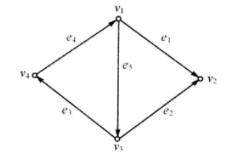

参考：
- [『 论文阅读』LightGBM原理-LightGBM: A Highly Efficient Gradient Boosting Decision Tree](https://blog.csdn.net/shine19930820/article/details/79123216)
- [LightGBM算法总结](https://blog.csdn.net/weixin_39807102/article/details/81912566)
- 据我们所知，LightGBM 是第一个直接支持类别特征的 GBDT 工具。 
# 解释论文中的一些内容
# 4 Exclusive Feature Bundling
## Take each row of the incidence matrix of G as a feature, and get an instance of our problem with $|V|$ features. 
- 给定图着色实例G=(V, E)。以G的**关联矩阵**的每一行为特征，得到我们问题的一个实例有|V|个特征。
### 邻接矩阵
定义：
设**无向图**$G=(V,E)$,其中顶点集$V={v_1,v_2,...,v_n}$，边集$E={e_1,e_2,...,e_\varepsilon}$。**用$a_{ij}$表示顶点$v_i$与顶点$v_j$之间的边数**，可能取值为0,1,2,…，称所得矩阵$\mathbf A =\mathbf A(G) = (a_{ij})_{n\times n}$为图$G$的邻接矩阵

若干性质:
- $\mathbf A(G)$为对称矩阵
- 若G为无环图，则$\mathbf A(G)$中第$i$行（列）的元素之和等于顶点$v_i$的度
- 两图$G$和$H$同构的充要条件是存在置换矩阵$P$使得$\mathbf A(G)=\mathbf P^T\mathbf A(H)\mathbf P$

类似地，**有向图**$D$的邻接矩阵$\mathbf A(D)=(a_{ij})_{n\times n}$**, $a_{ij}$表示从始点$v_i$到终点$v_j$的有向边的条数**，其中$v_i$和$v_j$为$D$的顶点

### 关联矩阵
定义：
设任意**无向图**$G=(V,E)$，其中顶点集$V={v_1,v_2,...,v_n}$，边集$E={e_1,e_2,...,e_\varepsilon}$。用$m_{ij}$表示顶点$v_i$与边$e_j$关联的**次数**，可能取值为0,1,2,…，称所得矩阵$\mathbf M(G) = (m_{ij})_{n\times \varepsilon}$为图G的关联矩阵

类似地，**有向图D**的关联矩阵$\mathbf M(D)=(m_{ij})_{n\times\varepsilon}$的元素$m_{i\times j}$定义为：
$$m_{ij}=
\begin{cases}
1,  & v_i是有向边 a_j的始点 \\[3ex]
-1, & v_i是有向边 a_j的终点 \\[2ex]
0,  & v_i是有向边 a_j的不关联点
\end{cases}$$
### example
示例，求图中有向图的邻接矩阵和关联矩阵。

解：根据定义，可求得该**有向图**的邻接矩阵:
$$\begin{bmatrix}
0 & 1 & 1 & 0 \\
0 & 0 & 0 & 0 \\
0 & 1 & 0 & 1 \\
1 & 0 & 0 & 0 \\
\end{bmatrix}$$

关联矩阵:
$$\begin{bmatrix}
1 & 0 & 0 & -1 & 1 \\
-1 & -1 & 0 & 0 & 0 \\
0 & 1 & 1 & 0 & -1 \\
0 & 0 & -1 & 1 & 0 \\
\end{bmatrix}$$

## we sort the features by their degrees in the graph in the descending order.
在图论中，一个顶点在图中的度 (degree)为与这个顶点相连接的边的数目。